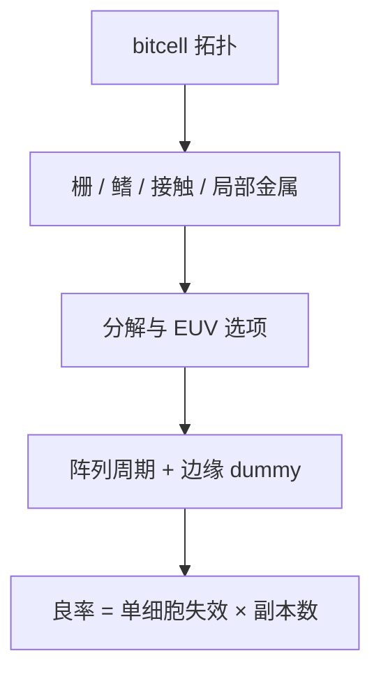

# SRAM 单元图形化

SRAM 是全芯片最密、最重复、最不肯让步的二维邻域；逻辑库的轨高合同到这里往往要另开一页。

<footer>—— 对照先进节点 SRAM 多图形、切线与 EUV 对 bitcell 的公开 DTCO 讨论</footer>

[上一课](/litho/scaling-boosters)把逻辑密度助推器写成新层。缺口是位元：SRAM 单元面积直接进缓存密度，图形比逻辑更二维、更周期，失败则整宏报废。[热点](/litho/hotspot-pv) 已警告 SRAM 拐角；本课钉单元图形化选项。金属与 via 如何协同，留给[下一课](/litho/metal-via-co-optimization）。

## 问题

6T SRAM 的栅、扩散、接触、局部互连挤在最小 CPP 与最小金属节距附近，尖端对尖端、弯折、不对称上拉/下拉是常客。逻辑允许单向金属加切线；SRAM 为面积常保留二维或特殊切线。EUV 单次能消掉一些双重着色，但随机缺孔与桥连在小接触上更狠。SAQP 鳍与切线套刻决定 fin 数与有效宽度，电学失配与图形化绑在一起。

缺口是**SRAM 专用规则与分解**，不是重讲 SRAM 电路。把逻辑 LRC 规格直接套 bitcell，不是过严害死密度，就是过宽放过周期杀手——周期会把单一热点复制成百万副本。

### 周期是双刃

重复使 RCWA、量测垫和 PWQ 矩阵都好做：一个 clips 代表整宏。但也使系统缺陷没有「稀释」：一次切线偏置走样，整片缓存失效。匹配模板必须以 SRAM 为独立族。填充 dummy 在阵列边缘必须设计，否则刻蚀负载在阵列/逻辑边界爆。

bitcell 常有自己的 OPC 配方和允许的 MRC 例外。版本号要与逻辑层分开，避免全芯片核被单元特例污染。

## 方法

选项：EUV 单次 vs 双重、鳍 SAQP + 切线、接触孔 EUV vs LELE、局部互连是否与逻辑同色规则。评估：单元面积、读写余量对 CD 失配、热点 PV、随机打开、阵列边缘 dummy。计量：阵列内 CD-SEM 与电学 bit 测试互补；只看逻辑 gauge 会漏 SRAM。与轨高课衔接：SRAM 轨/鳍数是另一张表。

电学 bit 失败要能分：读破坏、写失败、还是开路 via——前两者常是 CD 失配与 pitch walking，后者才是打开随机。混在一张失败率里，会把切线套刻和 EUV 剂量拧到同一旋钮。imec 的 SRAM DTCO 公开材料把图形化选项与余量放在同一张表，本课沿用这张表的结构。

## 机制

单元面积 $\approx$ $x$-节距 $\times$ $y$-节距。每一边被栅节距、鳍节距、接触尺寸、套刻和 tip 卡住。多图形把 $x$ 或 $y$ 拆到不同掩模，pitch walking 变成失配。EUV 随机把小孔的有效最小面积抬高，可能倒逼单元改拓扑（如接触合并或不同 bitcell 架构）。周期边界的负载效应让阵列中心与边缘 CD 不同，OPC 要分区或用密度核覆盖阵列尺度。

阵列副本把单细胞失效放大成宏级良率。dummy 与分区 OPC 是为了让中心与边缘走同一条路径，而不是装饰填充。

## 边界

不写某厂未公开的 SRAM 面积数字。不把存储阵列的设计规则泄成「通用逻辑规则」。本课不进入量化交易或大模型权重。

后课默认：SRAM 是独立图形化合同。下一课把互连侧的金属–via 覆盖收成协同，逻辑与 SRAM 都会用到。

## 小结

- SRAM 单元是最密二维周期，规则与 OPC 常与逻辑分家。
- 单一热点乘以阵列副本，系统缺陷没有稀释。
- 边缘 dummy 与分区 OPC 服务负载，不是装饰。
- 电学 bit 失败要分失配、打开与 via，切勿共用一个剂量旋钮。
- 出处：imec / 逻辑节点 SRAM DTCO 公开讨论；多重图形与 bitcell 通称。
