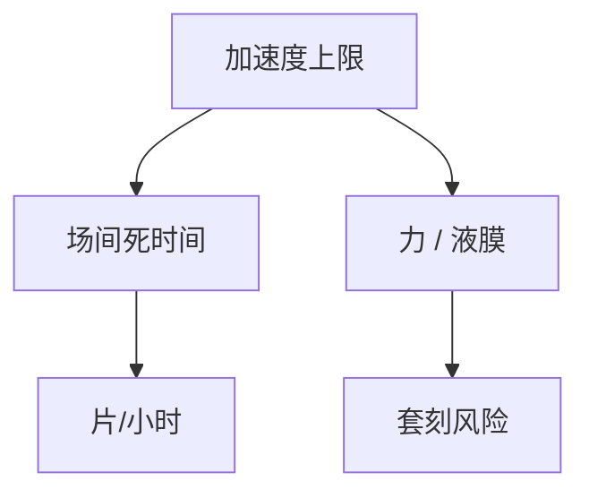

# 工件台加速度与产能

扫描产能不是激光有多亮，常是台能加多快、转向多重而不把套刻抖坏。加速度进会计，也进伺服残差。

<footer>—— 对照 [扫描仪产能](/litho/scanner-throughput)；双工件台见 [Twinscan](/litho/twinscan-dual-stage)</footer>

[上一课](/litho/vibration-isolation)挡住地。缺口是台自己：扫描段匀速，场间加速、转向、对准。本课钉加速度与产能，同步误差下一课 MSD。

## 问题

吞吐公式里有加速时间。加速度大，死时间短，但力大、液膜难、隔振被打。只升激光 $f$，台加不上速，产能不动。

## 方法

运动规划：扫描速度、加速极限、急动度 jerk 限制。双台：一块曝光一块对准，掩盖加速。浸没头对加速度有流体上限。会计：把加速段从「曝光时间」里分开报，否则优化激光会失望。

## 机制

牛顿定律：力 = 质量 × 加速度。台+片+夹盘质量固定，加速度直接是对导轨与隔振的力。液膜在转向时剪切，缺陷与同步误差一起升。

## 边界

下一课 MSD：加速度规划得再漂亮，扫描中掩模台与工件台跟不齐仍糊。

## 小结

- 产能会计必须单列加速死时间。
- 加速度与套刻、浸没流体抢同一条力预算。
- 出处：扫描仪产能课；Twinscan。
