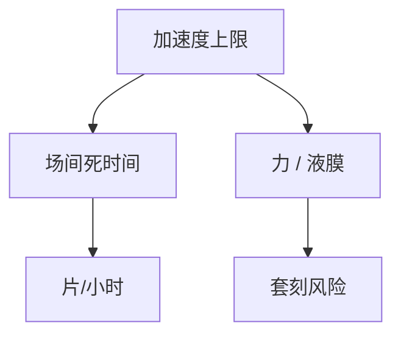

# 工件台加速度与产能

扫描产能不是激光有多亮，常是台能加多快、转向多重而不把套刻抖坏。加速度进会计，也进伺服残差。

<footer>—— 据 ASML, TWINSCAN: 20 years of lithography innovation（公开故事，2021）与 ASML 产能公开资料整理</footer>

[上一课](/litho/vibration-isolation)挡住地。缺口是台自己：扫描段匀速，场间加速、转向、对准。本课钉加速度与产能，同步误差下一课 MSD。[扫描仪产能](/litho/scanner-throughput)课给过产能公式骨架，本课拆最大的一块软肉：场间死时间。

## 问题

吞吐公式里有加速时间。加速度大，死时间短，但力大、液膜难、隔振被打。只升激光 $f$，台加不上速，产能不动。

展开：一片的工时是每场曝光、每场开销（步进、整定）与每片开销（装载、预对准）之和。场间死时间是其中最大也最可优化的一段：加速度大则步进短，但力大、液膜难、隔振被打——省的时间可能被更长的整定吃回去。「只升激光 rep rate、台加不上速」的教训很常见：光源升级前，先看死时间占多少。

## 方法

运动规划：扫描速度、加速极限、急动度 jerk 限制。双台：一块曝光一块对准，掩盖加速。浸没头对加速度有流体上限。会计：把加速段从「曝光时间」里分开报，否则优化激光会失望。

工程流程：把每场拆成扫描段与步进段——扫描段要匀速段的平直，步进段用 jerk 受限的 S 曲线，在峰值加速度、峰值速度与行程间优化；扫描方向逐场交替，换向 turnaround 的残振要压到下一场开曝前。双台（[Twinscan](/litho/twinscan-dual-stage)）一台曝光、另一台并行对准与换片，把步进与装载从关键路径拿掉。浸没另有一条流体上限：水膜跟随加速度有限，剪切太狠会撕开液膜，上限由「液膜不破」决定。

```mermaid
flowchart TD
  A["加速度上限"] --> T["场间死时间"]
  T --> WPH["片/小时"]
  A --> F["力 / 液膜"]
  F --> OVL["套刻风险"]
```

死时间按场数放大：约百场的一片，每场 10 ms 开销到片尾就是一秒上下，在 200 wph 的账上占好几个百分点——常比光源微升级更值得先优化。

## 机制

牛顿定律：力 = 质量 × 加速度。台+片+夹盘质量固定，加速度直接是对导轨与隔振的力。液膜在转向时剪切，缺陷与同步误差一起升。

写透一点：台、片、卡盘加浸没液的质量固定，加速度直接是导轨、电机与隔振的力。真正卡产能的常是 jerk：加速度突变激起机架与隔振的模态，残振要衰减到套刻允许的水平才能开曝——「加速度调高、整定拉长」的净收益可能为负，账上死时间不降反升。套刻与产能抢同一条预算：残振进曝光段就是同步误差，液膜转向剪切还叠加缺陷。失配形状可辨：残振型套刻误差在换向两场成对反号，不是对准或网格的病。

## 边界

本课只算时间与力，不写扫描中双台的同步误差怎么测（MSD 下一课）；柔性模态与地基的耦合归 [振动隔离](/litho/vibration-isolation)课，浸没流体归浸没课。运动学假设刚性台：jerk 激起的模态一旦闯进曝光段，规划要让位给隔振与整定策略。

## 小结

- 产能会计必须单列加速死时间。
- 加速度与套刻、浸没流体抢同一条力预算。
- 下一课 MSD：加速度规划得再漂亮，扫描中两台跟不齐仍糊。
- 出处：扫描仪产能课；Twinscan。
