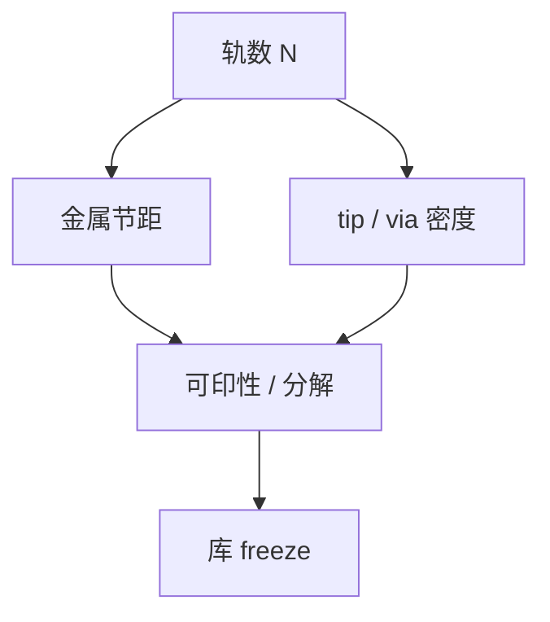

# 标准单元与轨道高度

轨道高度是标准单元的纵向节拍：它把金属节距、电源轨和可印取向收成一个整数，密度与可布线性在此对赌。

<footer>—— 对照 imec DTCO 对 track height、FinFlex 与布线网格的公开论述</footer>

[上一课](/litho/min-area-tip-to-tip)把 tip 与面积写成独立条款。缺口是单元：逻辑库用几条金属轨高，直接决定有多少 tip、多少 via、电源是否挤在不可印的缝里。[DTCO](/litho/dtco-patterning) 已点名轨道；本课钉图形化侧如何选轨高。缩放助推器（接触上栅、埋入电源等）留给[下一课](/litho/scaling-boosters）。

## 问题

标准单元高度常以金属 2（或中间层）轨道数计：6T、7.5T、5T 一类。轨少则密度高，但电源、信号、扩散接触争同一套 tip-to-tip 与 via 覆盖预算；轨多则好布、好印，面积涨。Fin/nanosheet 的器件宽度分档（FinFlex 一类）让同一轨高下 drive 可变，但布线通道数仍被轨高锁死。

缺口是**轨高作为光刻约束的整数**，不是重讲标准单元电路。把轨高当纯设计风格，会忽略：单向金属加切线、EUV 单次对二维 jog 的容忍、以及电源轨 CD 对电迁徙的可靠性规则。

### 半轨与奇数轨

非整数轨（7.5T）来自器件与金属网格不对齐或电源轨加倍。半轨让布线灵活，却制造更多不规则 tip 与着色困难。LFD 必须对整库、而不是只对 inverter 跑前向。奇数轨对镜像单元和电源网格的周期性不友好，填充与刻蚀密度也会破周期。

单元库 freeze 等于冻结该层最密、最二维的 clips。OPC 模型的保持集应含库，而不是只含逻辑随机布线。

## 方法

候选轨高 × 金属节距 × 分解选项 → 代表单元（逆变器、触发器、多指）跑 SMO/OPC/PV 与 via 覆盖。看：热点数、切线需求、电源轨窗口、可布线性（销钉是否够）。与 [CPP/MMP](/litho/cpp-mmp) 后课（路线图门）的关系：本课只问图形化可实现；晶体管密度数字留给节点命名课序。High-NA 半场是否逼大核改芯粒，是 DTCO 面积，本课只要求轨高评估包含拼接假设。

触发器和多位加法器比 inverter 更吃 tip 与 via 色。轨高评估集必须含这些，否则 6T 库在 inverter 上绿灯、在时序单元上红。imec 公开 DTCO 叙述正是用代表单元族，而不是单一标准单元。

## 机制

轨高 $H = N \times$ 金属节距（加电源特例）。$N$ 下降，信号轨变少，布线器更常制造 tip 对撞和错误 via 颜色。光学上，密且重复的单元是周期结构，RCWA/紧凑核都较稳；一旦半轨破坏周期性，全芯片匹配库必须增收非周期 clips。电源轨往往是最宽、最敏感的 CD，刻蚀负载与它的开口率绑定。

轨数下降时，图中 tip/via 密度先于金属节距成为可印瓶颈。库 freeze 要把这条路径写进保持集，而不是只交节距表。

## 边界

不把某代工厂未公开的轨高表当规范。不重写 FinFET/GAA 静电学。轨高选择含电学与时序，本课只交付图形化可行集。

后课默认：库轨高是已冻结的光刻约束。下一课看埋入电源、接触上栅一类助推器如何在不无限减轨的前提下再挤密度。

## 小结

- 轨道高度把金属节距与单元纵向通道收成整数，是 DTCO 的图形化旋钮。
- 少轨提高 tip/via 风险；半轨破坏周期与着色。
- 库必须进 OPC 保持集。
- 出处：imec DTCO 对 track height 的公开论述；标准单元与可印网格通称。
