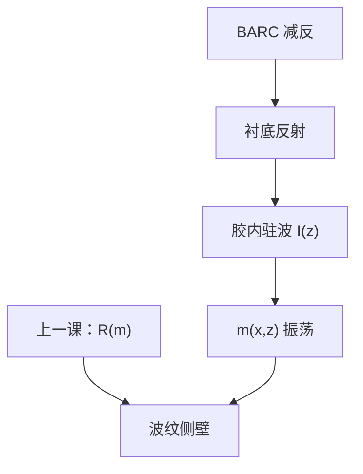

# 驻波与 BARC

衬底一反射，胶里就出现沿厚度的干涉条纹；溶解速率跟着 $I(z)$ 振荡，侧壁起波。BARC 要关掉的是这场反射，不是另做一层装饰膜。

<footer>—— 据 Mack 对驻波与 swing curve 的讨论，以及 Levinson 对底层抗反的表述整理</footer>

[上一课](/litho/dissolution-mack)把浮雕写成 $R(m)$ 的积分，并默认 $I(z)$ 是「给定的」。缺口是：衬底反射让入射与反射在胶里干涉，$I(z)$ 以 $\lambda/(2n)$ 为周期振荡，$m(z)$ 跟着振荡。本课钉驻波与底层抗反射（BARC）。剖面角如何进刻蚀，留给[下一课](/litho/sidewall-angle)。

## 问题

上一课的 $R(m)$ 在 $m$ 沿 $z$ 均匀时给出光滑侧壁。晶圆上很少均匀：胶–衬底界面反射把第二列波送回来，与入射叠加，形成驻波。亮节产酸（或 DNQ 转化）多，暗节少，显影后侧壁出现与周期对应的波纹。CD 对胶厚也极敏感——这就是 swing curve：厚度变四分之一光学波长量级，CD 可以走出窗。

缺口不是再拟合一次 $n$ 和 $m_\mathrm{th}$，而是把光学薄膜栈接进 $I(z)$。只加剂量，平均 $m$ 上移，波纹还在。只拧 PEB，酸扩散可以糊掉一部分 $z$ 向条纹，却在付横向模糊的账。

### Swing 不是剂量环能锁住的

剂量闭环锁的是面能量密度的积分，不锁胶厚。涂覆均匀性、台阶上的局部厚度，走的是 swing 的横轴。BARC 的第一任务是把衬底反射压下去，从而压驻波对比与 swing 振幅。

周期是胶内 $\lambda/(2n)$，不是真空 $\lambda/2$。换波长、换胶折射率，条纹间距变。浸没改的是镜头侧介质，驻波仍在胶里算。不要把 NA 焦深与驻波节点当成同一个轴向问题。

## 方法

光学：用薄膜栈（空气/水–胶–BARC–衬底）算 $I(z)$。BARC 是高吸收或干涉相消的底层：有机 BARC 靠 $k$ 吃反射；无机（如 SiON、SiARC）靠折射率与厚度做减反，并常兼硬掩模。厚度选在反射极小附近，且要对准这一层的 $\lambda$ 与入射角（高 NA 还要小心角分布）。减反极小通常有多个厚度解，要同时看刻蚀穿通与涂覆窗口，不能只盯光学反射的第一个零点。

上层抗反（TARC）减的是胶顶反射，主要改 swing 的另一头与斑点，不替代 BARC。CAR 的上层涂层还管出气与胺，功能重叠但机制不同。本课对象是底部反射 → 驻波。换金属衬底而不换 BARC，是驻波事故的常见写法。

### 与溶解模型的接口

把 $I(z)$ 送进产酸或 Dill 曝光，得到 $m(x,z)$，再进 Mack / Notch 的 $R(m)$。OPC 紧凑模型若假设单一平面强度，等于忽略本课；校准片必须在真实栈上做。换衬底（金属、多晶、介质）等于换反射，BARC 要重选。

## 机制

入射与反射相干叠加，波腹波节沿 $z$ 交替。正胶在波节处转化不足，显影后留下凸起；波腹处过转，凹进。横向看就是侧壁波纹。酸扩散（PEB）在 $z$ 向也有分量，可以部分抹平条纹，这是 CAR 相对 i 线 DNQ 的额外平滑——下一课讲侧壁角时会看到「波纹被糊掉但仍有平均锥角」。没有 BARC 时，Mack 的 $R(m)$ 仍然正确，只是输入 $m(z)$ 已经皱了；把波纹侧壁归因于「γ 不够」会去拧显影，而不是去选 BARC。

Swing：胶厚变，入射与反射的相位差变，耦合进胶的能量变，平均 CD 随厚度振荡。BARC 把反射振幅打下来，振荡幅度下降，涂胶窗口才打得开。高 NA、大入射角使有效路径与偏振分裂，减反条件变窄，这是矢量成像课已经警告过的薄膜缺口，本课落到 BARC 工艺。

BARC 开口以后，刻蚀要先穿 BARC 再刻衬底。减反膜同时是刻蚀栈的一层，选择比与残留进 AEI。光学最优厚度若刻不穿，光学窗会输给转印。

## 边界

本课不写某品牌 BARC 的 $n$、$k$ 表，不把「有机一定不如无机」写成定律。EUV 反射掩模与晶圆侧底层是另一套吸收逻辑，后课 EUV 底层再声明。不要把 flare 当成驻波：flare 是长程杂散，驻波是薄膜相干。

侧壁角的平均值（锥形、倒锥）即使驻波被压平也还在，来自吸收体效应与显影。下一课接这条几何，不再重推干涉。

换衬底金属或介质而不重选 BARC，是驻波事故的常见写法。光学最优若刻不穿，转印优先。

## 小结

- 衬底反射在胶内产生周期 $\lambda/(2n)$ 的驻波，$R(m)$ 跟着振荡。
- Swing curve 是 CD 对胶厚；剂量环锁不住厚度轴。
- BARC 压反射，从而压驻波与 swing；它同时是刻蚀栈。
- TARC 管顶反射，不替代 BARC。
- 下一课在减反之后仍要面对剖面角。
- 出处：Mack, *Fundamental Principles of Optical Lithography*；Levinson, *Principles of Lithography*。
