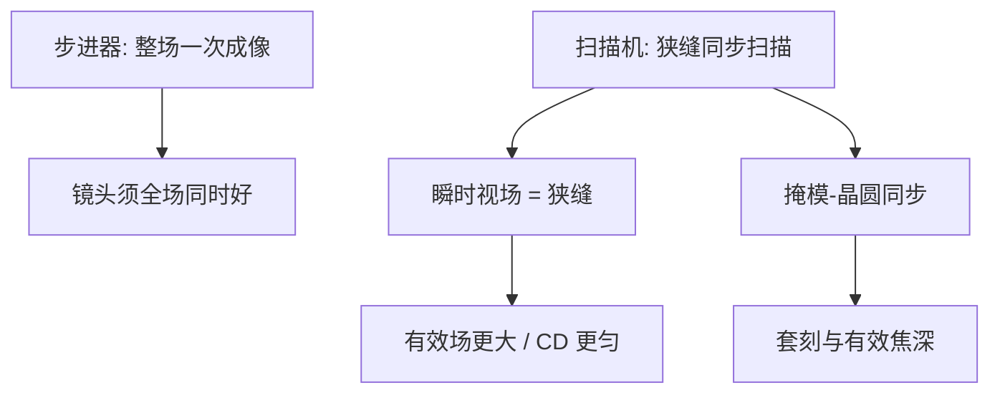

# 步进器与扫描投影

步进器一次把整个场印在晶圆上再挪步；扫描投影只照亮一条狭缝，掩模与晶圆同步扫过，镜头只需在狭缝里做到均匀。

<footer>—— 据 Levinson 对 step-and-repeat 与 step-and-scan 的区分，以及 ASML 对扫描机架构的公开说明整理</footer>

[上一课](/litho/twinscan-dual-stage)把测量与曝光拆到两张晶圆台上并行，默认光学已经是扫描投影。缺口是：还没有把「为什么是扫、而不是整场一次闪」写成合同。本课钉步进器（step-and-repeat）与扫描机（step-and-scan）的差别。成像栏到此结束；记录介质从[下一课](/litho/car-resist)的化学放大胶开始，不再回头解释工件台。

## 问题

双台解决的是片周期里测量与曝光谁先谁后。它不回答：一场 $26\,\mathrm{mm}\times 33\,\mathrm{mm}$ 量级的像，究竟是镜头瞬时满视场投影，还是一条狭缝扫出来的。早期步进器走前一条：掩模（reticle）静止，快门开一次，整场落在晶圆上，然后工件台步进到下一场。场一大，镜头必须在全场同时消像差、同时均匀照明，玻璃口径与均匀性一起爆炸。

扫描投影把照明收成与扫描方向垂直的狭缝，掩模台与晶圆台按缩比同步运动，狭缝扫过整场。瞬时视场只是狭缝宽度，镜头规格按「一条缝」写，有效曝光场可以更大、场内 CD 更匀。缺口因此是这场运动学，不是再讲一遍双台交换。

### 扫描不是为了「更快闪灯」

准分子脉冲在扫描方向上被积分成一条连续剂量。速度由脉冲能量、重复频率和目标剂量决定，不是步进器快门时间的线性升级。扫描同步误差（掩模与晶圆相对位置）会直接变成场内套刻与有效离焦——上一课的双台密网格，正是为这条同步服务的。把扫描理解成「步进器加一条传送带」，会漏掉同步就是光学的一部分。

缩比仍是典型的 $4\times$：掩模线性尺寸是晶圆的四倍。步进器和扫描机都可以是缩小投影；差别在场如何被填满，不在缩比本身。

## 方法

步进器：对准 → 整场曝光 → 步进。照明要铺满矩形场，光瞳在曝光瞬间对全场同一套。适合场不大、$\mathrm{NA}$ 不太高、套刻与 CD 均匀性要求较松的层。

扫描机：对准与调平之后，按场做步进–扫描。照明光瞳仍由 [$\sigma$](/litho/partial-coherence) 描述，但瞬时物面只是狭缝下的那一条。场内均匀性靠扫描积分，而不是靠把照明做成完美的大矩形。ASML 量产 DUV / EUV 平台都走这条，TWINSCAN 是它的双台版本。

### 何时步进器仍在

成熟节点、后段松层、某些封装与化合物产线，步进器或接近整场曝光的机型仍在用：光学简单、同步误差这项不存在。临界层在大场、高 $\mathrm{NA}$、浅焦深下，扫描是默认。本课不把「扫描=先进、步进=落后」写成道德；写成场尺寸与镜头均匀性的几何约束。

## 机制

整场成像时，视场边缘的主光线角、畸变、彗差必须与中心同时合格。狭缝扫描把「同时」改成「沿扫描方向积分」：每一点看到的是狭缝里那一小段镜头指纹的时间平均。这降低了对全场静态均匀性的要求，但加上运动轴：扫描方向的速度比必须锁在缩比上，垂直方向的狭缝必须与镜头像场匹配。

产能叙事与上一课衔接：扫描机的曝光时间是狭缝扫过场长的时间；双台把测量藏进这段时间。步进器没有「扫场」这笔，片周期结构不同，双台的收益账也不同。不要用 NXT 的 wph 去外推一台 i 线步进器。

照度均匀性在步进器里是二维场图；在扫描器里首先是狭缝积分均匀，再叠加扫描速度抖动。剂量控制从「快门时间」变成「速度 × 狭缝强度」。同步误差会变成场内畸变与 CD 指纹，这是步进器没有的误差通道。

ASML 浸没机公开场尺寸常见 $26\,\mathrm{mm}\times 33\,\mathrm{mm}$（晶圆侧）。$33\,\mathrm{mm}$ 是扫描方向拼出的场高，$26\,\mathrm{mm}$ 受镜头瞬时场宽限制。不要把两个数字都当成「镜头一次成像的圆直径」。

### 本课钉死的词

后课说「扫描机」就是 step-and-scan；说「步进器」就是 step-and-repeat。Twinscan 是扫描机上的双工件台，不是第三种成像几何。狭缝、同步、场尺寸，本课以后不再重讲。

## 边界

本课不讨论浸没喷淋头如何跟着狭缝走，那是[浸没](/litho/arf-immersion)的流体缺口。也不把 EUV 真空磁浮台的细节搬进来。扫描同步规格属于套刻预算，具体标记结构在计量课。胶的灵敏度会改扫描速度（剂量不够就扫慢），但那是下一课程的化学，不在运动学里展开。

场尺寸数字随机型变：ASML 浸没公开规格常用约 $26\,\mathrm{mm}\times 33\,\mathrm{mm}$ 的扫描场，不要把它写进所有历史步进器。步进器的场受镜头直径限制，往往更小，这正是当年改扫描的动机之一。

「Stepper」在口语里有时被用来统称所有光刻机。本课以后禁止这种混名：步进器是整场闪，扫描机是狭缝扫。

## 小结

- 步进器整场一次投影；扫描机用狭缝同步扫出有效场。
- 扫描降低对全场静态镜头均匀性的要求，把同步误差写进光学。
- 缩比与双台是正交的：TWINSCAN 是扫描机的产能架构。
- 成熟松层仍可用步进器；临界大场默认扫描。
- 成像课程到此结束，下一课进入抗蚀剂。
- 出处：Levinson, *Principles of Lithography*；ASML 对扫描投影与 TWINSCAN 的公开说明。
