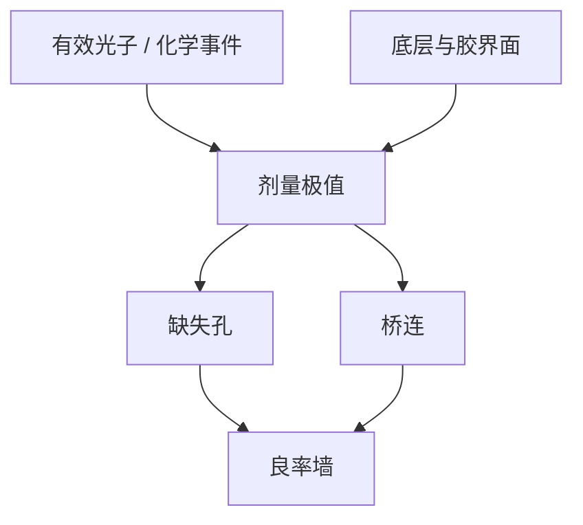

# 随机缺陷与缺失孔

平均 CD 仍在规格里时，接触孔阵列已经可以按泊松尾部丢孔。良率墙往往不是 Bossung 的均值，而是缺失孔的剂量悬崖。

<footer>—— 据 De Bisschop、Naulleau 对 EUV 随机失效与缺失接触孔的公开讨论整理</footer>

[上一课](/litho/resist-outgassing)（放气）。把胶下面的栈钉住：黏附、二次电子和硬掩模都进了平均行为。缺口是尾部。[随机效应](/litho/euv-stochastics)已经从光子计数讲过 LCDU 与 LER；本课不重算 $N$，只把失效模式收到产线最疼的那一种——接触孔缺失（以及对称的桥连）。底层与胶种改变有效 $N$ 和界面，但判决改成「百万分之一的孔没开」。

## 问题

E–D 窗切的是平均 CD。[euv-resist](/litho/euv-resist) 的 RLS 三角压的是分辨率、粗糙度、灵敏度。孔阵列上，泊松涨落让一部分孔的局部剂量掉到清场阈值以下，显影后是实心的「没开」；过剂量则相邻孔桥连。均值可以仍在 $\pm 10\%$ 内，缺陷密度已经不可接受。De Bisschop 把这类事件写成随机失效（stochastic failure），而不是工艺均值漂移。

Naulleau 一侧的公开论述强调：计量必须看见稀事件，SEM 抽样均值或 OCD 光栅平均都看不见缺孔率。缺口因此是把良率判据从 Bossung 换成剂量–缺陷曲线，不是再发明一种胶。

### 缺孔是极值，不是 3σ CD

LCDU 描述局部 CD 分布的宽度；缺孔是该分布越过「未开孔」阈值的尾部计数。高斯 $3\sigma$ 进不了 ppm 级良率。孔越小、对比越弱、底层二次电子越不均匀，同一平均剂量下尾部越肥。设计上的最小孔、最差衬度孔，会先掉下悬崖。

缺孔与桥连常在窗口两侧成对出现：欠剂量缺孔，过剂量桥连。只加剂量压缺孔，可能把桥连抬上来。重叠窗要两条缺陷曲线一起切。

## 方法

工程上画缺陷密度对剂量（有时再对焦）。公开图的典型形状是极陡：再加几 $\mathrm{mJ/cm^2}$，缺孔掉一个数量级，直到化学噪声或颗粒封顶。验收用电子束审查或专用缺陷检测，而不是把 OCD 均值当「零缺陷」。抽样面积必须大到能看见目标缺陷率，否则「本场没看见」只是统计无能。

缓解仍是随机课的四条杠杆，本课只强调孔层权重：加剂量、加 NILS、换高吸收胶/底层、放宽孔或加冗余通孔。OPC 若只拟合平均轮廓，会把弱孔修到悬崖边。随机感知的目标函数是失效概率，不是中心 CD。

### 底层如何进尾部

上一课的 underlayer 改界面二次电子与黏附。黏附差表现为剥落和局部未显影，看起来像缺孔，根子不是光子泊松。二次电子产额涨落则是真随机。分析要拆：重复性差的「系统缺孔」（掩模、热点）对可修；泊松尾要对剂量和对比。把 OPC 能修的东西加成剂量，是在买产能。

## 机制

孔的打印是阈值过程：局部吸收事件数不够，潜像达不到溶解连通。面积 $\propto CD^{2}$，缩孔时 $N$ 按平方掉，尾部比线宽 LCDU 更敏感——这就是为何孔层往往先于线层撞随机墙。模糊核（酸扩散、二次电子）既平滑方差也糊分辨率：过小的核把分子离散印成死孔，过大的核把相邻孔粘上。

掩模吸收体 LER、多层缺陷会以固定图案冒充随机。De Bisschop 的公开分析把可重复缺陷与真随机分开：前者对掩模/OPC，后者对剂量与胶。混在一张缺孔图里，会同时修错两边。

「无随机胶」是宣传句。理想阈值胶在 $N$ 小时仍有泊松。胶和底层只改有效 $N$ 与模糊，不能让统计消失。

### 与平均窗口的叠加

名义 E–D 窗可以很大，缺陷窗可以瘦到只剩一条剂量缝。产线停在缺陷悬崖上方，而不是瑞利极限或平均 EL 最大处。High-NA 提高 MTF 可能帮弱孔，但目标孔若跟着缩小，账要重算——随机课已经写过，这里只把它读成孔层合同。

## 边界

本课不提供任何节点的缺孔 ppm 承诺，也不把某次 SPIE 海报上的剂量数字写成宇宙常数。颗粒、气泡、掩模缺陷必须先从「随机」里剔掉，否则剂量杠杆会空转。电镜审查本身有收缩与漏检，缺陷率曲线要声明检测阈值。

抗蚀剂化学课序到此：胶种、底层、随机尾部已经能接到计量。后课默认：说到 EUV 孔层合格，先问缺陷剂量窗，再问平均 CD。

冗余通孔是设计买的随机保险，不是光学免费午餐。它改的是电路连通概率，不改单孔的泊松。

## 小结

- 缺失孔是随机失效的极值事件，平均 CD 合格仍可死于尾部。
- 判据是剂量–缺陷曲线，不是 Bossung 均值；OCD 看不见缺孔。
- 欠剂量缺孔、过剂量桥连，要两条曲线切重叠窗。
- 可重复热点对 OPC/掩模；真泊松对剂量、对比、胶与底层。
- 出处：De Bisschop、Naulleau 关于 EUV 随机失效与缺失孔的公开讨论；Bakshi 对光子噪声的框架。
