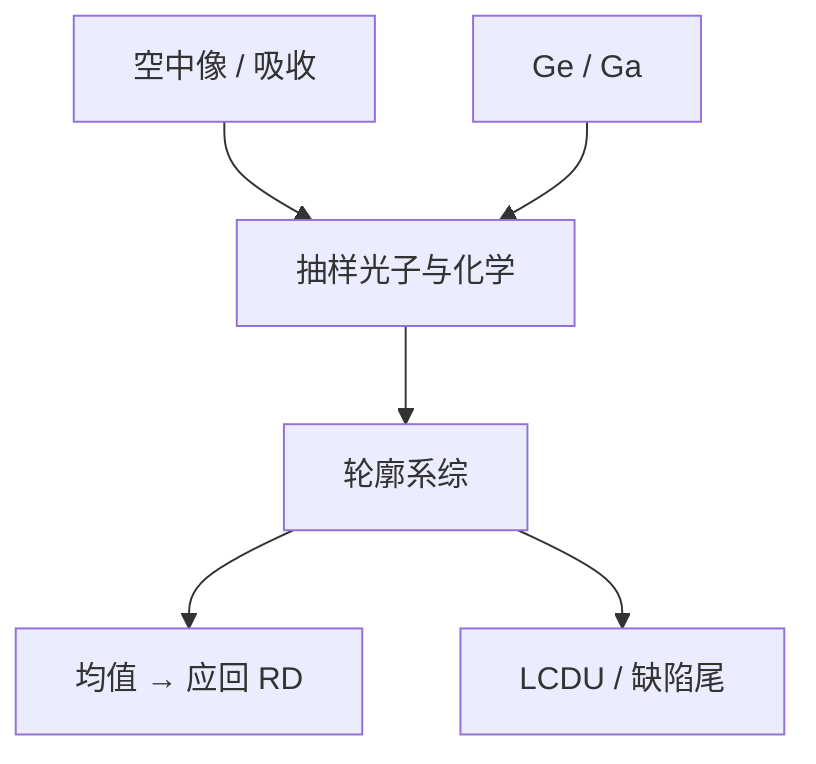

# 随机性 Monte Carlo 仿真

连续 RD 给出平均轮廓；缺陷率问的是百万分之一的尾。要把光子、电子核、酸与碱抽样出来，均值方程不够。

<footer>—— 据 Naulleau 等对随机抗蚀剂建模与重复曝光实验的公开框架整理</footer>

[上一课](/litho/secondary-electron-blur-model)给出平均场可卷积的 $G_e$。缺口是实现离散：Monte Carlo 按泊松抽吸收，再抽电子/酸/碱，推进显影，统计边与失效。本课钉这套仿真该抽什么、如何对实验，不写某软件的输入卡。LER 的功率谱如何读 MC 输出，留给[下一课](/litho/ler-psd)。

## 问题

[随机效应](/litho/euv-stochastics) 的缺陷是极值。平均场阈值模型没有尾部。MC 的最小内容：（1）按局部剂量抽吸收事件；（2）每个事件用 $G_e$ 放酸；（3）预置碱位置（随机或团聚）；（4）PEB 中和与扩散可用随机行走或核；（5）显影用 $R$ 或阈值。重复许多次，得 CD 分布、LER 实现、桥/断指示。

缺口不是再定义泊松，而是：哪些自由度必须抽，哪些可以留在核里。网格上给连续 $h$ 再加白噪声，不是 MC——它忽略体积相关与分支过程，会把频谱抽错。

### 要对的是重复曝光，不是掩模 LER

同一掩模、同一场重复曝光，CD 仍跳的那部分才是本课对象。掩模边缘粗糙是固定图案，MC 若不把掩模冻结，会把 PPE 算进随机。Naulleau 的实验语法是这条对拍。

SEM 噪声也是一次「抽样」。MC 输出要对真几何或声明过的计量核；把 SEM 白噪声拟合进胶 MC，剂量一改就穿帮。

## 方法

收敛：缺陷率目标若是 $10^{-6}$，朴素抽样要海量晶圆。工程用：加大统计的局部窗口、重要性抽样、或先拟合 CD 分布再外推尾——外推必须声明分布族，高斯 $3\sigma$ 进不了 ppm。校准：先对平均 CD 与 Bossung（均值应回到 RD），再对 LCDU–剂量斜率，再对稀事件。只拟合 LWR 一个数，频谱和尾都会错。

计算预算：全芯片 MC 不可行。用在热区、孔阵列、资格胶。OPC 仍用均值紧凑模型，至多加随机感知的目标函数，而不是每碎片抽分子。

## 机制

每个实现对应一张显影后边。边的系综均值应等于平均场轮廓，否则抽样或显影非线性实现有偏。方差来自光子与化学；相关来自核——下一课 PSD 就是这张相关的傅里叶读出。失效：局部有效酸低于阈值的连通域，表现为断线或未开孔；过连通表现为桥。MC 的价值是让「悬崖」可计算，而不是给出更好看的平均 CD。

分支：一个 92 eV 光子可产多酸，酸数方差可以大于泊松。忽略 Fano / 分支会低估尾。Kozawa 路径在 MC 里就是分支过程，不是把 $Y$ 乘在均值上了事。

金属氧化物 MC 抽的是团簇吸收与配体事件，不是 PAG。换胶族等于换抽样对象，不能只改剂量标尺。

## 边界

不发明未发表的截面文件名。不把实验室计量胶的 MC 参数写成 NXE 量产规格。下一课把 MC 边序列变成 PSD；没有谱，只报 $3\sigma$ LER，无法判断核有没有抽对。

## 小结

- MC 抽样光子、电子核、酸/碱（或团簇），输出轮廓系综与尾。
- 均值必须回到 RD；对拍用重复曝光不是掩模 LER。
- 白噪声加在连续 $h$ 上不是随机胶模型。
- 全芯片不跑 MC；热区与资格才跑。
- 出处：Naulleau 随机建模与实验语法；主干 [euv-stochastics](/litho/euv-stochastics)。
