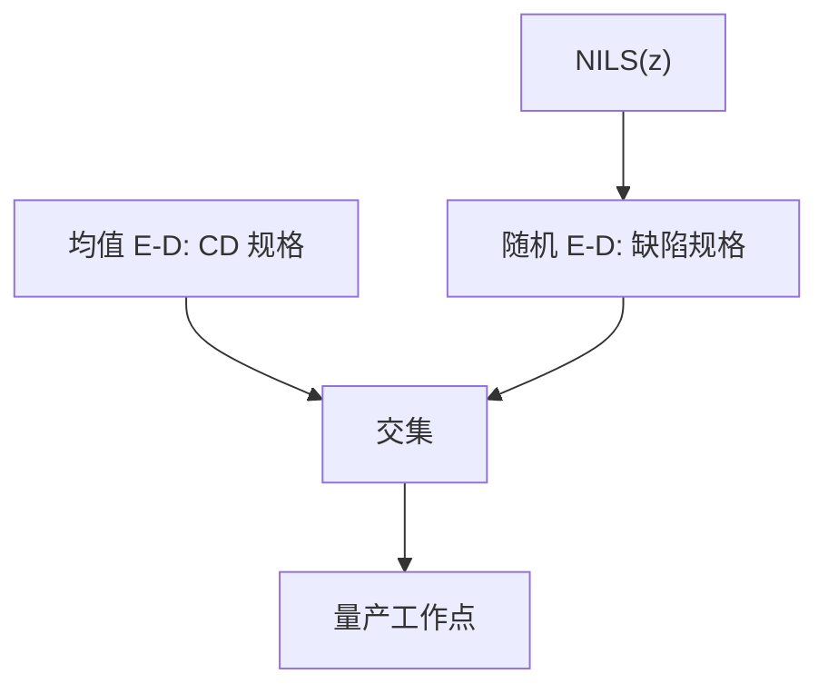

# 随机工艺窗口

E–D 窗切的是平均 CD；随机窗切的是桥/断/缺孔是否仍在规格以下。量产停在两块面积的交集上，往往是随机这块先没。

<footer>—— 据 De Bisschop 对随机失效窗；Mack 的均值 E–D 定义仍适用，只是判据换成缺陷</footer>

[上一课](/litho/rls-tradeoff)把材料点放在三角上。[E–D 窗口](/litho/ed-process-window) 在主干切平均 CD。缺口是第二张窗：剂量与焦漂的时候，缺陷率是否仍可接受。本课钉随机工艺窗口。化学上如何把这块面积做大，留给[下一课](/litho/chemical-stochastic-mitigation)。

## 问题

均值窗：Bossung 被 CD 规格带横切。随机窗：同一矩阵上画 $D_\mathrm{def}$ 或 NOK，用缺陷规格横切。离焦掉 NILS，悬崖向内推，随机窗在焦轴上通常比均值窗更窄。过剂量均值 CD 也许还在 $\pm 10\%$，断线率已经超标。

缺口不是重画 Bossung，而是：层的合格区是交集。只交均值窗会把量产停在随机悬崖边。High-NA 均值焦深已经薄，随机窗再削一刀，剂量不能再为了产能往下探。

### 多图形重叠更狠

密线、孤立线、孔的悬崖位置不同。随机重叠窗是各类缺陷曲线的交集，往往比均值重叠窗小得多。RET 把某一类 NILS 做高，可能把另一类的随机崖推近。SMO 必须用缺陷着色，而不是只用均值 EL。

计量面积不够时，随机窗会被「本场零缺陷」乐观估计。验收抽样必须匹配规格数量级。

## 方法

曝光–散焦矩阵 + 大面积检。输出：均值 E–D 与随机 E–D 两张图，再画交集。模拟：均值用 RD / LPM，尾用 MC 或经验 NOK(CD) 乘 LCDU。校准必须含离焦点，因为 NILS(z) 是随机增益。pellicle 透过率损失若未用源功率补回，等于整张随机窗向剂量轴负向平移。

与[剂量–焦耦合](/litho/dose-focus-coupling)：胶核改均值弯曲，也改随机窗——糊核可能让均值 Bossung 变平，同时把缺陷地板抬起来。两张图一起看，才能识破「假焦深」。

## 机制

工作点在剂量–焦平面上。每个点对应一个局部 CD 分布与连通性尾。离焦使分布变宽（NILS 降），尾越过桥/断阈值的概率升。剂量平移均值，相对两座悬崖的距离改。最佳随机工作点不一定是均值等焦点：等焦可能切在更缓的化学位置。这是耦合课「平不等于好」的缺陷版。

EUV 源功率与 wph 把允许剂量封顶，随机窗的右边界是产能，左边界是缺陷。量产停在悬崖上方，不是停在瑞利极限上——主干随机课的句子，本课给它一张平面。

套刻窗是第三块面积，不在本课。EUV 双重会让随机窗与套刻窗同时出现；单次 High-NA 减轻套刻、加重单层随机。

## 边界

不引用未公开的机台随机窗验收表。不把某胶在最佳焦的「无缺陷」宣传外推到离焦。下一课化学抑制（负载、PDQ、高吸收、均匀分散）是在材料上把随机窗撑开，光学 RET 是另一轴。

## 小结

- 随机工艺窗口用缺陷规格切 E–D，与均值 CD 窗取交。
- 离焦掉 NILS，随机窗通常先于均值窗关上。
- 多图形缺陷重叠是层的真窗。
- 假等焦可以骗均值、骗不了悬崖。
- 出处：De Bisschop 随机失效；Mack E–D；主干窗口与 [euv-stochastics](/litho/euv-stochastics)。
