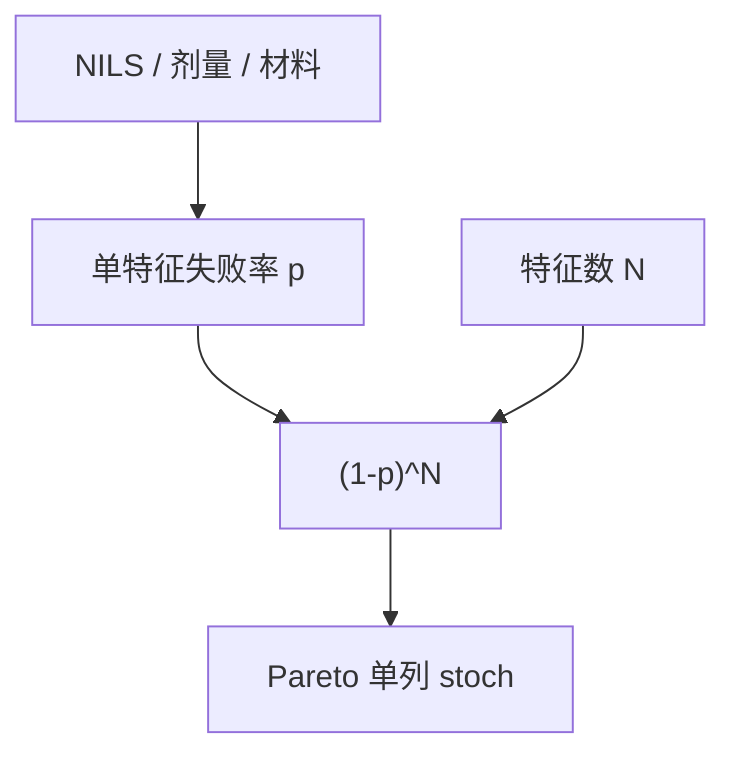

# 随机性良率

EUV 的缺孔与桥连可以在无颗粒、OPC 绿灯时仍按光子与分子计数抽签；这笔良率不进 Poisson 颗粒账，而进随机窗。

<footer>—— 对照 De Bisschop / Naulleau 对随机失效的公开论述；[随机工艺窗口](/litho/stochastic-process-window) 已切第二张窗</footer>

[上一课](/litho/systematic-vs-random-defects)拆开系统与随机。缺口是随机内部：颗粒关键面积解释不了「同一孔阵列、剂量仍在均值窗内」的打开失败。[随机窗](/litho/stochastic-process-window) 与 [z 因子](/litho/stochastic-z-factor) 已有物理；本课钉它如何进良率，不重推 RLS 三角。光学与电子束如何看见这些缺陷，留给[下一课](/litho/defect-inspection-optical-ebeam）。

## 问题

随机性良率：$Y_\mathrm{stoch} \approx (1-p)^N$，孔或线端独立失败率 $p$，特征数 $N$。$N$ 在 SRAM 和 via 阵列上巨大，于是 $p$ 必须极小。剂量、NILS、酸分子数推 $p$；这与颗粒 $D$ 独立相乘。把缺孔当颗粒去抓洁净，ROI 为零。

缺口是**统计合同**，不是再写蒙特卡洛。量产要规定：随机缺陷规格（ppb 级）、如何抽检（电子束点数）、以及剂量下限不得为产能突破随机窗。

### 与 LER 平滑的关系

转印平滑可降 LER 3σ，不降缺孔 $p$。拓扑事件与边粗糙是不同阶。报表只写 LWR 会假装随机良率已好。

系统热点处 $p$ 升高，看起来像「随机很多」。先修 NILS，再报 $Y_\mathrm{stoch}$。

## 方法

估计 $p$：电子束抽检阵列、电学 via 链、SRAM 位失败分类。外推到全芯片 $N$。与 PWQ：过程角上 $p(E,z)$ 的等高线即随机窗。与剂量：光子预算课已有；本课要求良率 Pareto 单列 stoch。重工对光子随机几乎无效（换一组抽签），分派课已预警。

$N$ 要用设计里的实际孔/线端数，而不是芯片面积。De Bisschop 与 Naulleau 的公开论述都把失败当成特征事件；本课把这句话写成良率公式的 $N$。

## 机制

Bernoulli 试验在弱相关时用独立近似；相关长度课说明邻近孔可能相关，则有效 $N$ 下降、方差变，负二项又出现——但是化学簇而不是颗粒簇。剂量升降低 $p$、伤吞吐与损伤。材料换 z 因子。这些旋钮都不在 CMP dummy 里。

p 与 N 来自特征事件，不是芯片外形面积。剂量下限由随机窗约束，不能为产能往下探。

## 边界

不重写二次电子全文。不编造某节点 ppb 数字。DUV 随机通常不是主导，但薄胶高 NA 不要假装为零。

后课默认：$Y_\mathrm{stoch}$ 单列，与颗粒相乘。下一课检测必须能看见这些小事件，否则 Pareto 是盲的。

## 小结

- 光子/化学随机是 Bernoulli 特征失败，不是颗粒 $DA$。
- 阵列 $N$ 迫使 $p$ 进 ppb；剂量下限受随机窗约束。
- 重工几乎不救光子抽签。
- 系统热点处 $p$ 升高，应先修 NILS 再报随机良率。
- 出处：De Bisschop、Naulleau 随机失效公开论述；Mack 随机窗衔接。
