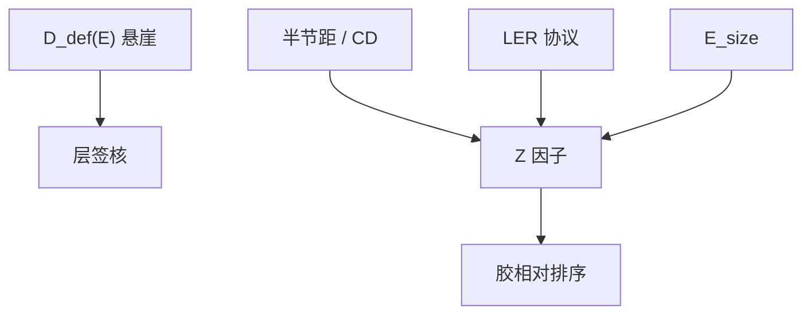

# 缺陷率与 Z 因子

悬崖有多远，可以用失效概率说，也可以用一个把分辨率、粗糙与灵敏度捆在一起的 Z 因子来比较胶。两个数回答不同的签核问题。

<footer>—— 据 Bristol / Gallatin 一类 RLS 综合因子的公开用法；缺陷率曲线见 De Bisschop / Naulleau</footer>

[上一课](/litho/bridge-break-defects)画出桥/断悬崖。缺口是比较：换胶、换剂量、换模糊时，用什么标量说「随机更好」。本课钉缺陷率曲线，并引入光刻里常称的 Z 因子（把分辨率、LER、灵敏度合成的优值），不把它神化成唯一物理。光学 NILS 如何压同一条悬崖，留给[下一课](/litho/stochastics-vs-nils)。

## 问题

缺陷密度 $D_\mathrm{def}(E)$ 往往对剂量极陡，直到化学地板。签核问的是在目标 $E_\mathrm{size}$ 上 $D_\mathrm{def}$ 是否低于规格，以及离悬崖还有几 mJ。这是产线数字。Z 因子则是材料/工作点的综合优值，公开形式常把半节距（或 CD）、LER 与 $E_\mathrm{size}$ 乘成分数——量纲设计成「越小越好」的随机负担。它便于胶与胶比，不替代某一层的 $D_\mathrm{def}(E)$ 曲线。

缺口是禁止偷换：Z 低不等于该层缺陷已经过关；缺陷过关也不等于 Z 在所有节距最优。Gallatin / Bristol 一类讨论把 Z 放在 RLS 平面上，本课先引入，三角课再展开权衡。

### Z 不是统计 z 分数的别名

失效也可以写成「阈值离均值多少个 $\sigma$」。那个 $z$ 是尾部概率的坐标。综合优值 Z 是另一套符号。文献里有时混用字母。本课约定：大写 Z 因子指 RLS 综合优值；说到尾部距离用「多少个 $\sigma$」或「相对悬崖的剂量裕量」，避免字母打架。

不要给 Z 发明一条「标准公式」当课标常数。公开文章的幂次（CD 的几次方、LER 的平方等）随作者略有出入。引用时写清哪一篇的定义，禁止抄未发表的内部式。

## 方法

缺陷率：大面积检，画 $\log D_\mathrm{def}$ vs $E$ 与 vs CD，读目标点与斜率。斜率像泊松时，加剂量有效；出现地板，加剂量浪费产能，该换胶或对比。Z 因子：在声明的节距、剂量、LER 协议下算，只用于相对排序。换计量滤波等于换 Z，必须冻结协议。

与 MC：MC 可以同时输出 $D_\mathrm{def}$ 与用于 Z 的 LER、$E_\mathrm{size}$。三者应同向，但二维热区的 $D_\mathrm{def}$ 可以比一维线的 Z 更差。

## 机制

泊松尾下，$\log D_\mathrm{def}$ 对有效 $N$ 近似线性下降。有效 $N$ 来自剂量、吸收、产额、体积。LER 幅度来自同一套涨落被 ILS 放大。把 CD、LER、$E$ 乘起来，是在说：更细的线、更毛的边、更敏（更少光子）都加重随机负担。Z 因子是这句口语的无量纲化尝试，不是新物理。真正的悬崖位置还取决于 NILS 与图形类别——下一课。

化学地板：团聚、颗粒、固定掩模缺陷让 $D_\mathrm{def}$ 不再随剂量掉。Z 仍可能很好看（计量 LER 在干净线上测）。所以缺陷曲线不能省。

High-NA 把 CD 缩小，Z 的分辨率项变差，必须靠 LER 与剂量补；补不回来就不是「NA 高了随机消失」。

## 边界

不把某一会议的 Z 排行榜写成供应商排名课标。不发明 arXiv。下一课把 NILS 明确乘进同一套尾，Z 因子本身通常不含光学项，这是它的边界。

## 小结

- 层签核看 $D_\mathrm{def}$ 相对悬崖的裕量；Z 因子用于声明协议下的胶排序。
- Z 综合 CD、LER、灵敏度，不是统计 z 分数。
- 化学地板让加剂量失效；Z 好看仍可能缺陷不过关。
- 公式幂次以所引公开定义为准，不编内部式。
- 出处：Bristol / Gallatin 对 RLS 优值；De Bisschop / Naulleau 缺陷率。
