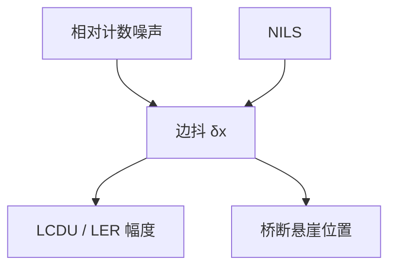

# 随机性与 NILS

同样数目的光子涨落，切在陡坡上只走一点边，切在缓坡上就断或桥。NILS 是随机的光学放大器，不是胶参数。

<footer>—— 据 Mack 对 NILS；Naulleau 对对比度 / 斜率与 LCDU、缺陷的公开讨论</footer>

[上一课](/litho/stochastic-z-factor)的 Z 因子通常不含光学项。缺口是把[NILS](/litho/nils-ils) 乘进同一套尾：[随机效应](/litho/euv-stochastics) 已说过对比越高、同样 $\Delta n$ 造成的 $\Delta\mathrm{CD}$ 越小。本课把这句话写成缺陷率与 LCDU 对 NILS 的敏感，而不重导 ILS 定义。分辨率–LER–灵敏度三角如何同时动，留给[下一课](/litho/rls-tradeoff)。

## 问题

边位移 $\delta x\approx \delta I/(dI/dx)$。相对强度噪声 $\delta I/I$ 来自光子与化学计数，于是 $\delta x$ 反比于 ILS，相对 CD 噪声反比于 NILS。Z 因子再好的胶，落到禁戒节距的缓坡上，悬崖仍会贴上来。缺口不是再定义 NILS，而是：随机预算必须按图形类给光学项，不能只给胶的 Z。

加 NA、换 SMO、加助条，首先改的是 NILS，从而改有效噪声增益。加剂量改的是 $\delta I/I$ 的幅度。两条杠杆不要写成一个「对比度」。光学 $C$ 高通常 NILS 也高，但切点不在最陡处时，只报 $C$ 会撒谎——主干 NILS 课已强调，随机上更致命。

### High-NA 不是自动降随机

0.55 可以提高同一尺寸孔的 MTF / NILS，有助于 LCDU。目标尺寸若跟着缩，面积掉、$N$ 掉，NILS 增益可能被体积抵消。[euv-stochastics](/litho/euv-stochastics) 已警告账要重算；本课指出重算的光学入口就是新的 NILS 图，不是瑞利 CD 公式。

阈值必须声明。换 $I_\mathrm{th}$ 等于换读斜率的位置，随机增益跟着变。胶 $\gamma$ 改有效切点，光学 NILS 与胶耦合，又回到剂量–焦耦合课，不是新光学。

## 方法

同一胶、同一剂量，换照明或 OPC 看 LCDU 与 $D_\mathrm{def}$：若 NILS 升而剂量不变，改善应归光学。同一照明，加剂量：NILS 几乎不动，改善归 $N$。把两张矩阵分开，才能填随机预算的「对比项」与「剂量项」。模拟：均值空中像给出 NILS，MC 给出尾；禁止用均值 EPE 代替失效概率。

弱孔、线端、二维拐角先画 NILS 热图，再决定哪里要随机感知 OPC。

## 机制

计数噪声是强度的相对涨落（泊松）或酸数的相对涨落。除以当地斜率之后变成纳米。NILS 把斜率无量纲化到目标 CD，便于跨尺寸比：NILS=1 的边，几个百分点的剂量噪声就是几个百分点的 CD 噪声量级。缺陷作为越过间距或线宽阈值的事件，对这个增益指数敏感——所以公开图里「NILS 再高一点，缺孔掉一个数量级」与「再加几 mJ」可以同样陡。

模糊核降低 NILS（潜像），同时降低噪声高频。净效果对 LCDU 不一定单调，这正是下一课 RLS 三角的来源。本课先把光学 NILS 与材料核分开记账。

flare 抬 $I_\mathrm{min}$，切点移到更缓处，NILS 掉，桥崖前移。杂散光是随机预算的光学项，不是胶脏了。

## 边界

不重推 $\mathrm{NILS}=\mathrm{CD}\cdot\mathrm{ILS}$ 的代数——见主干。不把「NILS>2」写成全球量产门槛。下一课把分辨率（要锐核）、LER（要糊核）、灵敏度（要少光子）写成不能同时最优的三角。

## 小结

- 随机边抖反比于 NILS；光学项必须按图形进入预算。
- 加 NILS 与加剂量是不同杠杆，要用对照矩阵拆。
- High-NA 改 NILS 也改面积，账要重算。
- 潜像核会再砍 NILS；与光学 NILS 分列。
- 出处：Mack 的 NILS；Naulleau 对斜率与随机计量。
