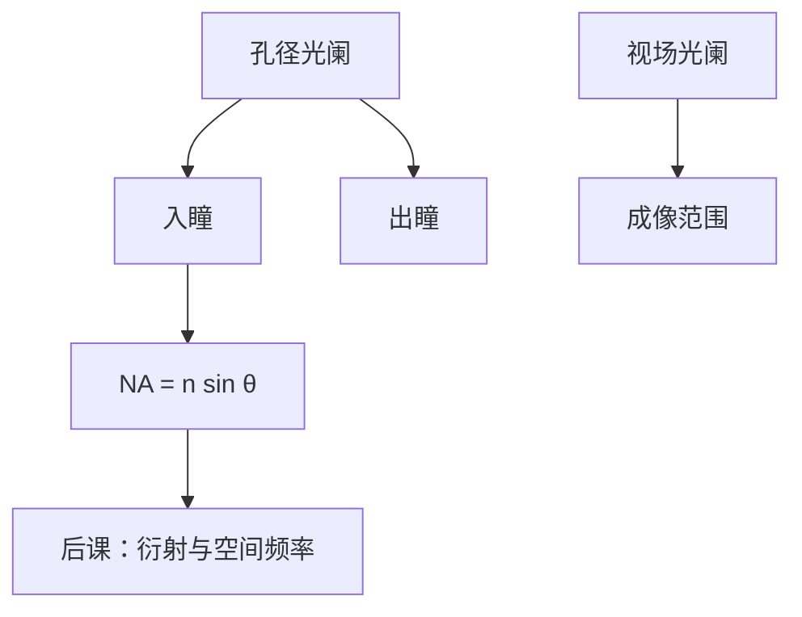

# 光阑、光瞳与视场

光阑限制光束截面；入瞳与出瞳是孔径光阑在物方与像方的共轭；视场决定一次能成像的范围，三者不是同一个孔。

<footer>—— 据 Born &amp; Wolf, Principles of Optics 对光阑与光瞳的整理</footer>

[上一课](/litho/focal-magnification)把横向放大 $M$ 钉死。本课不重解共轭距离。缺口是：谁决定进透镜的光锥有多胖？哪里是后课所说的「光瞳平面」？数值孔径、照明填充、离轴方向，都要先挂在光瞳上。

## 问题

成像方程与 $M$ 都不含孔径大小。同一 $f$ 下，孔径大则收集角大，衍射极限潜力高，但像差与焦深代价也大。若分不清物理光阑、入瞳、出瞳与视场光阑，后课「在瞳上选角度」没有附着点。缺口是几何光学里的光阑语言，不是再写一遍 $M=-s'/s$。

### 入瞳不是物镜第一片玻璃

孔径光阑是真实的机械或光学限制孔。入瞳是它在物空间的共轭像，出瞳是它在像空间的共轭像。光线在图上「穿过入瞳」，几何上可能穿过一块虚像。光刻口语里的「光瞳面」常指物镜的频谱平面，近似夫琅禾费面，与入瞳/出瞳共轭；读文献时认的是「角度选择器」，不是某一片镜的表面。

像方数值孔径 $\mathrm{NA}=n\sin\theta_{\max}$，$\theta_{\max}$ 是轴上点在像方的最大半角，$n$ 是像方介质折射率。视场光阑限制的是视场直径，不直接等于 NA。

## 方法

轴上物点发出的最大光锥由孔径光阑决定。像方 $\mathrm{NA}=n\sin\theta_{\max}$ 用该锥的边缘光线定义。视场光阑（或扫描狭缝）限制成像区域：步进曝光一次照全场，扫描曝光用狭缝加同步运动拼全场。本课只建立「瞳选角度、视场光阑选范围」，照明在瞳上填环形或偶极等形状，留给后课部分相干，本课不把照明配方写完。

孔径光阑若放在错误的共轭，入瞳会跑到物面附近，视场边缘被突然挡掉，出现渐晕。光刻投影把孔径放在频谱面附近，正是为了让 NA 对全视场尽量同一，而把渐晕留给照明均匀度去管。视场光阑则不应去限制 NA：两个孔职能分开，后课才不会把「开大孔径」和「加大曝光场」说成一件事。

远心：像方主光线近似平行光轴，晶圆离焦时倍率几乎不变，只变模糊，套刻更稳。物方远心则掩模离焦主要造成模糊而非 $|M|$ 漂移。光刻投影常做成像方远心；本课记下这条几何约束，不进入镜头设计。

远心不是「没有光阑」。光阑仍在，只是出瞳在无穷远，主光线平行轴。有限远出瞳会让离焦改 CD，套刻预算立刻变差。

## 机制

光瞳是空间频率的守门人：只让 $|k_\perp|\lt nk_0\sin\theta_{\max}$ 的平面波分量通过，更高频被截断。这是衍射极限的几何来源。本课程还不到把极限写成产线 CD 的时候；这里只需承认：开大孔径光阑就是放进更大的 $|k_\perp|$。

视场与孔径互相制约：离轴视场吃像差（下一课），开大视场还吃均匀照明与畸变。扫描狭缝是在瞬时视场与均匀度之间的工程折中。本课不把扫描仪机械写进来。

数值孔径里的 $n$ 是像方介质：空气中 $n\approx 1$，浸没液体 $n\gt 1$，于是同一几何角可以对应更大的 NA。这只是定义，不是本课去推导浸没工艺。物方锥角还要经 $|M|$ 与像方锥角配对，否则拉格朗日不变量对不上，光能耦合会在下一课 étendue 里再出现一次。本课先保证：说到 NA，先问在哪一方、相对哪一个光瞳。

## 边界

本课几何、旋转对称、单色。Seidel 像差下一课才分类。亮度与光学扩展量再下一课。也不展开照明器如何在瞳上整形。

渐晕、杂散光与瞳切趾会改有效 NA，但不改本课定义：NA 仍由边缘光线的几何角来写。后课默认：NA 在像方用 $n\sin\theta_{\max}$ 定义；光瞳平面是角度（横向 $\mathbf{k}$）的选择面；视场由视场光阑或扫描狭缝限制。下一课 [几何像差一览](/litho/geometric-aberration-tour) 问近轴之外光线落在哪。

## 小结

- 孔径光阑决定光锥；入瞳、出瞳是它的共轭，不是第一片玻璃本身。
- 像方 $\mathrm{NA}=n\sin\theta_{\max}$；视场光阑另管成像范围。
- 光瞳截断横向波矢；远心约束离焦时的倍率。
- 照明在瞳上的填充形状不在本课展开。
- 孔径光阑与视场光阑职能分开：开大 NA 不是加大曝光场。
- 出处：Born &amp; Wolf, *Principles of Optics*；Hecht, *Optics*。
