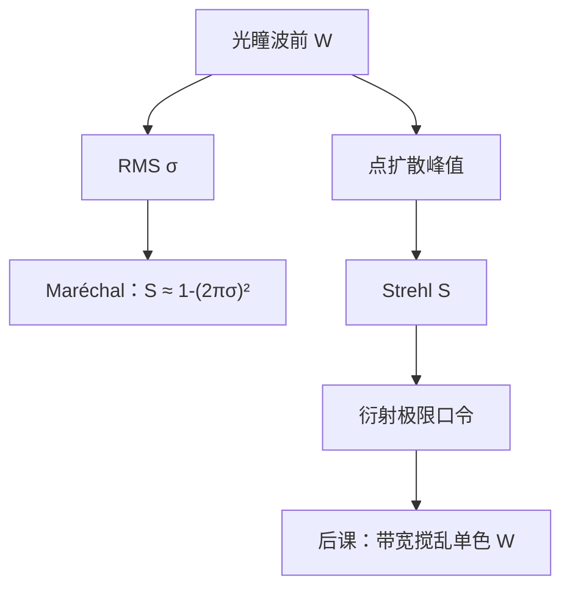

# Strehl 比

单项像差已经能把核拉歪、劈焦、搬家；还需要一个标量，问整块光瞳离「无像差圆孔」还有多远——Strehl 比把峰值强度收成衍射极限判据。

<footer>—— Strehl 定义与 Maréchal 近似见 Born &amp; Wolf, Principles of Optics</footer>

[上一课](/litho/distortion-field)把不糊的场相关平移写成畸变。缺口是：**对比与套刻拆完之后，仍缺一条「系统还能不能叫衍射极限」的总判据**。Strehl 不替代 NILS，也不替代套刻指纹。有限带宽如何把单色系数搅在一起，留给[色差与光源带宽](/litho/chromatic-bandwidth)。不要从瑞利 CD 起笔，也不要引用未公开的镜头 Strehl 验收数。

## 问题

球差、彗差、像散各自改核的形状；畸变甚至几乎不改峰值。车间要一句话回答：这块波前的 RMS 是否还小到可以当理想光瞳。Strehl 比

$$
S=\frac{I_\mathrm{peak}}{I_\mathrm{Airy}}
$$

是有像差点扩散中心（或配平后的峰值）相对同一孔径无像差艾里峰值的强度比。$S\to 1$ 表示能量仍集中在主瓣。缺口因此是这条**无量纲总指标**，而不是再增加一个 Seidel 项。

Maréchal 把小像差下的 $S$ 连到波前 RMS：相位误差不大时，$S\approx\exp\bigl[-(2\pi\sigma)^2\bigr]\approx 1-(2\pi\sigma)^2$，其中 $\sigma$ 是光瞳上 $W$ 的均方根（以波长为单位）。传统「衍射极限」口令 $S\gtrsim 0.8$ 大约对应 $\sigma\lesssim\lambda/14$。这是显微镜 / 镜头车间的判据，不是光刻的 $k_1$。

### Strehl 看不见的东西

畸变主要搬家，峰值可以仍高，$S$ 很好，套刻很差。切趾压低边缘透过率，即使 $W=0$，$S$ 相对硬切艾里的定义也要声明参考光瞳。部分相干下晶圆上没有单一「峰值点扩散」，Strehl 仍是投影通道的镜头指标，不是空中像 NILS。

参考必须写清：相对无像差、同孔径、同切趾的峰值，还是相对理想 circ。换参考，$S$ 换数。

## 方法

干涉仪拟合出 $W$（Zernike 截断 + 残差），算 RMS $\sigma$，再用 Maréchal 估 $S$，或直接对复光瞳做傅里叶变换读峰值。Malacara 的车间测试给出 $W$；Born &amp; Wolf 给出 $S$ 与 $\sigma$ 的关系。大像差时指数近似崩溃，必须积分点扩散，不能靠 $\lambda/14$ 口令。

光刻用途：镜头出厂与加热补偿用 $S$ 或 $\sigma$ 当健康度；层是否可印仍看该图形的 NILS 与套刻。密图形走光瞳边缘，对高阶径向项比 RMS 更苛刻——$S$ 合格可以 NILS 不合格。

### 与 MTF、NILS 的分工

MTF 是频率轴；NILS 是阈值边；Strehl 是点物峰值。三者相关：$\sigma$ 大则高频 MTF 掉、峰值掉。不可互换：对比反转时 MTF 变号，Strehl 仍可能是一个中等正数。工艺窗口用 NILS$(z)$，不用 $S(z)$ 冒充。

矢量成像里「艾里峰值」本身依赖偏振与薄膜。报 $S$ 要声明标量还是指定偏振通道；不要把 TE 的 $S$ 借给 TM 密线。

## 机制

无像差时，光瞳上各面元在几何焦点同相叠加，峰值最高。残差相位让一部分面元失配，峰值能量被打进旁瓣与环，$S$ 下降。Maréchal 把小相位的二阶展开收成 $\sigma^2$，所以低阶与高阶只要 RMS 相同，近似给出同一 $S$——这正是它的边界：光刻密图形并不对所有空间频率一视同仁，边缘加权的高阶项更伤 NILS。

活塞不进 $\sigma$ 的有意义部分；整体倾斜只搬家（远心 / 畸变），适当扣除后才谈 Strehl。配平（加 $Z_4$ 抵球差）是为了提高 $S$ 或压 RMS，与焦深课选窗口中心是同一类操作。

### 后课默认的接口

说到镜头是否接近衍射极限，用 $S$ 或 $W_\mathrm{RMS}$，并声明参考光瞳与 Zernike 截断。说到可印，用 NILS / 套刻。下一课把单色 $W$ 变成 $\lambda$ 的函数，$S$ 必须对光谱加权，不能只用中心波长的 Maréchal。

## 边界

Strehl 不含杂散光、不含胶扩散。禁止把某代投影物镜的 Strehl 写成未公开验收值；Born &amp; Wolf 与 Maréchal 的公式已经够用。High-NA 变形光瞳的「理想峰值」要另定义参考。畸变已在上一课拆走：谈 $S$ 时默认已扣除纯平移。

## 小结

- Strehl 是有像差峰值相对理想艾里峰值的比；小像差下 Maréchal 连到 $W_\mathrm{RMS}$。
- $S\gtrsim 0.8$ 是车间衍射极限口令，不是产线 $k_1$。
- 看不见畸变套刻，也不替代 NILS。
- 参考光瞳、截断阶数、标量 / 矢量必须声明。
- 单色 $S$ 下一课要对带宽积分。
- 出处：Born &amp; Wolf, *Principles of Optics*；Maréchal 衍射极限判据。
