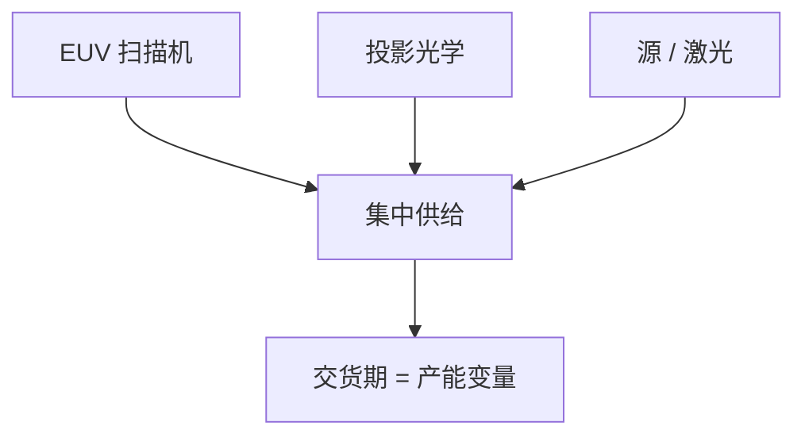

# 供应链集中与单一来源

EUV 扫描机、投影光学、锡源激光，公开格局是极端集中；交货期与出口规则进入产能方程，与 wph 并列。

<footer>—— 对照 EUV 工具链集中（ASML、Zeiss、源与激光供应链）的公开产业事实；出口见专门课</footer>

[上一课](/litho/moore-litho-view)把密度经济接到工具链。缺口是链上有多少家。本课钉供应链集中与单一来源。[EUV 出口管制](/litho/euv-export-control) 已谈规则；这里谈结构风险。胶的 PFAS 管制，留给[下一课](/litho/pfas-resist-regulation）。

## 问题

量产 EUV 扫描机由 ASML 交付，投影光学与 Zeiss 深度绑定，源与驱动激光同样高度集中。DUV 浸没竞争略多，但仍寡占。掩模坯、光化检验、pellicle 也各有窄口。单一来源的工程含义：台数上限、维修备件、学习曲线共享、议价、地缘。

缺口是**可获得性**，不是光学设计。把 capex 当唯一约束，会忽略「有预算但无槽位」。

### 集中也有正面

标准接口、匹配经验、全球备件，降低每厂独自集成的成本。课程既不写成垄断道德剧，也不写成无风险。

中国浸没 DUV 课谈另一条供给。本课对象是领先 EUV 链的集中事实。

## 方法

规划：交货期当资源。风险：双源仅在仍存在竞争的环节（部分 DUV、胶、部分计量）。合同：服务水平。与匹配：全球同一供应商使 cross-fab 经验可迁移，也使共同模式故障成为可能。

## 机制

极紫外工具的资本与知识门槛把潜在进入者挡在外面，集中是结果。物理上可以有第二套源概念（后课 FEL），工业上量产扫描机仍是另一门槛。

## 边界

不预测某公司股价。不泄露未公开产能。出口细节指向已有课。

后课默认：工具可获得性是约束；下一课材料侧的管制（PFAS）同样能卡胶。

## 小结

- 领先 EUV 链高度集中，交货期与备件进入产能方程。
- 集中有匹配红利，也有共同模式与地缘风险。
- 双源只存在于仍竞争的环节。
- 出处：EUV 工具链公开产业格局。
