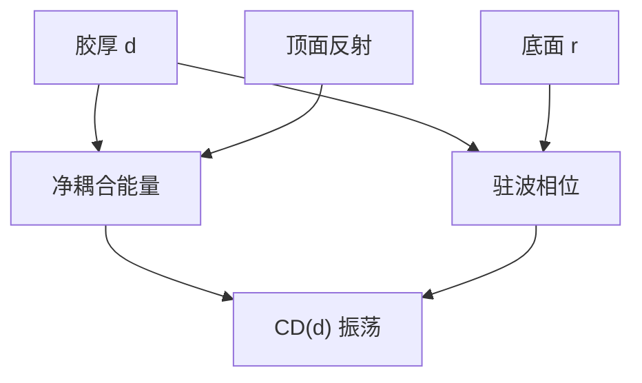

# 摆动曲线

胶厚变四分之一光学波长，耦合进胶的能量和驻波相位一起走；CD 跟着振荡。剂量环锁不住这条横轴。

<footer>—— Mack 对 swing curve 的讨论；薄膜周期见 Born &amp; Wolf</footer>

[上一课](/litho/thin-film-reflectivity)给出了复反射 $r$。缺口是：产线看见的不是一张 $r$ 表，而是 **CD（或 $E_\mathrm{size}$）随胶厚振荡**——摆动曲线（swing curve）。主干驻波课已经警告过；本课把振荡的周期、振幅与剂量闭环的分工钉死。胶厚怎么选，留给[下一课](/litho/resist-thickness-selection）。

## 问题

胶厚 $d$ 变，两件事同时发生：进入胶的净耦合（顶面与底面多次反射的能量）变；驻波相位变，有效产酸沿 $z$ 的积分变。阈值模型下，要维持同一 CD 所需剂量振荡，固定剂量下 CD 振荡。周期在胶内约为 $\lambda/(2n)$ 量级（正入射；大角度略改）。振幅由顶面反射与底面 $|r|$ 共同决定。

缺口不是再推 Fresnel 矩阵，而是：摆动的横轴是厚度，纵轴是 CD / 剂量，剂量计闭环锁的是面能量，不锁 $d$。涂覆不均、台阶上的局部厚薄，走的就是这条横轴。把 CD 摆动写成「灯漂了」，会去拧剂量而留下 BARC 事故。

### 顶与底两头

底面 $|r|$ 大 → 驻波深，摆动振幅大，BARC 主要压这一头。顶面胶–空气（或水、或 TARC）反射大 → 多次反射的能量摆动，即使底面已暗，仍可有较小的 swing。后课 TARC 管顶头，不要在本课把两头合成「一个反射率」。

浸没改顶面介质，摆动振幅和相位都会变；BARC 仍按胶下 $r$ 选。换水不自动换 BARC 厚度最优解。

## 方法

实验：同一掩模、同一剂量焦点，扫胶厚，量 CD，得 swing。模拟：用上一课的栈算 $I(z;d)$，进产酸 / 阈值，切 CD$(d)$。极大极小对应驻波相位与耦合的极值。减反良好时振幅压到工艺窗以内；减反失败时一个纳米级厚度误差就能把 CD 打出规格——EPE 预算里光学行必须声明是否含这条。

高 NA：不同 $\theta$ 的周期略不同，摆动被角谱糊一截，振幅可能下降，但角平均 $r$ 仍可很大。不要把「高 NA 摆动自然消失」写成定理。

### 与 Bossung 的正交

Bossung 扫的是焦点与剂量；swing 扫的是厚度。两者都改 CD，轴不同。最佳焦可以随 $d$ 微移（有效光程），于是 swing 与焦窗耦合。本课先把 $d$ 轴单独画清；选厚时再与焦深交。

## 机制

光学厚度 $n d$ 每增加 $\lambda/2$，往返相位 $4\pi n d/\lambda$ 转 $2\pi$，干涉条件循环一次。故 $\Delta d\sim\lambda/(2n)$。振幅 $\propto$ 两列波的对比，即顶、底反射振幅之积一类因子。CAR 的酸扩散沿 $z$ 糊驻波，可以减小侧壁波纹，但对 swing 的能量耦合项帮助有限——糊的是节点，不是净剂量。因此「PEB 更狠」不是 BARC 的替代。

## 边界

本课不指定某胶的 $n$ 到小数点后三位当唯一周期。溶剂残留、致密化让有效 $n$ 和 $d$ 在软烤后变，摆动要以烤后厚度计量。禁止编造未公开的 swing 纳米峰峰值当「典型值」。下一课才谈选在波峰还是波谷。

## 小结

- 摆动曲线是 CD 或 $E_\mathrm{size}$ 对胶厚的振荡，周期约 $\lambda/(2n)$。
- 底面 $|r|$ 与顶面反射分别贡献振幅；剂量环不锁厚度。
- 与 Bossung 的 $z$ 轴正交，但最佳焦可随 $d$ 微移。
- 酸扩散糊节点，不替代减反。
- 下一课：在曲线上选工作点。
- 出处：Mack；Born &amp; Wolf；Levinson。
