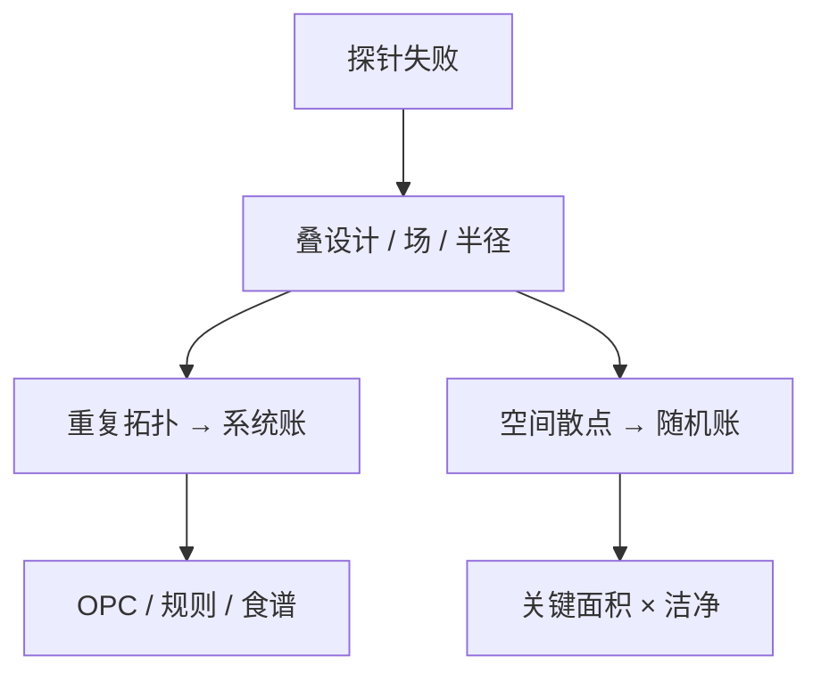

# 系统性对随机缺陷

系统缺陷在每颗管芯同一拓扑重复，改 OPC 或规则能一次杀掉；随机缺陷按位置抽签，洁净与光子统计才是杠杆。

<footer>—— 对照良率工程对 systematic vs random 的划分；计算光刻热点与颗粒缺陷的分工</footer>

[上一课](/litho/critical-area)把随机颗粒写成 $A_\mathrm{cr}$。缺口是分类：探针图上的重复失败是系统，散点是随机，混在一张 $D$ 里会开错药。[热点 PV](/litho/hotspot-pv) 已定义过程变化下的系统杀手；本课钉良率账的拆分。EUV 光子与化学随机，留给[下一课](/litho/stochastic-yield）。

## 问题

系统：错色、OPC 不足、切线偏置、焦距地图、掩模缺陷打印。特征是空间重复或与布局相关。随机：颗粒、残留、部分光子缺孔。诊断：把失败管芯叠到设计上，看是否对齐同一 clips；与过程角相关则更像窗口问题。

缺口是**两本账**，不是再跑 LRC。系统用设计/OPC/PWQ 消灭，随机用洁净、过滤、剂量（对光子）和关键面积。APC 补均值 CD 可能改善系统窗口，对颗粒几乎无用。

### 掩模缺陷是系统的一种

掩模上的固定缺陷在每场同一位置打印，像系统。AIMS 与掩模检测课已有；良率上应按「每场重复」识别，不要当晶圆颗粒去改轨道。

边缘环失败看起来「随机」，其实是边缘场系统。叠图要对晶圆坐标，也要对场坐标。

## 方法

叠图：管芯失败 × 设计 clips × 场坐标 × 晶圆半径。Pareto：系统 clips 清单 vs 随机密度。动作：系统走 LFD/OPC/食谱；随机走洁净与检测。与分派：系统批可能整批同源（错版），重工有效；随机按 $D$ 抽检。

场坐标叠图能抓住掩模打印缺陷和扫描机指纹；设计叠图抓住 OPC 热点。两张图都要做。良率工程对 systematic vs random 的划分，操作上就是这两张叠图。

## 机制

系统失效概率对管芯近似 0 或 1（在窗口外则全死）。随机是 $1-e^{-DA}$。混合良率 $\approx Y_\mathrm{sys} \times Y_\mathrm{rand}$。把系统残差塞进 $D$，会高估洁净收益。过程变化把「临界系统」变成批间闪烁，看起来像随机，要用 PWQ 与过程角去验。

设计叠图抓 OPC，场坐标叠图抓掩模与扫描机指纹。两张图分开，药才不会开错房间。

## 边界

分类有灰色：随机热点（NILS 低处更容易颗粒桥）。仍应先修 NILS。不把本课写成检测设备手册（后课）。

后课默认：良率 Pareto 分系统与随机。下一课专门把光子/化学随机从颗粒随机里再拆一刀。

## 小结

- 系统对齐设计与场；随机按位置抽签。
- 两本账，两种杠杆；禁止用 $D$ 吞热点。
- 掩模打印缺陷按场重复识别。
- 出处：良率工程 systematic/random 划分；计算光刻热点传统。
