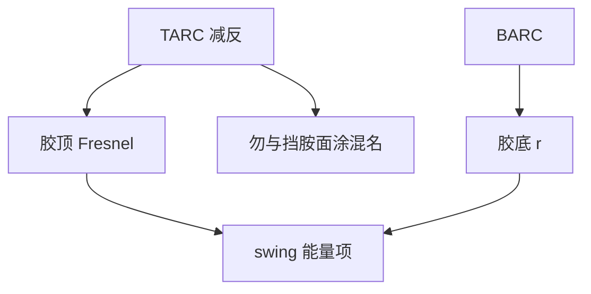

# 顶部抗反射 TARC

BARC 压的是胶底往上的回波；TARC 压的是胶顶与空气（或水）那一界面。两头不是同一层膜的两个名字。

<footer>—— Mack 对 TARC / 顶面反射与 swing 的区分；浸没面涂功能另见 Levinson</footer>

[上一课](/litho/resist-thickness-selection)要求先压摆动振幅再选极值。缺口是：底面 BARC 之后，**顶面 Fresnel** 仍贡献 swing 与入射侧多次反射，有时还贡献光斑（flare）式的杂散。本课钉顶部抗反射涂层（TARC）。多层底部抗反射留给[下一课](/litho/multilayer-barc)。CAR 的面涂挡胺、浸没防浸出，与 TARC 光学功能重叠但合同不同，本课只收光学。

## 问题

胶顶 $n$ 与空气（$\approx 1$）或水（$\approx 1.44$）失配，正入射反射已不可忽略，高 NA 更大。顶面反射使入射能量随胶厚摆动（上一课的「顶头」），并在胶内与底面回波形成更复杂的多光束。TARC 是一层（或两层）折射率与厚度选在减反条件附近的顶膜，把顶面有效 $|r_\mathrm{top}|$ 压下去。

缺口不是再选一次胶厚，而是：TARC 不替代 BARC。只涂 TARC、衬底仍亮，驻波节点还在；只做 BARC、顶面仍亮，swing 的能量项还在。浸没之后顶面失配减小，TARC 的光学动机变弱，面涂转为化学隔离——不要把浸没面涂自动叫成 TARC。

### 与斑纹、缺陷

顶面不平整或 TARC 涂覆不均，本身可以当弱相位屏。光学减反若引入颗粒或条纹，检测会报缺陷。选 TARC 要看轨道缺陷，不只看椭圆偏振仪上的 $|r|$。本课不写商品名。

TARC 通常要在曝光后、显影前去掉或可溶于显影液，以免挡溶解。厚度进入光学厚度预算，去掉之后最终浮雕不再含这层，但曝光时的 $I(z)$ 已经按有 TARC 算过。

## 方法

设计：在胶 $n$、入射介质 $n_0$、中心波长与主要 $\theta$ 上解减反（单层四分之一波一类，或双层）。高 NA 对角谱做平均，正入射最优不一定是浸没边缘光线最优。模拟必须把 TARC 算进薄膜矩阵，再决定胶厚工作点——顺序与上一课一致：TARC 改振幅与相位，极值位置会移。

计量：无 TARC / 有 TARC 的 swing 振幅对比。底面 BARC 不变时，振幅下降应主要来自顶头。若几乎不降，说明底面 $|r|$ 仍主导，该去查 BARC 而不是加厚 TARC。

### 与矢量成像

s/p 顶面系数不同，TARC 的减反对 TE/TM 不对称。密线若走 TE，TARC 优化应对准该偏振的角谱，而不是对准非偏振正入射。这是薄膜单元接到浸没矢量课的接口。

## 机制

减反条件：从入射介质看进去的等效导纳匹配，顶面 $r_\mathrm{top}\to 0$，多次反射项消失，swing 振幅下降。残留的振荡便主要来自底面驻波；BARC 再把它掐掉，曲线才真正平。TARC 相位也会微移胶内波腹，侧壁波纹形状可略变，但压节点对比仍靠 BARC。

## 边界

i 线 / KrF / 干式 ArF 上 TARC 光学动机强；浸没 ArF 上光学动机弱、化学面涂动机强；EUV 顶面是真空，另有出气与盖层，不能抄 DUV TARC 四分之一波。禁止把未公开的「TARC 降几纳米 swing」当普遍数。也不要把 TARC 写成分辨率增强：它不改光瞳截止。

## 小结

- TARC 减顶面反射，BARC 减底面反射，分工不可吞并。
- 浸没面涂主要是化学隔离，不要自动等于 TARC。
- 加 TARC 后必须重选胶厚工作点。
- 高 NA 按角谱与偏振优化，不正入射一张表。
- 下一课：底部用多层才能在角度上压 $|r|$。
- 出处：Mack；Levinson；Born &amp; Wolf。
