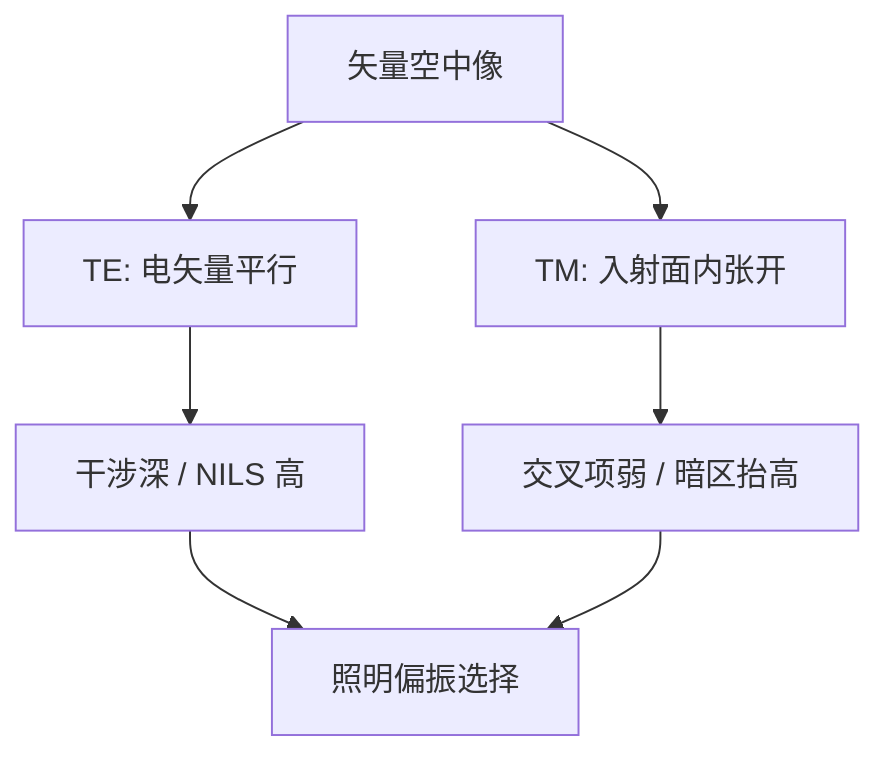

# TE / TM 对比

矢量成像已经把 $|U|^2$ 换成能量沉积；还要问的是：同一对衍射级，电场平行于线还是躺在入射面里，条纹深度完全不同。

<footer>—— 据 Flagello 高 NA 薄膜成像与 Yeung 矢量光刻模型对 s / p 干涉的讨论整理</footer>

[上一课](/litho/vector-imaging)把高 $\mathrm{NA}$ 空中像升级为胶内能量沉积，并指出 TE（s）干涉深、TM（p）交叉项变弱。缺口是把这两偏振的**成像差**写成可对线栅使用的对比：同一节距、同一光瞳，只换偏振，NILS 差在哪。光瞳相位如何展开，留给[Zernike 像差](/litho/zernike-aberrations)。产线 $k_1$ 仍不在本课重写。

## 问题

上一课给出了矢量接口，但工艺上要选的是照明偏振：让密线走哪一个通道。约定相对线栅：TE 的电场平行于线条，两束电矢量近乎平行，干涉项 $\mathbf{E}_1\cdot\mathbf{E}_2^*$ 接近满额；TM 的电场在入射面内，随孔径角张开，夹角接近 $2\theta$ 时交叉项按余弦一类因子下降，暗区抬高，对比与 NILS 掉。缺口因此是这条对比差，而不是再推一遍「为什么标量不够」。

非偏振是两通道强度平均，密线得到中间值。要极值必须控偏振；只加大 $\sigma$ 填不满这笔账。

### 对比差在最佳焦距就存在

离焦二次相位对两个通道都会乘，但 TM 损失在 $z=0$ 已征收。把「浸没后焦深变差」全部写成 $k_2\lambda/\mathrm{NA}^2$，会把偏振税误记成轴向预算。Bossung 上，TM 主导的密线往往窗更瘦，即使光学焦深公式看起来只与 $\mathrm{NA}$ 有关。

线栅的 TE/TM 随取向转。水平密线与垂直密线要的「好偏振」正交。二维孔无法同时让两向都走纯 TE，这是接触孔比一维栅更早付矢量税的原因之一。

## 方法

把进入光瞳的每条光线分解为局部 s/p，在像面（或胶内）矢量叠加后再对源积分。Flagello 把高 NA 成像放进分层薄膜：界面上的 Fresnel 系数对 s/p 不同，驻波节点也不同。Yeung 的矢量核则把投影侧的偏振传递写进计算光刻。本课不推薄膜矩阵，只要求：报密线对比必须声明偏振；标量 $C$ 是偏乐观的上界。

照明侧：线偏振、切向（azimuthal）偏振把能量推向 TE 通道，是浸没密线的常用附件。它不改 $\mathrm{NA}/\lambda$ 截止，只改通带内两束的点积。

### 浸没放大夹角

$\mathrm{NA}=n\sin\theta$。水把同样空间频率对应的 $\theta$ 做大，TM 退化来得更早。干式高 $\mathrm{NA}$ 已需小心；浸没必须默认矢量。本课不讲喷淋头，只钉夹角与点积。

「极化照明」几乎总是光源侧的偏振控制，不是把投影物镜改成偏振器。镀膜的 s/p 透过率差是二阶修正。

## 机制

两束 TM 的电矢量随 $\theta$ 张开，相干叠加的调制相对 TE 下降；频率越靠近截止，$\theta$ 越大，密图形先死。这与离焦「高频先死」同构，只是本课的税在焦面就征收。掩模铬栅自身也会当弱偏振器，反射式吸收体还有取向差——那是掩模 3D 的缺口；本课的物是已经进光瞳的矢量场。

NILS 的定义不变，输入 $I$ 换成能量沉积。上一课的 ILS 课仍然适用：TM 把阈值处的对数斜率削掉，剂量轴随之变脆。这就是为什么 SMO 目标里要写偏振，不能只优化标量 TCC。

### 后课默认的接口

说到密线对比，高 $\mathrm{NA}$ 必须拆 TE/TM 或声明非偏振平均。Zernike 相位乘在每个偏振通道上，像差与矢量相乘，不互相替代。截止频率仍是 $\mathrm{NA}/\lambda$；矢量改的是同样进了瞳的两束还能黑多少。

## 边界

本课不是掩模 FDTD，也不是 EUV 多层膜偏振反射率表。不要引用未公开的机台偏振纯度指标。标量模型在低 $\mathrm{NA}$、松节距上仍可用；切换判据是夹角与目标节距，不是品牌。切向偏振对孔类和正交密线有自己的代价，不是免费的「全部变 TE」。

## 小结

- TE 电矢量平行于线，干涉深；TM 随 $\theta$ 张开，对比掉。
- 偏振税在最佳焦距已存在，与离焦叠加。
- 非偏振是平均；极值对比要控照明偏振。
- 取向正交的密线无法共用同一纯 TE。
- 像差在下一课进光瞳相位，与本课通道相乘。
- 出处：Flagello 等对高 NA 薄膜成像；Yeung 矢量光刻模型；Mack / Levinson 的产线表述。
