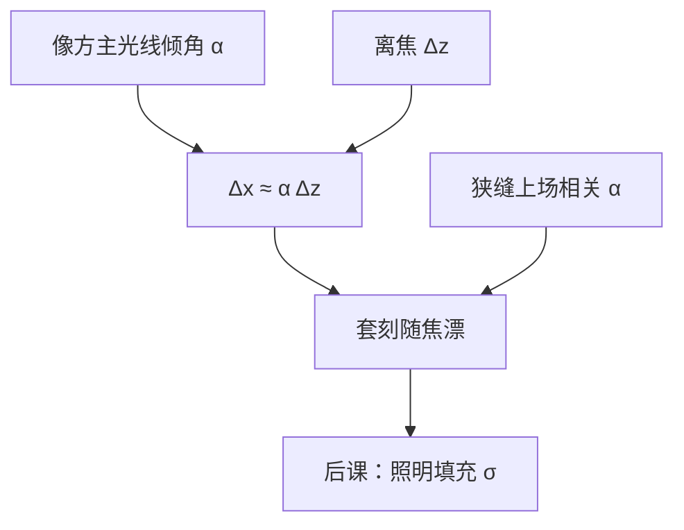

# 远心误差

像方主光线一旦相对光轴带上残余倾角，离焦就不再只是糊斑：糊斑的中心沿斜线搬家，套刻随焦面一起漂。

<footer>—— Levinson, Principles of Lithography 对远心与套刻的产线表述</footer>

[上一课](/litho/etendue-telecentricity)已经定义光学扩展量，并把像方远心说成「主光线平行于轴，离焦不改倍率」。缺口是：**残余倾角如何定量进套刻**。上一课停在几何名字；本课写成 $\Delta x\approx\alpha\,\Delta z$，并强调狭缝上场点不同、$\alpha$ 不同。照明如何填充光瞳，留给[部分相干](/litho/partial-coherence)。不要从瑞利 CD 重讲，也不要引用未公开的机台远心角规格。

## 问题

理想像方远心时，离焦只拉伸点扩散，质心不动。真实投影物镜的出瞳不在无穷远，或随视场、波长、热状态漂移，晶圆侧主光线带着倾角 $\alpha$（远心误差）。调焦把平均焦面拉回，横向位移 $\Delta x=\tan\alpha\cdot\Delta z$ 仍在；场内 $\alpha$ 若随狭缝坐标变，同一 $\Delta z$ 造成不同 $\Delta x$，表现为通过焦点的套刻扇形。缺口因此是这条**横向泄漏**，而不是再守恒一次扩展量。

扩展量问能送进多少光；远心问糊斑中心走不走。两者都随 $\mathrm{NA}$ 变敏感，账本不同。

### 倾角不是彗差的别名

彗差让核带尾巴、左右 NILS 不对称，即使最佳焦距上也在。远心误差是主光线斜率，对离焦呈线性的质心移动，一阶上像一个与视场相关的倾斜项。后课 Zernike 会把倾斜与彗差拆开；本课只要求：报套刻随焦漂，先问 $\alpha(x_\mathrm{slit})$，再问彗差。

物方远心失败改的是掩模侧主光线，EUV 斜入射是有意留下的物方非远心，阴影与像方 $\alpha$ 不是同一根矢量。本课默认讨论晶圆侧。

## 方法

对每个场点（扫描狭缝上的位置）量或仿真像方主光线角 $\alpha$。小角度

$$
\Delta x = \alpha\,\Delta z
$$

（$\alpha$ 用弧度）。扫描方向上再对狭缝时间平均：静态透镜的 $\alpha$ 图被扫成一条有效套刻。Levinson 把这类项放进套刻预算的光学桶，与工件台同步、晶圆变形并列，而不是放进 CD 的 $k_1$ 桶。

照明填不满光瞳时，有效主光线是被点亮的那一块光瞳的质心，不是几何出瞳中心。换偶极或自由形状源，$\alpha$ 的有效值会变——机制仍是质心，不是「$\sigma$ 改了分辨率」。

### 通过焦点的套刻图怎么读

固定套刻标记，扫焦，横轴 $z$、纵轴 $\Delta x$：斜率就是 $\alpha$。狭缝两端斜率不同，则场内有远心梯度。调平可以压平均 $z$，压不掉这条斜率；要压斜率必须动镜头远心（或接受它并在套刻模型里补偿）。

不要把远心误差和焦深公式收成一个数。DOF 问 NILS 还够不够；$\alpha\Delta z$ 问中心在不在。窗口可以仍开着，套刻已经超标。

## 机制

几何上，像点沿主光线走。频率上，远心是光瞳里与视场相关的波前倾斜：线性相位使像平移，二次离焦相位使像模糊，两者叠加。密图形的有效「质心」还可能被不对称照明拉开，表现为照明依赖的远心——源质心偏了，等效 $\alpha$ 偏了。

浸没把同样空间频率对应的 $\theta$ 做大，同样的出瞳误差折到晶圆上的 $\alpha$ 更刺眼。本课不讲水层；只承认像方 $n$ 已经进了上一课的 $\mathrm{NA}$，远心角必须在像方介质里读。

### 后课默认的接口

说到通过焦点的套刻，先给 $\alpha$（及场点），再给调平残差。$\sigma$ 尚未展开；本课只留下：有效主光线可以随照明质心动。CD 随焦面走是 Bossung，与质心移动分开报。

## 边界

本课不含工件台伺服带宽、不含晶圆翘曲本身——它们提供 $\Delta z$，乘的仍是本课的 $\alpha$。也不含高阶畸变：畸变是场相关倍率，即使 $z=0$ 也在，后课再写。禁止引用未公开的扫描机远心毫弧度表；Levinson 的几何与预算分类已经够用。

EUV 物方非远心的阴影是掩模三维课的缺口，不要在这里用像方 $\alpha$ 冒充。

## 小结

- 像方远心失败给出主光线角 $\alpha$；离焦造成 $\Delta x\approx\alpha\Delta z$。
- $\alpha$ 随狭缝场点变，套刻扇形随焦面张开。
- 照明光瞳质心会改有效 $\alpha$，与投影出瞳误差相加。
- 远心不是焦深，也不是彗差。
- 下一课用 $\sigma$ 描述光瞳被填了多大一圈。
- 出处：Levinson, *Principles of Lithography*。
