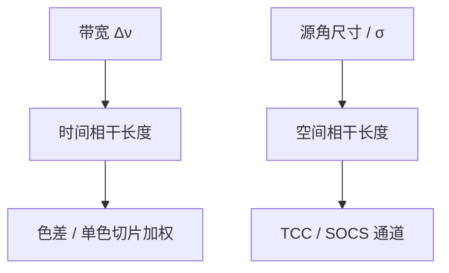

# 时间相干与空间相干

空间相干问不同方向的光能不能稳定干涉；时间相干问不同频率的光还能不能保持相位。两个长度，两个旋钮。

<footer>—— Born &amp; Wolf 对互相干函数的划分；van Cittert–Zernike 把扩展源连到空间相干</footer>

[上一课](/litho/socs-decomposition)把部分相干写成若干相干通道的强度和。缺口是：口语「相干性」把**时间**与**空间**吞并，通道权重 $\lambda_k$ 从哪来会说不清。本课把互相干拆成两条轴。光源太相干时像面发花，留给[下一课](/litho/speckle)。不重写 $\sigma$ 的产线定义，只把它接到空间轴上。

## 问题

单色点源：完全相干，一场干涉到底。真实准分子或 EUV 等离子体：有限带宽、有限角尺寸。互相干函数 $\Gamma(\mathbf{r}_1,\mathbf{r}_2,\tau)$ 同时依赖两点与时延。时间相干：固定两点，看 $\tau$——谱越宽，相干时间 $\tau_c\sim 1/\Delta\nu$ 越短，光程差超过 $c\tau_c$ 条纹消失。空间相干：固定 $\tau=0$，看两点间距——扩展源越大，横向相干长度越短。

缺口因此是禁止用一个「相干因子」同时回答带宽和照明填充。主干[部分相干](/litho/partial-coherence)与 $\sigma$ 讲的是空间轴；[色差与带宽](/litho/chromatic-bandwidth)讲的是时间轴的镜头后果。本课把两条在傅里叶骨架上对齐。

### van Cittert–Zernike

不相干扩展源，远场复相干度正比于源强度分布的傅里叶变换。光刻里有效光源 $S(\mathbf{f})$ 填在光瞳上，物面（掩模）两点的空间相干就是 $S$ 的傅里叶对——又回到[第一课](/litho/fourier-pairs-convolution)的对，只是这次对的是源，不是物。$\sigma$ 大，源撑满，横向相干短，趋向非相干 OTF；$\sigma$ 小，源像点，横向相干长，趋向单条 CTF。

时间相干不由 $\sigma$ 决定。窄线宽激光时间相干可以很长，同时用大 $\sigma$ 把空间相干压短。反过来，宽谱灯空间上也可以用小孔做得很相干。两个旋钮独立。

## 方法

成像计算的惯例：先在单一 $\omega$ 上做空间部分相干（TCC / SOCS），再对光谱加权——时间轴变成色差与焦移的积分，而不是再乘一个「时间 TCC」。当光程差远小于相干长度（投影物镜设计如此），单色切片是好零阶；带宽只作为[色差课](/litho/chromatic-bandwidth)的微扰。

空间轴：$\Gamma(\mathbf{x}_1,\mathbf{x}_2,0)$ 决定哪些掩模点对能干涉。Hopkins 的双线性正是这场干涉的频率写法。SOCS 的多通道，来自空间互相干不是秩 1，不是来自多色。

### 不要用相干长度代替 NA

纵向相干长度限制的是能打多重光束干涉的光程差（薄膜驻波仍要单色切片够长）。横向相干长度限制的是掩模上多远的开口还能交叉项。分辨率仍由光瞳截止与工艺阈值读，见[瑞利课](/litho/rayleigh-litho)；本课不把 $\tau_c$ 改写成 CD。

## 机制

干涉条纹可见度 $|\gamma|$。时间轴：频谱的傅里叶是延时相干，宽谱把大光程差的条纹洗掉——驻波对比会略降，但 DUV 激光通常仍够「准单色」。空间轴：源上两点互不相干，物面相干度随间距振荡衰减，密栅的 0 级与 1 级能否干涉，取决于源是否让这两级在光瞳里还与同一块 $S$ 重叠——这就是 TCC 重叠图像。

EUV 等离子体源空间上很大、时间上有带宽，空间部分相干仍由照明光学整形后的 $S$ 决定，不是由等离子体火球直径直接当 $\sigma$。

## 边界

标量互相干不含偏振；矢量通道各有一份 $\Gamma$。动态斑纹（下一课）在时间轴上若积分不够，空间上再「部分相干」也仍可能颗粒。禁止把激光器说明书里的「单纵模」直接叫成光刻 $\sigma$。

## 小结

- 时间相干 ↔ 带宽与光程差；空间相干 ↔ 源角尺寸与 $\sigma$。
- van Cittert–Zernike：源分布的傅里叶给出物面空间相干。
- TCC / SOCS 主要吃空间轴；光谱加权吃时间轴。
- 两个旋钮独立，不能合成一个相干因子。
- 下一课：空间相干过高时的 speckle。
- 出处：Born &amp; Wolf；van Cittert–Zernike；Goodman。
