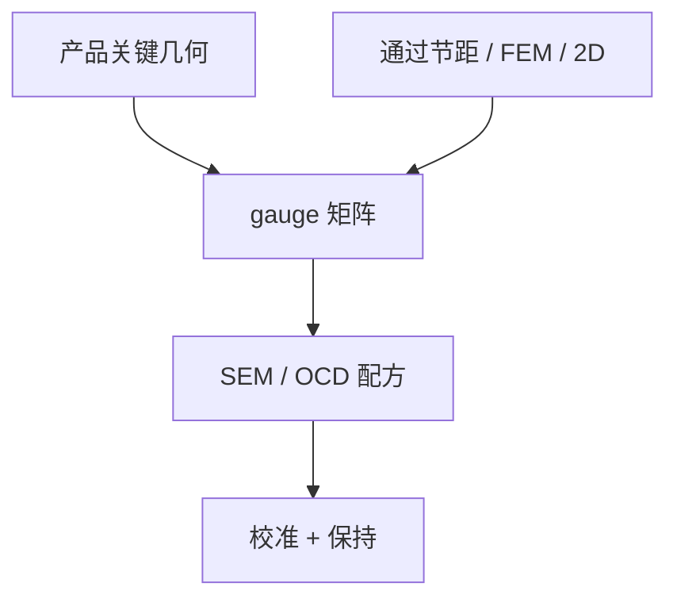

# 测试图形与 gauge

模型只在被量过的几何上受约束；gauge 的抽样偏差会变成全芯片的系统性盲目。

<footer>—— 对照 OPC 校准 gauge、通过节距与二维测试键的产线通称</footer>

[上一课](/litho/resist-model-calibration)把拟合协议钉死。缺口是样本从哪来：只放 1D 通过节距，二维线端与 SRAM 会成为外推。本课钉测试图形与 gauge。残差怎么读，留给[下一课](/litho/model-residual-analysis）。

## 问题

校准集是实验设计。典型缺失：只有水平和垂直、没有 45°；只有线没有孔；只有标称剂量没有窗口角；只有逻辑密度没有 SRAM  densest pitch；助条宽度未扫。SEM 收缩、量测部位（顶/底）、抽样数决定噪声地板——比噪声更密的模型项是假精度。

缺口是**可观测性**，不是再列 CM 参数名。把产品热区当唯一 gauge，会在 TAPOUT 前才发现模型从未见过那种邻域。

### Gauge 必须进同一条计量链

CD-SEM 配方、收缩补偿、OCD 模型，要与将来监控一致。换 SEM 配方等于换数据集。计量课的 [CD-SEM shrink](/litho/cd-sem-shrink) 在这里是校准偏差源。

故意放「禁戒节距」和「设计不允许但 OPC 可能长出的助条」进 gauge，才能约束病态区。只放 DRC 合法图形，模型在 MRC 边界上自由游荡。

## 方法

设计：通过节距、iso-dense、线端缩短、二维拐角、孔阵列、助条存在/缺失、FEM。统计：每类足够重复以估 SEM 噪声。权重：按产品重要性，而不是按好测。EUV 加随机：同一 gauge 多点平均，避免把泊松噪声拟合进确定性核。

与 DTCO：库里真实 clips 应占保持集，不只占宣传图。

## 机制

成像算子对某些几何方向不敏感（信息论上不可观），对应参数会与别的项交换。gauge 的作用是打开这些方向的激励。若所有 gauge 都是长线，阈值与光学半径会混叠——残差课会看到「什么都能吃一点、什么都吃不干净」。

## 边界

Gauge 晶圆不是产品良率证明。测太多会变成计量瓶颈，延迟模型版本。不把某代工厂的测试键版图当公开标准。

后课默认：校准数据有设计好的激励；下一课用残差图判断缺的是光学、胶还是抽样。

## 小结

- Gauge 是实验设计；抽样偏差等于模型盲区。
- 计量配方与 SEM 收缩是数据集的一部分。
- 保持集要含真实库 clips 与病态节距。
- 出处：OPC 校准 gauge 产线通称；计量与模型绑定的公开讨论。
