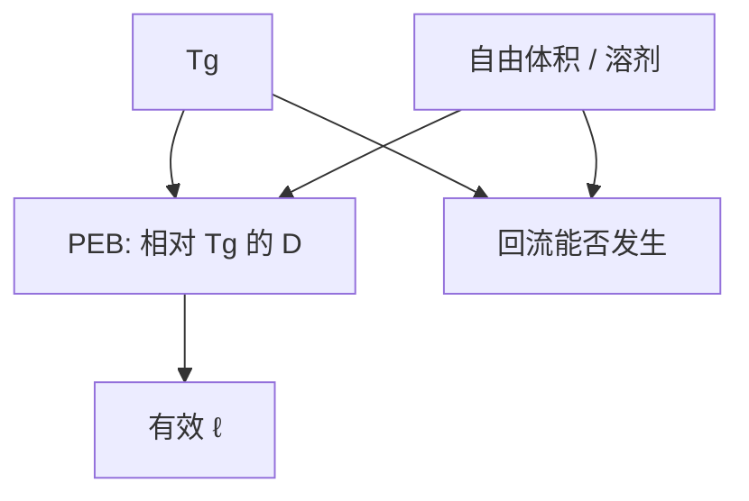

# 玻璃化温度与自由体积

酸能不能走、显影后能不能流，首先问聚合物离 $T_g$ 多远、自由体积还剩多少。热板数字只有映射到这两件事才是材料。

<footer>—— 据聚合物自由体积与 $T_g$ 的通称（Fox / Flory 量级语言）；光刻中的扩散与回流叙述见 Mack</footer>

[上一课](/litho/resist-reflow)把回流写成 $T\gt T_g$ 的黏流。缺口是把 $T_g$ 与自由体积写进同一套胶物理：它们也管 PEB 里酸的 $D$，不只管显影后流动。本课钉这两个聚合物量。瓶子里的时间如何改它们，留给[下一课](/litho/resist-shelf-life)。

## 问题

玻璃化温度 $T_g$ 是膜从玻璃态进入高弹/黏流的标志（量热或力学，数值随测法变，必须声明）。PEB 通常在 $T_g$ 附近或以下：太靠近，酸扩散和回流一起失控；太低，催化不够。自由体积是链段未占满的空隙分数，残留溶剂、分子量、冷却历史都改它。$D$ 对自由体积极敏感——同一 PEB 设定，PAB 赶溶剂不充分，$D$ 可以大一截，LWR 核跟着胖。

缺口不是再解反应–扩散 PDE，而是：方程里的 $D(T)$ 不是单纯 Arrhenius 对空气温度，而是对「相对 $T_g$ + 自由体积」的有效温度。把数据表 110 °C 抄到另一批胶，等于假定 $T_g$ 相同。

### Fox 混合只给量级

增塑剂（溶剂、小分子 PAG）压低 $T_g$，粗略可用 Fox 一类混合规则估方向，不能当配方计算尺。本课禁止用一条未标定的 Fox 式给出去胶温度。Flory–Fox 对分子量：$T_g$ 随 $M_n$ 上升后饱和，后课聚合物分布会用到，这里只承认方向。

DSC 测的粉料 $T_g$ 与薄膜、含溶剂膜不是同一个数。签核用本层涂烘后的膜，不要用树脂桶上的规格单替代。

## 方法

表征：$T_g$（DSC、热机械）、膜密度或溶剂残留（称重、光谱）、PEB 后 CD / LWR 对 PAB 的敏感度。实验设计：只改 PAB、只改 PEB、只改分子量，分清自由体积与催化时钟。回流窗口：在 $T_g$ 以上扫一小段，看黏流是否可重复——窗口窄说明 $T_g$ 与分解温度挤在一起，不是扫描机问题。

与[酸扩散](/litho/acid-diffusion-lwr)的接口：报 $\ell$ 时声明膜的 $T_g$ 与 PAB。换树脂批次若 $T_g$ 漂，等于换核。

## 机制

低于 $T_g$，链段运动受限，酸走的是自由体积里的跳跃，$D$ 小、活化能看起来高。接近 $T_g$，自由体积涨，跳跃变频繁，同一酸分子的 $\ell$ 变长。淬灭剂分子体积大，对自由体积更敏感，争夺带形状会随 PAB 变。回流则是整段链的协同流动，阈值更硬地钉在 $T_g$ 以上。

冷却速率决定自由体积被冻住多少：急冷留下更多空隙，随后 PEB 的有效 $D$ 偏大。轨道热板的升降温斜率因此进 CDU，不只是稳态温度。

EUV 金属氧化物网络的「$T_g$」语言弱得多，交联后更像无机玻璃。本课默认有机 CAR / 酚醛。换 MOR 不要抄 $T_g$ 表。

## 边界

不把 WLF 方程展开成课标公式去拟合所有胶。不发明树脂牌号。下一课老化：吸水、PAG 分解、溶剂挥发，都会改本课两个量。PAB 课会把「赶溶剂」写成可控步骤，本课只提供它为什么有效。

## 小结

- $T_g$ 与自由体积是 $D$ 和回流的材料坐标，热板温度是映射。
- 残留溶剂增塑、压 $T_g$、抬 $\ell$。
- 报扩散核必须声明膜的 $T_g$ 与烘历史。
- 粉料 DSC ≠ 薄膜 $T_g$。
- 出处：聚合物 $T_g$ / 自由体积通称；Mack 对 PEB 扩散与烘程的讨论。
