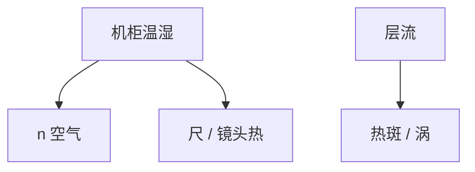

# 温控与气流

空气是干涉仪的一部分，也是热板和镜头的浴。温度零点几度、气流一层涡，套刻和剂量就会换地图。

<footer>—— 对照 [热板均匀性](/litho/hotplate-uniformity)、[干涉仪](/litho/interferometer-vs-encoder)</footer>

[上一课](/litho/msd-moving-standard-deviation)钉同步。缺口是机柜气候：温、湿、气压、层流。本课钉温控与气流，装载下一课。

## 问题

干涉仪 $n(T,p,H)$；镜头和尺热胀；胶的 PEB 在轨道但片在扫描仪里仍换热。乱流把热斑吹到狭缝。把 CDU 条带只写成照明，会漏空调。

## 方法

封闭机柜、分层流、多点温控。规格：温度稳定性、梯度、湿度（浸没与静电）。维护：滤网堵塞改流场，要进 SPC。与轨道集群共用 mill 环境化学（胺）已在联机课，本课管热流体。

## 机制

空气折射率经验公式把 $T$ 变成假位移。机械热胀把编码器尺变长。气流雷诺数高则涡，温度计平均不到涡里的瞬时梯度。

## 边界

下一课片怎么进这柜子：装载门一开，气候被破坏。

## 小结

- 气候是计量与热的公共浴。
- 气流形态与设定点同样重要。
- 出处：干涉仪课；热板课。
