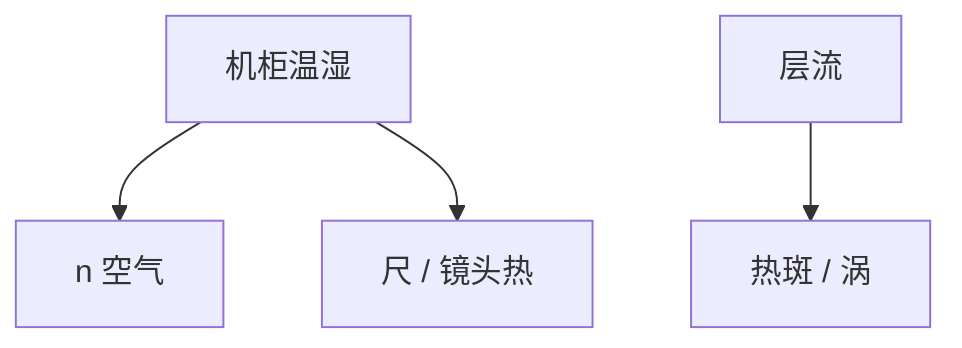

# 温控与气流

空气是干涉仪的一部分，也是热板和镜头的浴。温度零点几度、气流一层涡，套刻和剂量就会换地图。

<footer>—— 空气折射率与温、压、湿的关系见 B. Edlén, The Refractive Index of Air, Metrologia 2, 71 (1966)</footer>

[上一课](/litho/msd-moving-standard-deviation)钉同步。缺口是机柜气候：温、湿、气压、层流。本课钉温控与气流，装载下一课。空气与热改写的是测量本身，这笔账归本课。

## 问题

干涉仪 $n(T,p,H)$；镜头和尺热胀；胶的 PEB 在轨道但片在扫描仪里仍换热。乱流把热斑吹到狭缝。把 CDU 条带只写成照明，会漏空调。

展开：空气同时进两本账。[干涉仪](/litho/interferometer-vs-encoder)用激光波长量位移，光程里多出来的折射率全被记成位移；镜头与编码器尺是热胀冷缩的实体，温度场一变几何就变。胶侧 PEB 的热在轨道热板上（[热板均匀性](/litho/hotplate-uniformity)），片回到扫描仪内仍与环境换热。乱流把热斑吹到狭缝方向，套刻与 CDU 出现缓变或随方位变化的条带——先查空调再查照明，能省一整轮冤枉检修。

## 方法

封闭机柜、分层流、多点温控。规格：温度稳定性、梯度、湿度（浸没与静电）。维护：滤网堵塞改流场，要进 SPC。与轨道集群共用 mill 环境化学（胺）已在联机课，本课管热流体。

工程流程：封闭机柜分层收口——外柜稳场，内罩贴近镜头与台，水回路带走镜头与光源的热，温度窗口逐级收紧。层流罩给干涉仪光路与片面一个定常流场，雷诺数压在湍流转变之下。湿度窗同时防浸没流场失稳与静电异常。滤网堵塞、风机衰减会悄悄改流场，气流与温差读数进 SPC。补偿端用温、压、湿传感器按 Edlén 型公式实时修正折射率，喂给位置环。

```mermaid
flowchart TD
  HVAC["机柜温湿"] --> AIR["n 空气"]
  HVAC --> MECH["尺 / 镜头热"]
  FLOW["层流"] --> MIX["热斑 / 涡"]
```

Edlén 之后公式被多次精化（Birch–Downs、Ciddor），但机台里的要点不在第五位有效数字，而在传感器摆哪：要量到干涉仪光路那层空气，不是房间平均值。

## 机制

空气折射率经验公式把 $T$ 变成假位移。机械热胀把编码器尺变长。气流雷诺数高则涡，温度计平均不到涡里的瞬时梯度。

写透一点：折射率误差直接乘进光程 $L\,\delta n$。常压下空气折射率对温度约 $-10^{-6}/\mathrm{K}$ 的量级，一米光路升一度就是约一微米假位移——比套刻预算大四个数量级，只能靠控温加实时补偿把残余压进纳米。机械热胀是另一条路：编码器尺与镜筒按各自膨胀系数变长，尺漂是网格缓漂，镜筒漂是焦点与放大率缓漂。公差分配的次序：慢漂交给校正表与热模型，快扰交给伺服带宽；带宽吃不掉的就是乱流的账——涡里的瞬时梯度温度计平均不到，表现为同步误差 MSD 的低频隆起与套刻的场间散布。

## 边界

本课管机柜尺度的热与气流，不写镜头内部曝光生热与热透镜补偿（[镜头热化](/litho/lens-heating-compensation)课），也不写热板多区控温。HVAC 只能补分钟量级以上的慢漂：曝光脉冲的瞬时沉积、开门进片的扰动超出它的带宽，靠机内罩与调度习惯隔离。

## 小结

- 气候是计量与热的公共浴。
- 气流形态与设定点同样重要。
- 下一课装载：门一开气候就被破坏，进片节奏也是气候的一部分。
- 出处：干涉仪课；热板课。
