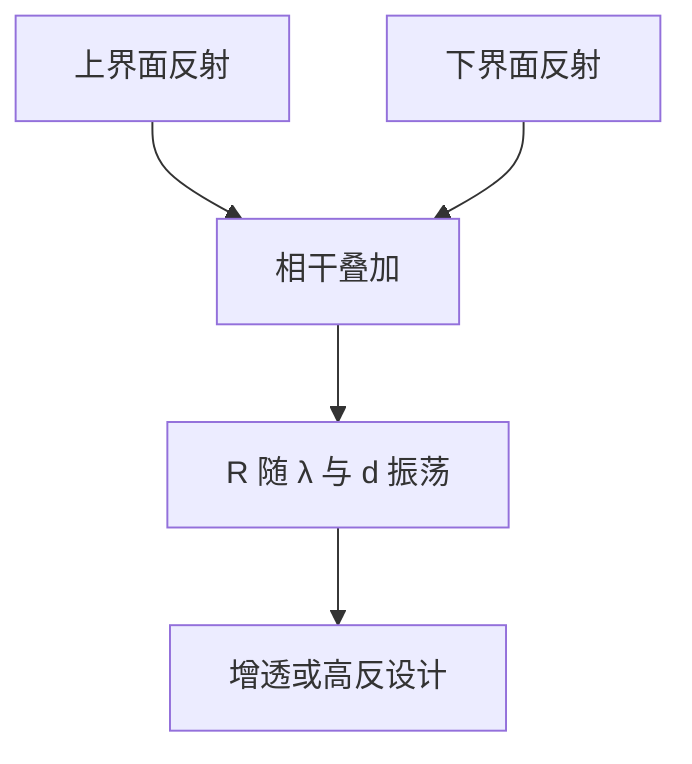

# 薄膜干涉

薄层上下界面各反射一束；两束或多束相干叠加，反射率随厚度与波长振荡，单界面菲涅尔公式不够用。

<footer>—— 据 Born &amp; Wolf, Principles of Optics 第 1.6 节对多层膜与干涉条件的整理</footer>

[上一课](/litho/brewster-tir)处理了半无限界面上的特殊角。本课不重写 $r_p=0$。缺口是：介质若有有限厚度 $d$，上下界面各反射一次（以及多次内反射），这些束如何干涉？后课抗反射层、胶层驻波与多层反射镜，都用这套相位差语言。

## 问题

[菲涅尔反射与透射](/litho/fresnel-coefficients) 只给出单个界面。实际膜有厚度：上表面反射与下表面反射走不同光程，往返相位差含 $2 n k_0 d\cos\theta_t$。没有这条差，无法设计「某一波长增透」或「某一波长高反」，也无法解释为什么同一衬底上改胶厚会改反射率。缺口是把两套菲涅尔系数用传播相位连起来，不是再引入一种新的偏振。

本课是「从麦克斯韦到平面波」这一课序的最后一课。下一课转入几何成像：[薄透镜成像方程](/litho/thin-lens-equation)。薄膜公式仍是波动；透镜方程是短波极限。两者都要用，但不要混成一个式子。

### 半波损失不是可选项

从低 $n$ 射向高 $n$ 时 $r\lt 0$，等价额外 $\pi$ 相位。只算几何光程 $2nd$、忘掉界面符号，增透条件会差四分之一波。空气–膜–玻璃与空气–膜–空气的「亮暗」口诀不同，原因正在这里，不是膜的色散。

正入射时往返相位 $2 n k_0 d$。斜入射把 $d$ 换成 $d/\cos\theta_t$ 并改用该角的菲涅尔系数。s 与 p 振荡周期可以错开，矢量膜系必须分开算。

## 方法

正入射、单层膜夹在介质 0 与 2 之间，反射振幅的连分式（Airy 求和）给出

$$
R=\left|\frac{r_{01}+r_{12}e^{i2nkd}}{1+r_{01}r_{12}e^{i2nkd}}\right|^2,
$$

其中 $k=k_0 n$，$r_{01}$、$r_{12}$ 为两界面系数。构造性或相消取决于 $2nd/\lambda$ 与界面相位。四分之一波膜：$d\approx\lambda/(4n)$，若两反射振幅接近且符号相反，则增透。四分之一波高低折射率交替堆叠，则在设计波长附近高反——EUV 掩模 Blank 上的 Mo/Si 多层是同一原理的深 Bragg 栈，传输矩阵是后课工具，本课只建立双光束直觉。

分母里的 $r_{01}r_{12}e^{i2nkd}$ 是多次内反射。膜很弱时（$|r|$ 小）可只留两束；金属或高反堆栈必须保留多光束。光刻胶–硅腔通常反射不弱，驻波要用完整式而不是「只加两束」。本课公式已经包含这一点，后课驻波只是换名字。

## 机制

薄膜把「路径差 → 相位差 → 强度振荡」写成可算的 $R(d,\lambda)$。晶圆上抗蚀剂与衬底形成腔，入射与衬底反射叠加，曝光剂量沿深度起伏——后课称驻波，用底部抗反射层压衬底反射。本课只说明物理是薄膜干涉，不把光刻胶化学提前讲完。

带宽有限时，不同 $\lambda$ 的条纹错开，对比度下降，与后课 [相干长度与光源带宽预备](/litho/coherence-length-prep) 相连。吸收膜用复 $n$，振荡被阻尼；EUV 多层必须在吸收与反射率之间折中，仍是本课相位差，只是层数多。

驻波的纵向周期约 $\lambda/(2n)$，胶厚若跨过若干周期，曝光剂量沿深度起伏，侧壁会出波浪。抗反射层把衬底反射压下去，等于把 $r_{12}$ 变小，公式里振荡项变弱。本课点到这一应用就停：不写胶的化学显影，也不把 BARC 工艺参数表搬进来。几何成像从下一课开始，暂时离开膜腔。

## 边界

本课不展开传输矩阵软件与膜厚公差优化。粗糙度引起的散射、非均匀膜，不在本课。也不把 $R(\lambda)$ 写成分辨率判据。下一课改用物距、像距与焦距，暂时不写膜。

后课默认：提到增透、高反、胶层反射振荡，都先问 $2nkd$ 与菲涅尔相位。几何成像课序从薄透镜方程开始，不再从麦克斯韦重推。

## 小结

- 薄膜是多界面反射的相干叠加；相位差含 $2nkd$ 与界面符号。
- 增透与高反由厚度和折射率设计；多层 Bragg 栈是同一原理。
- 胶层驻波与抗反射层是后课应用，机制已在本课。
- 下一课转入几何成像，不把干涉公式带进透镜方程。
- 出处：Born &amp; Wolf, *Principles of Optics*；Hecht, *Optics* 第 9 章。
