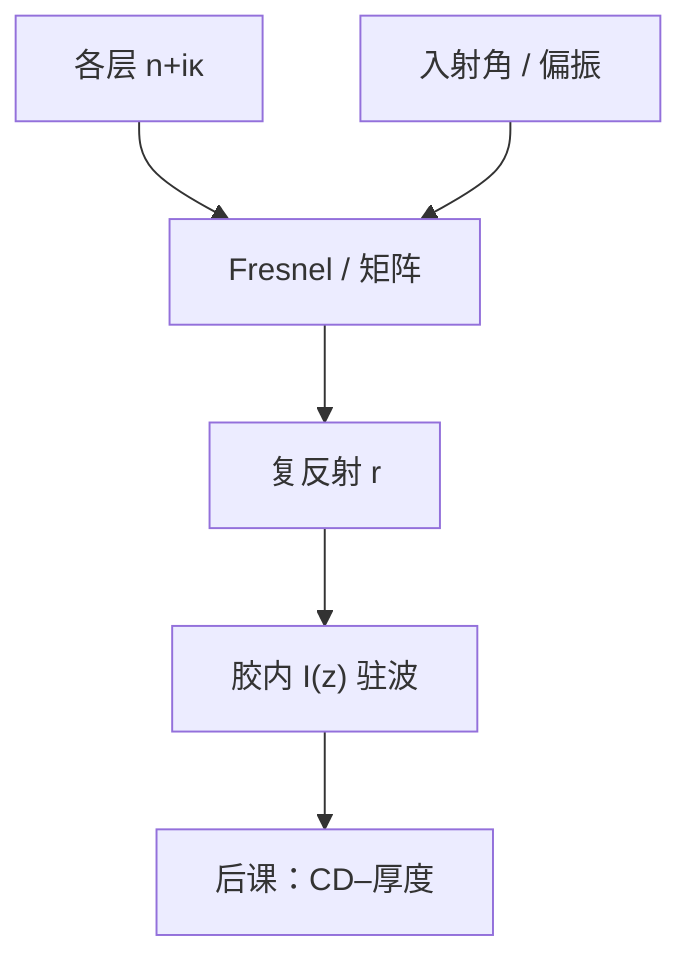

# 薄膜干涉与反射率

胶下每一层界面都按 Fresnel 系数反射；多层相位对齐时反射可以相长或相消。驻波的源不是「衬底会亮」，而是这张反射振幅。

<footer>—— Born &amp; Wolf 对分层介质与 Fresnel 公式的表述；光刻栈读法见 Mack</footer>

[上一课](/litho/epe-budget)把边偏差收成预算，成像核课序结束。缺口是：空中像默认的 $I(x,y)$ 还缺沿厚度的调制——**胶–BARC–衬底栈把多少光送回来**。主干[驻波与 BARC](/litho/standing-wave-barc)已经点名现象；本课把反射率写成薄膜计算，作为后课摆动曲线的输入。不重推 $k_1$，不把 BARC 当装饰层讲工艺品牌。

## 问题

[单色波](/litho/em-wave-index)给出每层的 $n$（本课允许复折射率 $n+i\kappa$）。界面上 s/p 的 Fresnel 反射 / 透射由两侧 $n$ 与入射角决定。多层用特征矩阵（或递推）把界面串起来，得到从胶向下看的复反射振幅 $r$。入射与反射在胶里干涉，周期约 $\lambda/(2n_\mathrm{resist})$。

缺口不是再描述侧壁波纹，而是钉死：$I(z)$ 的对比由 $|r|$ 和相位决定，$r$ 由栈与角度决定。横向傅里叶骨架仍负责 $I(x,y)$ 的形状；本单元负责把 $|U|^2$ 换成沿 $z$ 振荡的沉积。高 NA 必须按角谱积分 $|r(\theta)|$，近轴一个数不够。

### 能量与相位都要

只报衬底「反射率百分之几」会丢相位：同样 $|r|$，相位决定波腹落在胶底还是胶中，侧壁波纹的节点不同。BARC 的工作可以是高 $\kappa$ 把 $|r|$ 吃掉，也可以是干涉相消把 $r$ 赶到零附近——两种 $|r|$ 小，相位行为不同，对胶厚敏感度不同。

浸没把入射介质从空气换成水，最上界面的 Fresnel 变了，但胶内驻波仍用胶的 $n$ 来量周期。不要把浸没 NA 的焦深和驻波节点当成同一个 $z$ 问题。

## 方法

近轴：空气/水–胶、胶–BARC、BARC–衬底三张界面，矩阵连乘得 $r(\lambda)$。吸收层用复 $n$。高 NA：对光源与光瞳里的每条 $\theta$、每个偏振算 $r$，再按矢量成像加权——接到[浸没矢量](/litho/immersion-vector-imaging)的角谱，而不是另起电磁学。

金属衬底 $|r|$ 大、相位随 $\lambda$ 陡，换铜 / 多晶 / 介质等于换整张 $r$。OPC 紧凑模型若假定单一平面强度，等于忽略本课。

### 与横向成像的接口

严格做法是分层介质里的矢量角谱，横向频率仍由掩模衍射给出。工程上常把「薄膜因子」乘在标量或矢量空中像上，得到 $I(x,y,z)$。换栈必须重算因子；换掩模不必重算 $r$，除非掩模 3D 改变入射角分布（EUV 后课）。

## 机制

两列相向波叠加，强度沿 $z$ 为 $1+|r|^2+2|r|\cos(2k n z+\phi)$ 一类（正入射示意）。$|r|$ 大则对比深，产酸（或 DNQ 转化）沿厚度打摆，显影后侧壁起波。相位 $\phi$ 决定第一个波腹位置。BARC 把 $|r|$ 压下去，对比项 $2|r|$ 消失，横向像的 NILS 才近似等于「无衬底」计算。

## 边界

本课是一维分层、平面界面。形貌台阶是后课。不写具体 BARC 商品的 $n$、$k$ 表。EUV 所有层都强吸收，$r$ 的故事不同，放在本课序末。禁止发明未发表的矩阵软件名当文献。

## 小结

- 胶下反射是多层 Fresnel 的复振幅 $r(\theta,\mathrm{pol})$。
- $|r|$ 定驻波对比，$\arg(r)$ 定节点；两者都要。
- 横向傅里叶核与沿 $z$ 的薄膜因子相乘才是沉积。
- 高 NA 必须对角谱积分，不能只用正入射 $r$。
- 下一课：把 $r$ 随胶厚的变化读成摆动曲线。
- 出处：Born &amp; Wolf；Mack；Levinson。
