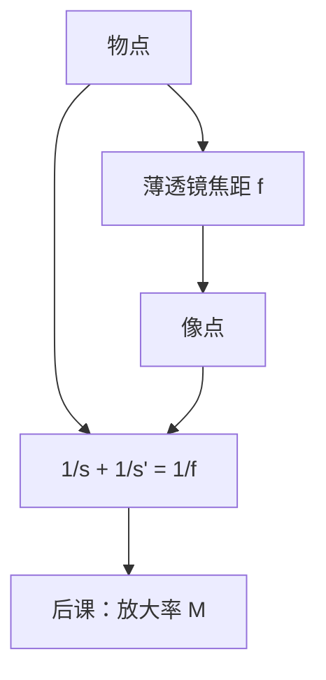

# 薄透镜成像方程

近轴极限下，薄透镜把物距、像距与焦距收成一条倒数关系；物在焦点外则成实像，不必先写衍射积分。

<footer>—— 据 Hecht, Optics 与 Born &amp; Wolf, Principles of Optics 对 paraxial 成像的整理</footer>

[上一课](/litho/thin-film-interference)处理膜层里的多束干涉。本课换一套语言：物点、像点与透镜焦距。不重推菲涅尔系数。缺口是：投影系统「把掩模平面搬到晶圆平面」在 paraxial 极限下写成什么方程？后课放大率、光瞳与像差，都从这式子出发。

## 问题

前六课在波动框架里走完界面与薄膜。光刻机工程图却画光轴、物面、像面、焦点。若不会

$$
\frac{1}{s}+\frac{1}{s'}=\frac{1}{f},
$$

无法把「共轭距离」与透镜功率对应，也无法理解缩小投影为何物方比像方长。缺口是几何光学的零阶模型，不是再问薄膜反射率。

波动仍在：几何像点是亥姆霍兹方程短波极限下的汇聚。本课先用这极限把共轭钉死；何时必须回到衍射，见 [标量衍射的适用边界](/litho/scalar-diffraction-bound)。

符号约定各国教材对 $s$、$s'$ 的正负有时相反。本课用「实物在左为正、实像在右为正」。读 Hecht 与 Born &amp; Wolf 时以各自前言为准，公式形状相同。

### 薄透镜不是光刻物镜的零件清单

「薄」指厚度趋于零、折射可收在一个平面上；真实投影物镜是厚透镜组、多片、有光阑。工程师仍先用薄透镜方程定共轭，再把组代成等效焦距。本课方程是零阶，不是机台剖视图。

符号：物在左、实像在右时 $s>0$、$s'>0$；会聚透镜 $f>0$。paraxial 指 $\sin\theta\approx\theta$。功率 $\Phi=1/f$，单位屈光度。

## 方法

高斯成像方程如上。$s>f$ 得实像；$s=2f$ 时 $s'=2f$，横向等大。$s\to f^+$ 则 $s'\to\infty$；$s\to\infty$ 则 $s'\to f$，平行光会聚于后焦面。多片组合用矩阵光学或等效 $f$；光刻投影物镜是有限共轭的厚系统，瞬时仍满足物像共轭。横向放大率 $M=-s'/s$ 下一课展开，本课只先承认像高随 $s'$、$s$ 变。

符号约定必须前后一致：物距从物到透镜（或主面），像距从透镜到像。若把晶圆到末片的空气间隙误当成 $s'$，共轭会算错一整段。本课方程不管透镜有多厚，只问等效 $f$ 与两个主面距离。真实排光路时再把主面位置从镜头图纸读出。

## 机制

近轴折射定律连乘之后，同一物点发出的近轴光线重新交于一点——这就是「成像」。投影光刻把掩模放在物方、晶圆放在像方；缩小意味着像距相对物距更短。扫描仪让掩模与晶圆同步扫描，每一瞬间仍满足共轭；运动控制不是本课。

焦距由曲率与折射率决定（磨镜者公式）。浸没把像方介质 $n$ 从 1 抬高，等效功率与后课 NA 一起变；本课先把 $f$ 当给定参数。色差使 $f=f(\lambda)$，带宽课再处理；本课单色。

厚透镜要用主面：物距、像距从主面量起，而不是从玻璃物理表面。薄透镜把两主面收成同一平面，所以方程里只有一个 $f$。投影物镜一定是厚的，但共轭关系仍写成对等效 $f$ 的同一条倒数式。这就是「零阶还够用来排距离」的含义。扫描曝光每一瞬时场仍满足该共轭；扫描并不改写成像方程，只是换哪一块视场正在共轭。

## 边界

本课忽略像差、有限孔径衍射与视场光阑。边缘光线不满足 paraxial，像点糊成斑——[几何像差一览](/litho/geometric-aberration-tour)。像方远心（主光线近似垂直晶圆）是光刻物镜的常见约束，本课不推导，只在光瞳课点名。

虚像（$s<f$）在显微镜物镜一侧常见，投影光刻要的是实像落在晶圆上，本课默认 $s>f$。后课默认：物像共轭满足薄透镜方程（或等效焦距的同一形式）；实像、倒像、有限共轭是投影的零阶图。下一课 [焦距、物距与横向放大](/litho/focal-magnification) 只补 $M$。

## 小结

- 薄透镜：$\frac{1}{s}+\frac{1}{s'}=\frac{1}{f}$；实像要求 $s>f$。
- 投影把掩模与晶圆放在共轭两侧；方程是零阶，真实物镜是厚透镜组。
- 放大率下一课才写；像差与衍射是更后的修正。
- 几何光学是短波极限，不取代本栏开头的波动方程。
- 出处：Hecht, *Optics*；Born &amp; Wolf, *Principles of Optics* 第 4 章。
