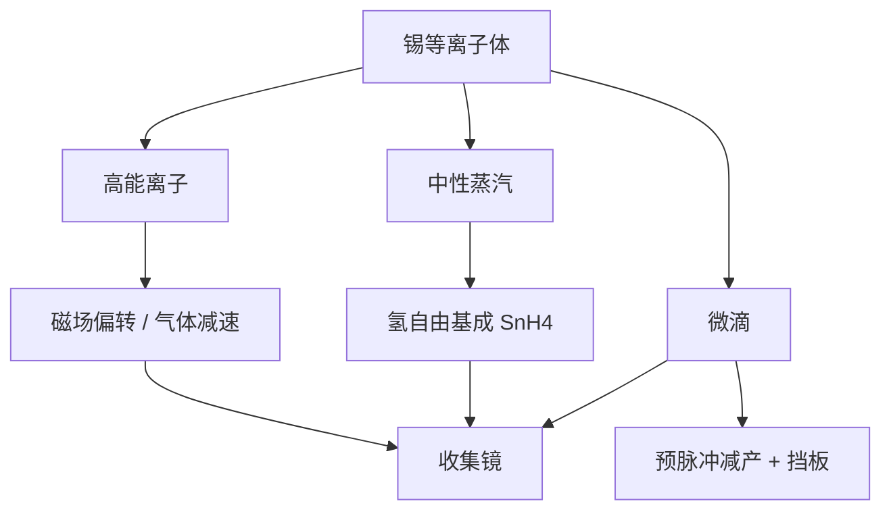

# 锡碎屑与防护

每一次出光都伴随锡的离子、蒸汽和微滴；收集镜是第一面牺牲光学，防护必须在出光的同一微秒里完成。

<footer>—— 改写自 ASML / Cymer 对 LPP debris 的公开分类与抑制叙述</footer>

[上一课](/litho/tin-ionization)（锡电离态）。把靶做成准时到达的锡滴。缺口是：主脉冲把滴变成等离子体之后，质量并没有消失——高能离子、中性原子和微米/亚微米液滴继续飞向收集立体角。本课钉碎屑分类与防护层级。多层收集镜如何因此退化，留给[下一课](/litho/collector-lifetime)。

## 问题

[收集镜](/litho/zeiss-euv-optics)必须张在等离子体旁边，才能收数球面度的 13.5 nm。同一立体角也是碎屑的通道。离子溅射帽层与周期膜，中性锡镀成吸收层，高速微滴造成坑和粗糙——氢刻蚀对前两类薄膜有效，对后一类机械损伤帮助有限。只优化 [CE](/litho/euv-prepulse) 而放任碎屑谱，IF 功率短期上升、镜子很快不可用。

还要保护 IF 之后的扫描腔。[DGL](/litho/euv-hydrogen-dgl) 用氢气流当无形窗，前提是光源舱已经把大部分质量流截住或化学成可抽气体。碎屑防护不是扫描机的事后过滤器，而是 LPP 源的一等设计量。

### 三类碎屑不要写成一种「污染」

公开叙述把 debris 分成：高速离子（动能溅射、植入）、中性蒸汽（均匀镀膜）、微滴（撞击、二次喷溅）。离子可用磁场偏转或气体碰撞减速；蒸汽靠氢自由基变成 SnH₄；微滴要靠靶形态（预脉冲）从源头减产，磁场对它几乎无效。把三类混成「开氢就干净」，会误判收集镜寿命。

碎屑质量流远大于带内光子质量当量。光源舱的第一任务是管理锡，第二才是出光。CE 数字不包含「有多少锡没变成 EUV 却打到了镜子上」。

## 方法

量产公开架构是多层并行，而不是单点魔法。预脉冲把实心球改成盘，降低大微滴产额。相互作用点附近的缓冲氢缩短离子平均自由程。磁场把带电粒子弯出收集镜主区。收集镜自身浸在可原位刻锡的氢自由基里。朝 IF 的通道用 DGL 差压气帘，挡住扩散蒸汽。未电离锡走回收，避免在喷嘴和腔壁上再蒸发。

防护的光学代价写在功率账里：气体柱密度进入 $T_{\mathrm{gas}}$，光阑与磁场结构可能挡一部分收集立体角。工程点是在挡屑与出光之间取窗，而不是把污染降到实验室本底。

### 磁场与氢各管什么

磁场只对带电粒子做功。中性微滴穿过磁场，必须靠源头与几何挡板。氢的双重角色——缓冲碰撞加化学反应——已在气锁课写过；本课只强调它清的是镀上的薄膜锡，补不回溅射坑。预脉冲偏心造成的侧向喷流，会打在收集镜特定方位，形成局部损伤热点，这是发生器稳定性与碎屑防护的耦合，不是气锁流量能单独拧平。

## 机制

离子在鞘层和膨胀里被加速，打到多层膜时既溅射 Mo/Si，也把表面打毛，后续散射上升。蒸汽到达后若未被及时氢刻，吸收带内光，等效于 $R_{\mathrm{col}}$ 下降。微滴的动能密度高，局部熔化与二次抛射把损伤半径扩到比液滴本身大。三类过程的时间尺度不同：闪光是纳秒，膨胀是微秒，镀膜累积是小时到天——防护必须同时覆盖。

收集镜是椭球共轭：等离子体一个焦点，IF 另一个。碎屑沿直线或微弯轨迹走，不完全沿 EUV 射线。这才给磁场和挡板留下「挡屑少挡光」的几何缝。IF 合同面要求光谱与功率稳定；碎屑若漏到照明，投影镜的清洗窗口比收集镜窄得多，策略仍是「源侧牺牲、物镜侧严防」。

不要把 DPP 电极喷溅和 LPP 锡滴碎屑写成同一种源。量产 NXE 公开叙述是锡滴 LPP；电极金属碎屑是另一条已退出 HVM 主线的问题。

## 边界

本课不给出未公开的磁场特斯拉数、氢 SCCM 或挡板图纸。也不把某次会议的「无碎屑 LPP」海报写成厂内状态。后课默认：说到收集镜退化，先问离子溅射、蒸汽镀膜还是微滴坑，三类对策不同。

换靶材（氙、锂）在历史上正是为了碎屑，但带内 CE 或重复频率不够，量产仍停在锡。追求极端 CE 若以微滴暴增为代价，工厂综合成本可能变差。引用以 ASML/Cymer debris 公开分类为准，等离子体细节见 Bakshi。

氢化物抽走是化学通道，不是「锡消失了」。排气处理、毒性与泵的耐锡能力属于工厂设施，光学课可以不展开规范，但不能暗示碎屑只存在于镜子表面。

## 小结

- LPP 碎屑分离子、中性蒸汽、微滴，对策分别是磁场/缓冲、氢刻蚀、源头减产。
- 收集镜与碎屑共享立体角，防护是出光设计的一部分。
- 氢清薄膜锡，清不掉高速微滴的机械坑。
- DGL 挡的是漏向扫描腔的质量流，不能替代源侧谱控制。
- 下一课把这些损伤写成收集镜反射率与寿命。
- 出处：ASML / Cymer LPP debris 公开材料；Bakshi, *EUV Lithography*。
