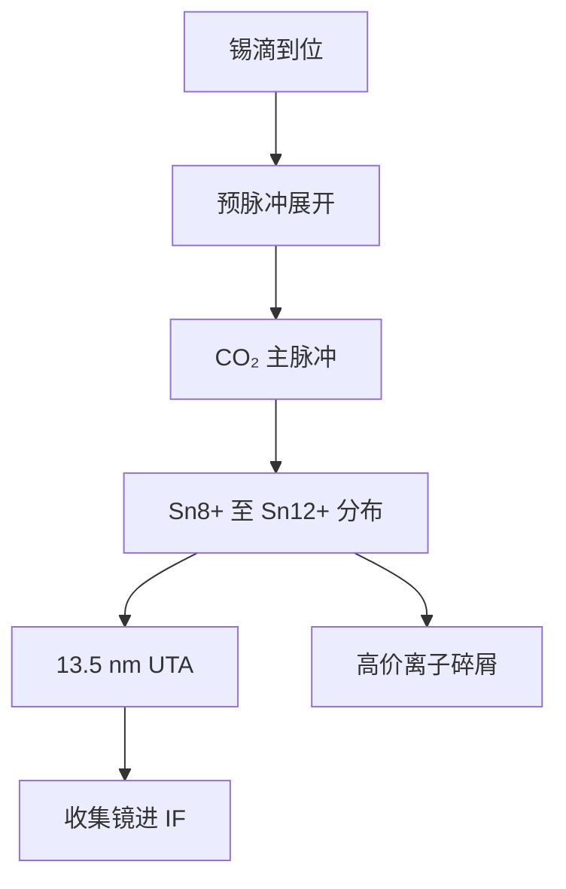

# 锡电离态

13.5 nm 不是锡原子自己发光，而是多价锡离子的未分辨跃迁阵列刚好压进多层膜窗口；公开讨论把这条带钉在 Sn⁸⁺–Sn¹²⁺ 一带。

<footer>—— 改写自 Cymer / ASML 对 LPP 锡等离子体光谱的公开叙述；原子物理背景见 Bakshi, EUV Lithography</footer>

[上一课](/litho/droplet-generator)把靶做成准时、同位、同质量的液滴链。缺口是：滴进焦斑之后，主脉冲必须把锡电离到**会发带内光**的价态，而不是随便烧成任意等离子体。本课钉公开讨论的 Sn⁸⁺–Sn¹²⁺ 窗口。碎屑如何带着这些离子打收集镜，留给[下一课](/litho/tin-debris)。

## 问题

[LPP](/litho/euv-lpp-tin) 已经写过：曝光光来自锡离子自发发射，不是 10.6 μm 激光。发生器只保证质量到达；价态不对，[预脉冲](/litho/euv-prepulse)把靶展得再漂亮也只出带外光子和动能。多层膜的带内窗口大约 2%，中心约 13.5 nm。候选元素里锡的未分辨跃迁阵列（unresolved transition array, UTA）与这条窗对齐最好，但 UTA 只在一段电荷态上密集。

太低价：4p–4d 类跃迁还没走进 13.5 nm，CE 掉。太高价：能量跑到更高电离和离子动能，带内变稀，碎屑更猛。问题因此是等离子体温度–密度必须把电荷态分布停在公开叙述的 Sn⁸⁺–Sn¹²⁺ 一带，而不是「锡等离子体」四个字。

### 价态是分布，不是单一离子

公开光谱讨论不会宣称「光源里只有 Sn¹⁰⁺」。碰撞电离、三体复合和膨胀冷却同时进行，电荷态是一条随半径和时间变的分布。工程盯的是带内功率与碎屑谱，不是某一价的数密度峰值。把某张实验室谱线上的最强价写成量产配方，会把封闭控制表误当成可引用规格。

Cymer 并入 ASML 之后，公开材料仍把 13.5 nm 归因于多价锡的 UTA，而不是某一条可指定的原子线。后课只引用「带内来自 Sn⁸⁺–Sn¹²⁺ 一带」，不要把会议海报上的电荷态直方图抄进厂内控制。

## 方法

主脉冲把展开靶加热到数十电子伏量级，电子碰撞把中性锡逐级电离。CO₂ 的临界密度低，吸收区在相对稀薄的冕，有利于把能量留在出 UTA 的价态上，而不是耦进过密核。光谱诊断看的是带内对带外、以及若干价态示踪线；量产机并不把完整电荷态解当作实时执行器。

控制旋钮仍是上一课已经对齐的那条链：滴质量、预脉冲展开、主脉冲能量与包络、氢缓冲。价态窗口是这些旋钮的约束，不是第四套独立硬件。改滴径或改预脉冲，等于改光学厚度和膨胀时间，电荷态分布跟着走，[CE](/litho/euv-prepulse) 与离子动能一起漂。

### 为什么公开讨论钉在 8+ 到 12+

锡的 4d 壳层在这段价态上给出密集的 4p–4d 类跃迁，叠成宽度与 2% 带宽相当的 UTA。邻近更高价（公开叙述里也会提到 Sn¹³⁺、Sn¹⁴⁺）仍然贡献，但再往上带内权重下降、动能碎片上升。把课标写成 Sn⁸⁺–Sn¹²⁺，是抓住公开讨论的核心窗，不是声称窗外完全不发光。

## 机制

UTA 是大量近邻线叠在仪器与等离子体展宽之下，看起来像一条带，而不是教科书里的单线激光。电子温度决定电离阶梯能爬多高；密度决定碰撞频率和光学厚度。过密则自吸收和流体力学喷溅；过稀则吸收长度不够，激光穿靶。Sn⁸⁺–Sn¹²⁺ 是这条平衡里带内最亮的一段。

同一套离子也是碎屑。高价离子在鞘层里被加速，溅射收集镜帽层；未电离或低价的微滴则几乎不受磁场偏转。优化价态等于同时优化光子与损伤：把分布往高价推，可能短期 CE 好看，镜子先死。

不要把「电离」理解成曝光光束的电离。落到掩模上的是 13.5 nm 光子；锡离子绝大多数飞向收集立体角或被氢中和，进不了 [IF](/litho/intermediate-focus) 之后的投影光路。

## 边界

本课不重写发生器流体力学，也不把磁场、氢刻蚀算进电离方程。电荷态的定量碰撞辐射模型在 Bakshi 与等离子体文献里，ASML 不公开量产的 Te、ne 控制表。后课默认：说到带内 EUV，先问等离子体是否停在 Sn⁸⁺–Sn¹²⁺ 一带，而不是问「锡打亮了没有」。

氙、锂做过 EUV 源研究，谱匹配或 CE 或碎片让它们退出量产叙事。不要在本课引入未公开的离子价配方或编造光谱仪通道。

LPP 课曾把窗写到 Sn⁸⁺–Sn¹⁴⁺。那是同一族 UTA 的宽说法；本课按公开讨论的核心段收在 8+–12+，两者不是两套物理。

## 小结

- 带内 13.5 nm 来自多价锡的 UTA，公开讨论钉在 Sn⁸⁺–Sn¹²⁺ 一带。
- 滴到位只是前提；价态窗口由温度、密度和 CO₂ 吸收区共同决定。
- 价态是分布；单一离子标签不能当控制规格。
- 同一套高价离子是收集镜溅射源，CE 与碎屑必须一起看。
- 出处：Cymer / ASML LPP 公开光谱叙述；Bakshi, *EUV Lithography*。
