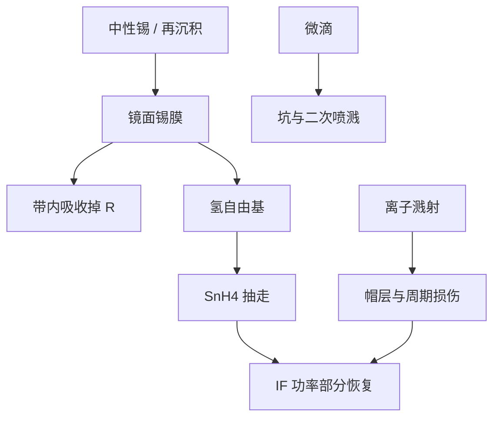

# 镜面锡沉积

没被电离打掉、又没变成氢化物抽走的锡，会在第一面光学上长成吸收膜；功率掉的方式与起泡分层不同。

<footer>—— 改写自 ASML / Cymer 对 LPP 锡污染与氢原位清洗的公开叙述</footer>

[上一课](/litho/hydrogen-blister)把氢的代价写成膜内起泡。缺口是氢真正要清的那一层：镜面上的锡。本课钉锡沉积（锡镀膜、溅射再沉积）。防护膜如何挡颗粒，留给后课 pellicle，不在这里展开透过率。

## 问题

[碎屑课](/litho/tin-debris)分过三类：离子溅射、中性蒸汽镀膜、微滴撞击。落到多层上的中性锡和低能再沉积形成连续或岛状金属膜，13.5 nm 吸收截面大，几个纳米量级就够让带内反射率可见地掉。[收集镜寿命](/litho/collector-lifetime) 已把这件事写成消耗品曲线；本课补的是沉积本身的空间与化学，以及它和起泡如何叠在同一面镜子上。

若 DGL 或 IF 通道失手，锡还可以走向照明与投影——那是事故态，不是量产稳态。量产叙述假定锡质量流被关在光源舱，收集镜当牺牲面。缺口是：牺牲面上的锡是均匀吸收还是有角分布，氢洗是在清膜还是在打帽层。

### 镀锡与溅射损伤不要一张工单

均匀镀锡：氢自由基生成 SnH₄，反射率可部分恢复。溅射把帽层和周期打薄、打糙：氢补不回。微滴坑是局部几何损伤。只报「镜子脏了」，维护会选错：该换的洗、该洗的换。

锡膜是金属吸收体，不是碳膜。碳氢残余裂解成碳，氢走 CH₄ 通道；锡走 SnH₄。两种污染物的光学后果都是掉 R，化学旋钮不同。

## 方法

光源舱维持足够氢密度和 EUV 解离，让收集镜表面处于「镀上–抽走」的准动态平衡。流量、镜温、IF 功率闭环：流量小则锡累积，流量大则沿程吸收吃带内功率，并加重上一课的植入。磁场与缓冲气体先减离子通量，氢再清蒸汽镀层；微滴仍靠靶形态从源头减产。

监测用 IF 带内功率、光瞳填充和（公开讨论中的）收集镜状态代理。剂量环加激光能量可以短时间顶住瓦数，锡膜加厚时角谱和散射已经变，CD 指纹会先于功率计告警。

### 空间指纹跟立体角走

正对等离子体的多层先镀、先溅射；掠入射对照几何里，擦角壳层的镀锡沿缝和阴影不同。无论哪种，污染都不是均匀加一个衰减系数：照明 σ 图会歪。OPC 假定的光源是出厂图，收集镜寿命末期要用光源侧补偿或接受窗口收缩。

## 机制

中性锡到达后物理吸附、成核、连成膜。后续离子把已镀锡再溅射到别的方位，形成二次污染。氢刻蚀速率依赖自由基通量、表面温度和锡的化学态（金属锡对氧化物）。氧化锡更难氢化，放气与漏水会把「可洗」变成「洗不动」。

与起泡叠加时：氢流量为清锡而加大，植入通道变宽；锡岛又可能成为局部氢捕获或应力集中。维护策略必须同时看表面金属和膜内鼓包，不能只开大氢。

投影镜上的锡是失败模式。公开量产故事把锡关在收集器一侧。写工艺事故时不要把收集镜氢洗配方套到 POB 上。

## 边界

本课不重写电荷态，也不给锡膜厚度的出厂阈值。不要编造收集镜更换小时。后课默认：说到氢，先分清清锡、起泡、沿程吸收三件事。

LPP 公开材料给出氢清锡的原理与收集镜作为牺牲光学；不给出表面覆盖度诊断配方。

「镜子上有锡」在光源舱是预期消耗；在扫描腔是污染事件。词汇不要混用。

## 小结

- 中性锡在收集镜上长成吸收膜，是 LPP 的预期消耗通道。
- 氢刻蚀可逆地清薄膜锡；溅射与微滴坑清不回。
- 污染有角分布，照明光瞳会先于平均功率变坏。
- 加大氢清锡会加重起泡，窗口是折中。
- 出处：ASML / Cymer LPP 锡污染与氢清洗公开材料。
