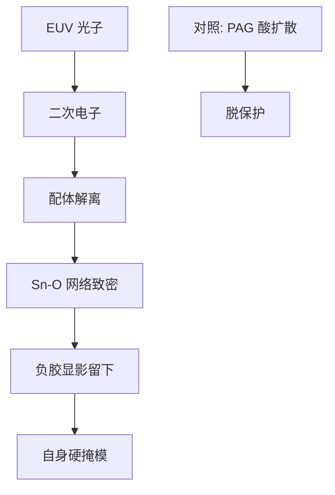

# 锡氧胶化学

锡提高 13.5 nm 的吸收，笼状锡氧骨架在曝光后丢掉配体、交联成金属–氧网络：工作点换了，不是把 CAR 的酸再命名一次。

<footer>—— 据 Inpria 等对锡氧 / 金属氧化物胶的公开原理整理，不涉及配方比例</footer>

[上一课](/litho/euv-resist)把 EUV 记录介质分到 CAR 与金属氧化物两条 RLS 工作点。缺口是金属氧化物里被公开讨论最多的那一支：锡氧笼（tin oxo）如何吸收、如何成像。本课只讲公开原理。底层从[下一课](/litho/euv-underlayer)接，不在这里排栈。

## 问题

CAR 用 PAG 产酸、PEB 脱保护。金属氧化物胶把「像素」换成含金属的团簇。锡的原子序数让 13.5 nm 吸收截面明显高于纯有机膜，薄膜仍能收够光子，深宽比和倒塌预算一起下降。公开叙述里，典型锡氧胶是带有机配体的锡–氧笼或团簇：曝光（经二次电子）使配体解离，金属–氧网络致密、溶解度下降，显影留下曝光区——多数为负胶工作点。

缺口不是重讲 RLS 三角，而是：吸收换在锡上、成像换在配体/网络上，酸扩散不再是第一模糊核。把它写成「含锡的 CAR」，会把 OPC 抗蚀剂模块留在错误的族。本课不写摩尔配方、不写烘箱食谱、不编某节点是否已切到锡氧。

### 公开原理停在机制，不停在牌号

Inpria 等厂商的公开材料把锡氧胶描述为分子锡氧簇 + 配体，EUV 下配体脱落、氧化锡网络形成，干法选择比高。细节配体种类与溶剂是产品秘密。课内只保留：高 Sn 吸收、负胶网络、薄胶硬掩模能力、金属沾污约束。

不要把「锡氧」理解成唯一金属胶。铪、锆氧团簇是同一族的其他工作点。本课用锡氧当代表，因为公开讨论最多；换金属等于换吸收边与沾污门，不是换一套百科。

## 方法

工艺接口与 CAR 不同：涂布仍是旋涂，但 PEB 的含义更接近网络致密化时钟，而不是酸催化循环。显影液、去胶、腔体沾污规格都要重开。剂量–CD 曲线、缺陷密度、与底层的黏附必须在该胶族上标定。OPC 用团簇离散 + 二次电子核，而不是 PAG 扩散高斯；上一课已经警告过，本课把它落到锡氧这个实例。

蚀刻：锡氧网络自身可当硬掩模，胶可以更薄；薄胶减轻倒塌，也让底层平面化变成一阶——下一课。灵敏度数字必须和缺失孔、桥连一起读，不能只报「比 CAR 更敏」。

### 后课默认

说到金属氧化物胶，默认成像是配体解离 + 金属–氧交联，极性多为负。说到锡氧，默认高 EUV 吸收来自锡，不来自化学放大倍数。随机与沾污仍按层签核。

## 机制

92 eV 光子在锡位点被优先吸收，打出光电子与级联二次电子。电子打断配体或引发氧化，笼与笼之间连成不溶网络。事件载体是纳米团簇：每个簇吸不吸到、连不连上，是离散统计——RLS 的「R」更受团簇尺寸与团聚制约，而不是受酸的 $\ell$ 制约。吸收截面大，同样剂量下 $\bar{N}$ 更大，这是相对 CAR 买灵敏度的正道；团聚则引入低频粗糙，是负道。

干法选择比高，是因为无机骨架相对有机下层可被选择性保留。代价在真空与腔体：锡挥发分、颗粒、交叉污染。实验室 LER 好看，过不了沾污门就不能进量产机台。公开原理把这写成集成约束，不是分辨率论文的附录。

引用锡氧结果时写清：胶厚、底层、剂量、极性、测的是 LER 还是缺孔。只报「金属胶更先进」而省略沾污与缺陷，与只报 loss 不报评测集同类。

## 边界

不发明配体结构、不编 wt% 锡含量、不把某篇会议剂量当工艺点。CAR 在非最紧层上仍会长期存在：供应链与模型熟。同一节点按层混用，上一课已经说过，锡氧只是金属族里的一条。

二次电子产额与底层如何向胶里灌电子，是再后两课的账；本课只承认锡位点是吸收中心。出气物种与碳氢污染光学，也还未展开。正胶 CAR 的显影、去胶生态不能原样搬来：负胶网络的去胶与金属残留规格要单独开，这是集成课，不是把「更先进」写进对比曲线。

## 小结

- 锡氧胶用锡吸收 EUV，用配体解离与 Sn–O 网络成像，多为负胶。
- 模糊核靠近二次电子与团簇离散，不是 CAR 酸扩散。
- 薄胶 + 自身硬掩模换倒塌预算；合同含沾污与涂布缺陷。
- 不写配方；公开原理足够后课引用机制。
- 底层下一课；二次电子再下一课。
- 负胶去胶与金属残留规格要单独开，不能搬 CAR 生态。
- 出处：Inpria 等对锡氧 / 金属氧化物胶的公开机制；Mack 的空中像–潜像–显影像框架仍适用。
