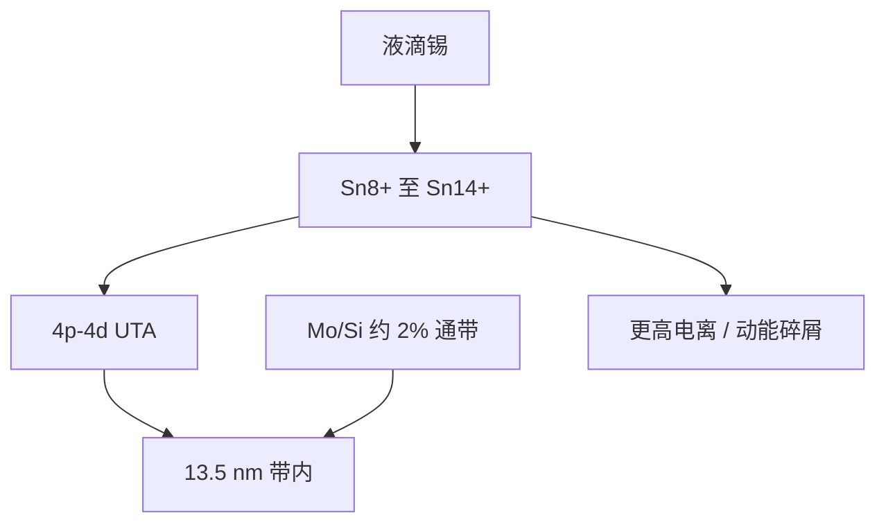

# 锡等离子体辐射

13.5 nm 不是随便选的短波长。多价锡离子的 4p–4d 未分辨跃迁阵列正好盖住 Mo/Si 多层膜的通带。

<footer>—— 据 O'Sullivan 等对 Sn UTA 的光谱工作；Bakshi, EUV Lithography</footer>

[上一课](/litho/conversion-efficiency-physics)把 CE 写成带内能量分支。缺口是分子里那份光从哪来：不是 CO₂ 的谐波，而是锡等离子体自己的自发发射。本课钉锡的价态、UTA 与 13.5 nm 窗口的对齐。功率如何从 250 W 往 1 kW 推，留给[下一课](/litho/euv-power-roadmap)。

## 问题

CE 课把「带内」当成合同带宽。合同要成立，发射体必须在这扇窗里足够亮。氙、锂做过 DPP/LPP 候选：氙的谱与多层窗口重叠较差或 CE 不够，锂的谱线窄但靶与碎片难做成数十 kHz 液滴循环。锡的优势是开壳层离子在 13.5 nm 附近堆成未分辨跃迁阵列（unresolved transition array, UTA），宽度与多层约 2% 通带相当，等于一块天然的带内灯。

缺口是把 UTA 落到离子价态，而不是再定义一次 CE。价态错了，CE 公式的分子自动变小，加激光只是加碎屑。

UTA 是大量近邻跃迁叠成的准连续带，不是激光器的单色线。剂量环盯的是带内积分，不是某一条 Sn 线的峰值。

## 方法

公开图像：主脉冲把展开后的锡加热到约 20–40 eV，电离到大致 Sn⁸⁺–Sn¹⁴⁺ 一带，4p–4d 类跃迁形成 13.5 nm 附近的 UTA。ARCNL 的 Versolato、Torretti、Schupp 等用激光锡等离子体的光谱诊断，把价态分布、光学厚度和带内辐射连起来：太厚则自吸收把峰压扁并加宽，太薄则发射体积不够。量产配方把靶的柱密度停在「对 10.6 μm 光学厚、对 EUV 尚未完全自蚀」的窗口——这是 CE 课的靶条件在原子物理上的对应。

氙灯或同步辐射可以当计量光源，不能当扫描机的 50 kHz 灯。液滴把每次击打的质量量子化，谱才可能脉冲间重复。谱若跳价态，收集镜看到的角分布和碎屑一起变，光瞳填充比后课会再遇到。

### 光学厚度与自吸收

UTA 亮到一定柱密度会自吸收：峰被压扁、带内能量搬到窗沿，CE 分子并不单调上涨。量产要的是可重复的适度光学厚，而不是把尽可能多的锡电离进光路。诊断上看带内形状比看绝对峰值更有用——形状跳了，价态或柱密度已经离开窗口。

## 机制

多价锡的 4d 开壳层让能级极密，自旋–轨道与组态相互作用把成千上万条线挤进几埃，光谱仪分不开，故称未分辨。O'Sullivan、Murphy 等的原子计算给出：13.5 nm 附近的亮带随离子电荷移动；平均价态由电子温度和密度通过电离平衡决定。辐射冷却与激光加热对抗：UTA 本身是强冷却通道，温度被钉在出光窗口附近，这是锡比「随便一种金属」更合适的原因之一。

带外辐射仍然存在：邻近极紫、更长波、以及驱动红外漏光。它们不进 CE 分子，却进热和胶的误曝光，已在[光源带宽](/litho/euv-source-bandwidth)课写过。本课补的是：带内亮，是因为价态对了；带内暗，优先查温度密度，而不是先加一级 CO₂ 放大。

不要把实验室 EBIT 或真空火花的「某条 Sn 线」当成量产光源。扫描机要的是 UTA 积分在 50 kHz 下可重复，且碎屑谱可收集镜承受。

## 边界

本课不写 250 W→1 kW 的机台路线，也不重写预脉冲时序。后课默认：说到「谱漂了」，先问价态窗口，再问放大链。出处：O'Sullivan 等 Sn UTA；Versolato / ARCNL 锡等离子体光谱；Bakshi 对发射体选择；ASML 对锡滴 LPP 的公开叙述。

## 小结

- 曝光光来自多价锡的 UTA，与 Mo/Si 通带对齐，这是 13.5 nm 路线的光谱前提。
- 价态窗口大约在 Sn⁸⁺–Sn¹⁴⁺；偏离则 CE 掉、碎屑变。
- 后课功率路线默认发射体已经是这块 UTA，不再换元素。
- 出处：O'Sullivan；ARCNL tin-plasma；Bakshi；ASML LPP 公开材料。
