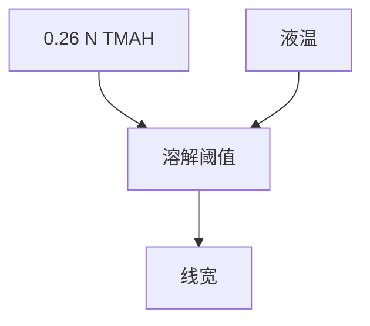

# TMAH 与显影液

0.26 N TMAH 是正性 CAR 的工业默认碱；浓度、温度和表面活性剂改的是溶解阈值，不是空中像。

<footer>—— 对照工业标准 tetramethylammonium hydroxide 显影液</footer>

[上一课](/litho/develop-puddle)给出铺液方式。缺口是液体是什么：四甲基氢氧化铵（TMAH）水溶液，常标 2.38 wt%（约 0.26 N）。主干胶课假定「碱显影」；本课钉这一默认契约，以及为什么不能当纯水漂。

## 问题

正胶曝光区聚合物变亲水、可溶。碱浓度决定阈值：过稀，该溶的不溶；过浓，未曝光区也咬。温度几度就改速率，轨道显影模块的液温是 CDU 源。把显影液当成「水」，会把化学对比度派给 PEB。

TMAH 有毒性与废水约束，厂内是危险化学品管理对象。本课只写工艺角色，不写操作规程替代 MSDS。

## 方法

浓度、温度、表面活性剂（下一课冲洗也会用）写进配方。新鲜液对循环液：循环降低成本，但带溶解产物，阈值漂。过滤与补给是缺陷课的前置。负胶或金属氧化物胶可能不用 TMAH——本课不吞并。

## 机制

酚羟基（或 CAR 脱保护后的羧酸）在碱中电离，聚合物链溶剂化后离开膜。离子强度改双电层与溶胀，从而改倒塌风险——后课倒塌抑制会回到液面张力，不全是 TMAH 浓度。

## 边界

不写有机溶剂显影或干法显影化学。下一课冲洗：把碱和产物带走，毛细力开始主导。

## 小结

- 工业正胶默认 0.26 N TMAH；浓度与温度是 CD 旋钮。
- 循环污染会漂阈值。
- 出处：TMAH 显影工业通识；Mack 溶解语境。
