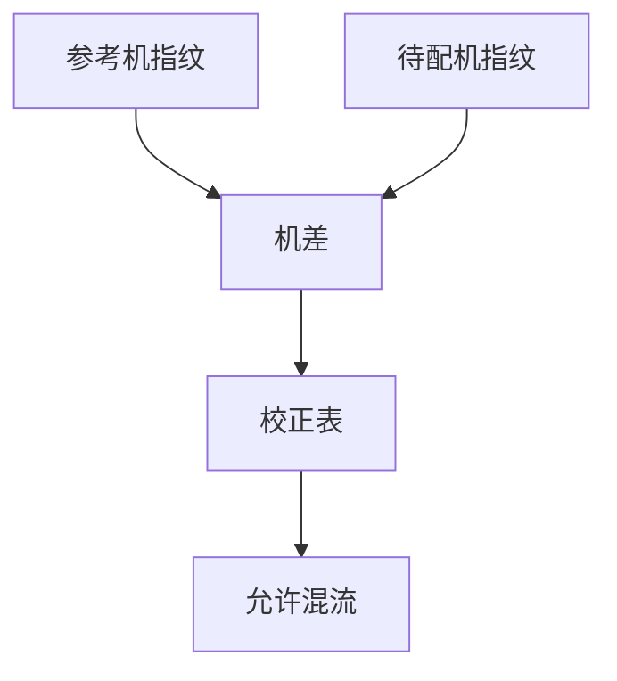

# 机台匹配

同一套版、同一条胶，换一台扫描仪，CD 和套刻指纹会换一张脸。匹配不是把两台调成同一序列号，是把指纹差压进预算。

<footer>—— 对照 tool matching / fingerprint matching；套刻指纹差见 [机台对机台套刻](/litho/tool-to-tool-overlay)</footer>

[上一课](/litho/reticle-library-exchange)把版换进机。缺口是多机：量产不会只活在一台上。本课钉匹配，稼动率下一课。

## 问题

照明瞳、镜头像差、台网格、剂量标定各台不同。混流后层间套刻和 CD 出现「机台条」。只校准单机到规格，不保证两机差。

## 方法

选参考机，测照明、剂量、套刻网格、焦点。用校正表（照明、放大率、扫描同步偏置）把差压进剩余。统计：匹配残差进 SPC，超限停混流。与 [扫描仪校准周期](/litho/scanner-calibration-cycle) 分工：校准是单机回到自己的零，匹配是两机相对零。

## 机制

像差指纹通过 TCC 进 CD；网格指纹进套刻。校正若只做低阶（放大、旋转），高阶像差差仍在。High-NA 半场机差更刺眼。

## 边界

下一课：匹配再好，机台不在线就没有产能。

## 小结

- 匹配管的是机差，不是单机绝对精度。
- 校正阶数必须覆盖混流敏感的指纹。
- 出处：套刻与照明课；校准周期课。
