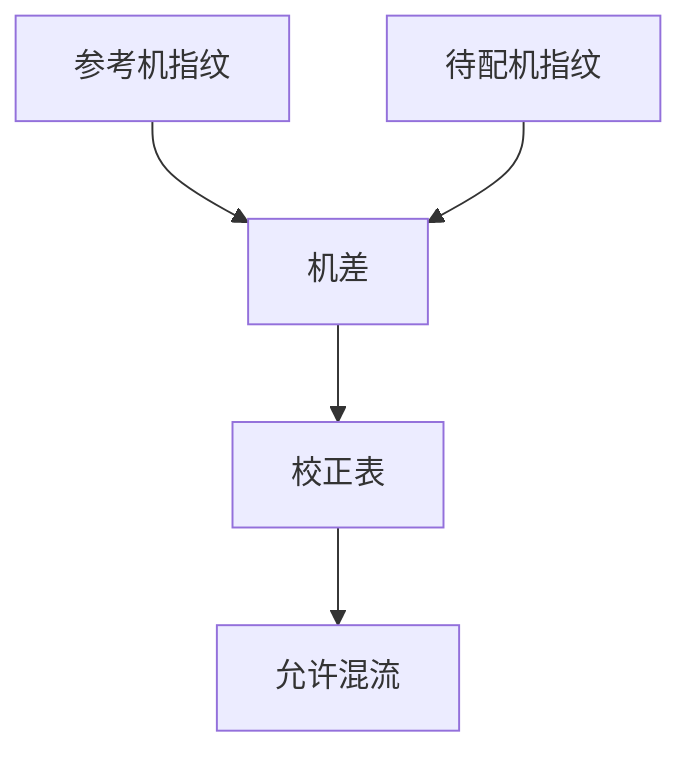
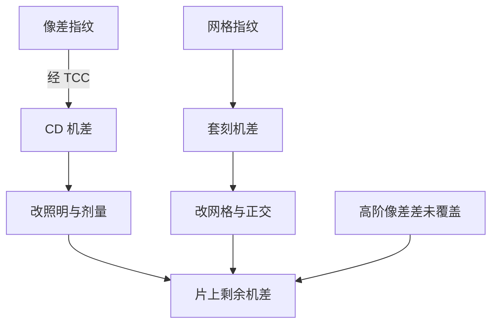

# 机台匹配

同一套版、同一条胶，换一台扫描仪，CD 和套刻指纹会换一张脸。匹配不是把两台调成同一序列号，是把指纹差压进预算。

<footer>—— 据 Levinson, Principles of Lithography 对套刻与机台匹配（mix-and-match）的讨论整理</footer>

[上一课](/litho/reticle-library-exchange)把版换进机。缺口是多机：量产不会只活在一台上。本课钉匹配，稼动率下一课。匹配的对象是指纹而不是精度：每台都在规格内，两台的差仍能吃光套刻预算。

## 问题

照明瞳、镜头像差、台网格、剂量标定各台不同。混流后层间套刻和 CD 出现「机台条」。只校准单机到规格，不保证两机差。

展开：机台指纹来自四层——光学层（照明瞳与像差）、几何层（网格、正交、放大率、焦面）、设置层（剂量、焦点零点）、时间层（漂移方向各异）。混流后批在机台间弹跳，按机台分组的系统差在套刻账上现形（[机台对机台套刻](/litho/tool-to-tool-overlay)）。规格内不等于可混：$\pm$ 窗口里两台各站一角，机差可达窗口全宽——只校准单机到规格，不保证两机差。

## 方法

选参考机，测照明、剂量、套刻网格、焦点。用校正表（照明、放大率、扫描同步偏置）把差压进剩余。统计：匹配残差进 SPC，超限停混流。与 [扫描仪校准周期](/litho/scanner-calibration-cycle) 分工：校准是单机回到自己的零，匹配是两机相对零。

工程流程：选稳定高产的机台当参考机，用片上计量（裸片网格加产品套刻标记）测出两台指纹；差值分解成低阶（平移、放大、旋转、正交）与高阶（[高阶套刻](/litho/high-order-overlay)项）逐层写校正表：照明与剂量差改设置，网格差改模型，像差差覆盖不了就退回专机专用。

```mermaid
flowchart TD
  REF["参考机指纹"] --> DELTA["机差"]
  DUT["待配机指纹"] --> DELTA
  DELTA --> CORR["校正表"]
  CORR --> MIX["允许混流"]
```

匹配不是把 A 机调成 B 机：校正表在各机自己的坐标系里解释同一目标，参考机只在定义坐标系时用一次——匹配因此隔着数周的计量滞后仍有效，它约束指纹，不是实时状态。

## 机制

「指纹」可以想象成笔迹：两台机都写得工整（都在规格内），但写同一个字时笔画的歪法不一样。量产要的是两台机的字能叠在一起用，所以匹配管的是「笔迹差」，不是「谁更工整」。

常见误区：以为匹配就是「把 B 机再校准一遍」。校准是让每台回到自己的零；匹配是让两台的零彼此靠近。只校准不匹配，两个各自「准」的机台加起来仍可能吃光套刻预算。

像差指纹通过 TCC 进 CD；网格指纹进套刻。校正若只做低阶（放大、旋转），高阶像差差仍在。High-NA 半场机差更刺眼。

写透一点：两条账分开管——像差指纹经 TCC 进 CD，匹配动照明与剂量；网格指纹进套刻，动网格与正交；混在一张表里改，按下葫芦浮起瓢。校正阶数必须覆盖混流敏感的指纹：只做低阶时，两台的高阶像差差原样留在片上，表现为随场位置弯曲的套刻残差。机差还会 fading：镜头老化、换件、两台校准漂移方向不同，会慢慢吃掉匹配好的预算——匹配是带保质期的状态，不是一次性调平。High-NA 半场靠拼接（[High-NA 拼接](/litho/high-na-stitch)）拼出全片，机差直接落进拼接缝，更刺眼。

```mermaid
flowchart TD
  AB["像差指纹"] -->|经 TCC| CDD["CD 机差"]
  GR["网格指纹"] --> OV["套刻机差"]
  CDD --> FI["改照明与剂量"]
  OV --> GA["改网格与正交"]
  FI --> RES["片上剩余机差"]
  GA --> RES
  HO["高阶像差差未覆盖"] --> RES
```

为什么重要：匹配省下的复测计量看似是几小时的节省，实际是把风险转成几批套刻超限的报废。镜头老化与漂移方向不同让机差悄悄涨回来，匹配因此要按保质期管理，不是调平一次就归档。

## 边界

匹配只在同代同型机台间充分有效：跨代混流时照明自由度与像差量级差太远，校正表通常只敢接网格与放大率，其余靠工艺裕度硬吃。本课不写套刻计量的取样与建模（[套刻预算](/litho/overlay-budget)课域）；CD 机差与套刻机差分开归账，别用一张匹配表包打天下。

## 小结

- 匹配管的是机差，不是单机绝对精度。
- 校正阶数必须覆盖混流敏感的指纹。
- 下一课稼动率：匹配再好，机台不在线就没有产能。
- 出处：套刻与照明课；校准周期课。
