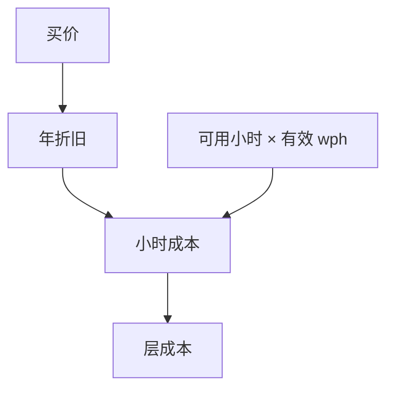

# 机台价格与折旧

扫描机的小时成本是买价按年折旧再除以有效 wph；EUV 与高 NA 把分子抬高，剂量把分母压低。

<footer>—— 对照 ASML FY2024：净销售 €28.3B；EUV 系统销售 €8.3B / 44 台（含 High-NA）；DUV €12.8B / 374 台；Installed Base €6.5B。年报给销量与销售额，不给可抄的价目表</footer>

[上一课](/litho/euv-vs-multipattern-cost-crossover)用模块成本比较路径。缺口是模块里最大的资本项。本课钉机台价格与折旧。折旧如何在厂级变成瓶颈机台数量，留给[下一课](/litho/capacity-planning-bottleneck）。

## 问题

光刻机台（尤其 EUV、高 NA）是晶圆厂最贵的单机之一。会计上折旧年限（常见五到七年量级的产业讨论，非本课税法意见）把买价摊成年度成本，再按可用小时与 wph 摊到晶圆。维护、光源耗材、服务合同是现金，不一定走同一折旧科目，但进小时成本。浸没机单价低、wph 高，多重次数把有效层成本拉回。

缺口是**资本回收**，不是光学。ASML 年报给的是销量与销售额：2024 年 EUV 系统 €8.3B、确认收入 44 台（NXE 与 EXE），DUV €12.8B、374 台。这只是平均确认收入量级，混有机型与升级，**不是**目录价。服务与升级走 Installed Base（2024 年 €6.5B），与折旧并列进小时成本。

### 有效 wph

可用性、setup、剂量、pellicle、计量插入，把铭牌 wph 打成有效 wph。折旧分母是有效，不是铭牌。

高 NA 半场可能让大 die 的有效场数下降，分母再变。经济课与拼接课必须一起读。

## 方法

小时成本 ≈ (折旧 + 服务 + 耗材) / 有效小时。层成本再除有效 wph 乘过机次数。产能规划用同一套分母。与掩模：写模机也是折旧对象，进掩模摊销。

## 机制

固定成本高的机台必须高利用率，否则小时爆炸——这会压迫排产把非临界层塞进浸没，把 EUV 留给交叉后的层。利用率与混跑策略因此是财务约束，不只是工程偏好。

## 边界

不提供投资建议，不给具体标价。折旧年限因公司而异。机台价格不含厂房。

后课默认：小时成本由折旧与有效 wph 决定；下一课用它来数需要几台、瓶颈在哪。

## 小结

- 层资本成本来自折旧除以有效 wph，不是铭牌。
- 高单价机必须高利用率，从而塑造混跑。
- 不把传闻标价写进账。
- 出处：ASML Q4/FY 2024 新闻稿与 IR 演示（2025-01-29）；半导体设备折旧的产业通称。不把 €8.3B/44 写成标价。
