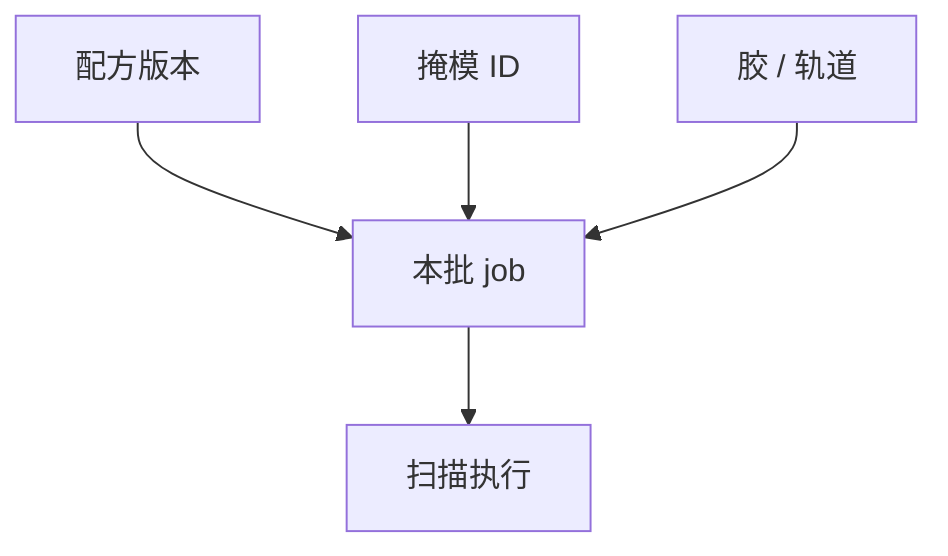

# 配方与机台软件

曝光机是一台会跑状态机的精密仪器。配方把照明、剂量、对准、扫描编成可重复的剧本；软件缺陷会表现为「随机套刻」。

<footer>—— 对照 scanner recipe / job deck；APF 一类机台软件通识</footer>

[上一课](/litho/tool-uptime-mtbf)把停机算进稼动。缺口是：很多停机和偏移来自配方与联机软件，不是轴承。本课钉配方软件，校准周期收束本单元。

## 问题

同一硬件，配方选错照明、选错对准标记、扫描向反了，CD 和套刻会整批废。版本：胶换了剂量表没升版。联机：轨道送来的片 ID 对不上 job。把所有偏移写成光学，会漏软件配置。

## 方法

配方版本进变更控制，与胶批、掩模 ID 绑定。仿真/干跑检查标记是否在窗、场图是否越界。日志：哪条校正表、哪次校准被用。与 APC 课分工：APC 改剂量套刻偏置，本课管机台是否执行了那张配方。

## 机制

状态机：装载 → 预对准 → 对准 → 曝光 → 卸载。中断恢复若丢校正表，会留下一场「幽灵指纹」。时间同步：机台钟与计量钟差，APC 会喂错批。

## 边界

下一课把硬件零点周期性拉回来：校准。配方再对，零点漂了仍偏。

## 小结

- 配方是可版本化的光学与运动剧本。
- 联机状态与日志是「随机」失效的第一现场。
- 出处：对准与 APC 课；SEMI 作业管理通识。
