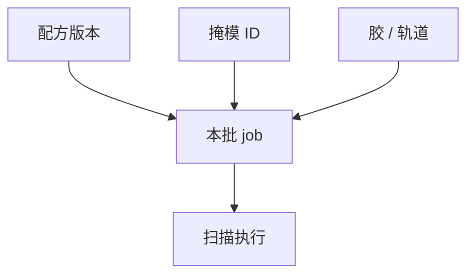
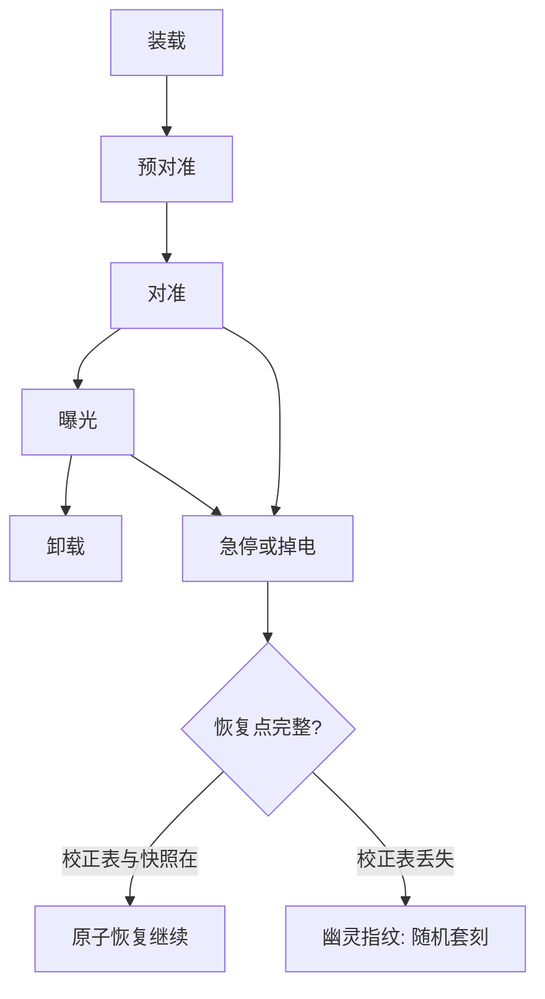

# 配方与机台软件

曝光机是一台会跑状态机的精密仪器。配方把照明、剂量、对准、扫描编成可重复的剧本；软件缺陷会表现为「随机套刻」。

<footer>—— 机台与主机联机见 SEMI E30（GEM）；作业与载具模型见 E40 / E87 / E94 作业族标准</footer>

[上一课](/litho/tool-uptime-mtbf)把停机算进稼动。缺口是：很多停机和偏移来自配方与联机软件，不是轴承。本课钉配方软件，校准周期收束本单元。同一台机，两套配方就是两台机。

## 问题

同一硬件，配方选错照明、选错对准标记、扫描向反了，CD 和套刻会整批废。版本：胶换了剂量表没升版。联机：轨道送来的片 ID 对不上 job。把所有偏移写成光学，会漏软件配置。

展开：配方是一叠参数——照明设置、NA 与 σ、剂量表、对准策略（标记组、捕获窗）、扫描方向、场图边场处理。选错一项就成批显形：照明错是整批 CD 偏移，标记错是对准报错或盲曝，扫描向反是套刻按场翻转。版本更隐蔽：胶批换了、剂量表没升版，漂移被误判成工艺或硬件过期。联机问题则表现成「随机」：片 ID 与 job 对不上、状态机卡半途，日志没留好就查无实据。

## 方法

配方版本进变更控制，与胶批、掩模 ID 绑定。仿真/干跑检查标记是否在窗、场图是否越界。日志：哪条校正表、哪次校准被用。与 APC 课分工：APC 改剂量套刻偏置，本课管机台是否执行了那张配方。

工程流程：生命周期分生成、下发、执行三段。生成端由层定义加机台能力文件出配方，干跑校验标记在窗、场图不越界、剂量在表内；下发经 SEMI E30 GEM 一类的主机联机界面（E40/E87/E94 管作业与载具），配方版本与掩模 ID、胶批绑定；执行端日志必须能答出「用的哪版配方、哪张校正表、哪次校准快照」。

```mermaid
flowchart TD
  REC["配方版本"] --> JOB["本批 job"]
  MASK["掩模 ID"] --> JOB
  RES["胶 / 轨道"] --> JOB
  JOB --> EXE["扫描执行"]
```

把配方文件做摘要（hash）写进批历史，复盘才有「当时执行了什么」的第一手证据；没有它，事故调查会在「确定改过剂量表吗」这层空转。

## 机制

状态机翻译成大白话：机台内部有一张「现在在哪一站、下一步允许去哪」的地图，装载、预对准、对准、曝光各是一站。软件的一切行为就是按这张地图走；「卡住」多半是走到了地图上没铺路的一步。

状态机：装载 → 预对准 → 对准 → 曝光 → 卸载。中断恢复若丢校正表，会留下一场「幽灵指纹」。时间同步：机台钟与计量钟差，APC 会喂错批。

```mermaid
flowchart TD
  LD["装载"] --> PA["预对准"]
  PA --> AL["对准"]
  AL --> EX["曝光"]
  EX --> UL["卸载"]
  AL --> INT["急停或掉电"]
  EX --> INT
  INT --> REC{"恢复点完整?"}
  REC -->|校正表与快照在| OK["原子恢复继续"]
  REC -->|校正表丢失| GH["幽灵指纹: 随机套刻"]
```

写透一点：状态机里最容易出鬼的是中断恢复：急停、掉电后，恢复点必须连校正表与对准快照原子地回来——丢了校正表的后半批留下一场「幽灵指纹」，现场是随机套刻，日志是状态机停在半句。MES 与设备端的差分排查有固定次序：先对配方摘要，再对校正表版本与校准日期，最后才轮到硬件；多数「随机套刻」走到第二层就现形。时间同步是暗坑：机台钟与计量钟差会让 APC 把偏置喂错批，钟差对齐前调工艺没用。

常见误区：把所有漂移都往光学或机械上猜。实际排查次序是软件配置优先——配方摘要对得上，校正表版本与校准日期对不上，问题就已经定位了一半，动硬件反而是最后一步。

## 边界

本课不写 APC 怎么算偏置（[APC](/litho/apc)、[前馈反馈](/litho/feedforward-feedback-r2r)课域），也不写配方引用的版图从哪来（[掩模数据准备](/litho/mask-data-prep)课）；状态机只覆盖单机，track 与 scanner 的交接时序归[联机](/litho/track-scanner-link)课。

## 小结

- 配方是可版本化的光学与运动剧本。
- 联机状态与日志是「随机」失效的第一现场。
- 下一课校准周期：配方再对，零点漂了仍偏。
- 出处：对准与 APC 课；SEMI 作业管理通识。
