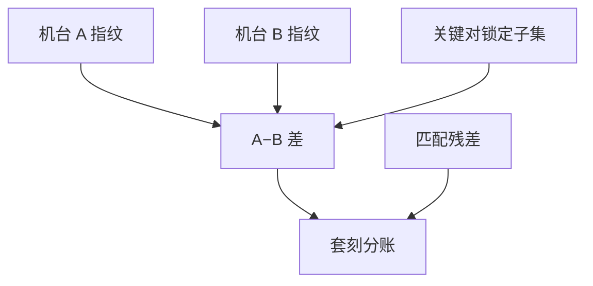

# 机台对机台套刻

同一套版，A 机曝栅、B 机曝切线，套刻指纹是两台机器的差，不是单机规格的均方根能代办的。

<footer>—— 对照 dedicated chuck / tool dedication 与 overlay matching 的公开讨论</footer>

[上一课](/litho/wafer-distortion-stress)给出工艺弯月。缺口是混流：量产不会单机。[机台匹配](/litho/tool-matching) 已写扫描机指纹匹配；本课钉**层间套刻的机台对**，不重写照明瞳匹配全文。厂级数据如何把这些环连起来，留给[下一课](/litho/fab-data-loop）。

## 问题

层间 overlay = 本层机台指纹 − 参考层机台指纹 + 工艺 + 版图。单机都在规格内，差值可以超关键对规格。策略：关键对专用机台/卡盘（dedication）、或把匹配残差压进预算并在 APC 里存「机台对」指纹。混用无匹配的 EUV 与浸没更严。

缺口是**对的矩阵**，不是单机校准。N 台机的关键对有 $N\times N$ 种差，全部开放则匹配实验爆炸。实务是聚类：匹配到参考机，或关键层锁定子集。

### 卡盘与镜头要分账

同一机台换卡盘，翘曲吸平变；镜头指纹相对稳。匹配要以卡盘为对象，而不是只写机台序号。Twinscan 双台本身就要当两个卡盘匹配。

APC 状态必须用 (机台, 卡盘, 层对) 做键。串错键，补偿会加在错误的差上。

## 方法

匹配：用同一批或专用匹配片在机台对上曝参考层与本层（或测扫描机网格差）。预算：匹配残差占 overlay 分账。调度：MES 对关键对限制机台集合。与计量匹配：套刻机也要进同一尺度，否则机台差被计量差污染。

dedication 名单要短而硬：关键对只允许已匹配的子集，紧急混机必须走加密计量和临时指纹，而不是默默借用邻机状态。公开的 overlay matching / chuck dedication 讨论，核心就是这张矩阵的稀疏化。

## 机制

指纹 $F_i(x,y)$。层对 $(i,j)$ 的系统 overlay 含 $F_j-F_i$。dedication 令 $i=j$ 的硬件相关部分相消，工艺项仍在。匹配把 $F_j-F_i$ 降到残差。APC 存 $\widehat{F_j-F_i}$。换机等于换模型键，应重置或加载对应键，与 R2R 事件规则相同。

层间看见的是指纹差。APC 键含机台与卡盘；串错键等于把补偿加在错误的差上。

## 边界

不重复扫描机光学匹配细节。不把某厂 dedication 政策当 SEMI 强制。本课不写价格与机时费。

后课默认：关键套刻按机台–卡盘对管理。下一课把 APC、SPC、分派接到厂级数据系统。

## 小结

- 层间套刻看见机台指纹差；dedication 或匹配残差分账。
- APC 键含机台与卡盘。
- 计量匹配必须同步，以免假机台差。
- 出处：overlay matching / chuck dedication 公开讨论；ASML 匹配公开论述。
