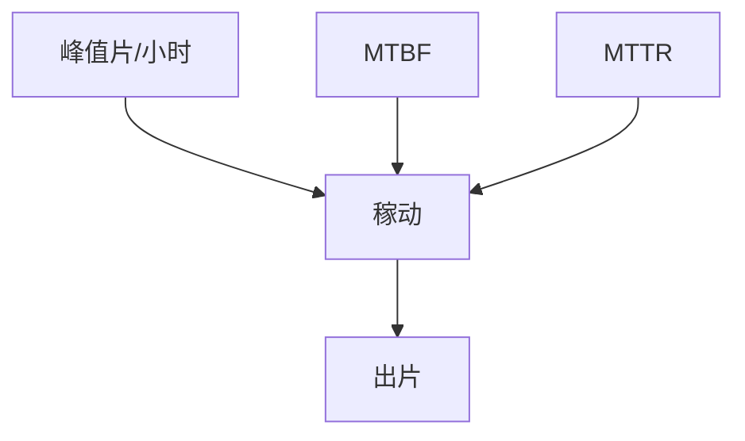

# 稼动率与 MTBF

WPH 是理想节拍。稼动率把故障、校准、换版、等片乘进去。MTBF 决定你敢不敢把关键层绑在一台上。

<footer>—— 对照 SEMI E10 稼动分类；[扫描仪产能](/litho/scanner-throughput)</footer>

[上一课](/litho/tool-matching)让多机可混。缺口是单机到底在不在产。本课钉稼动与 MTBF，配方软件下一课。

## 问题

产能表用峰值 WPH，财务用出片。停机：激光、浸没头、台、源。预防维护和校准吃掉日历时间。把「激光功率不够」写成唯一瓶颈，会漏可用性。

## 方法

SEMI 时间分类：生产、待机、工程、计划停、非计划停。MTBF / MTTR 分子系统。双台掩盖装载，掩盖不了激光换管。备件与远程诊断进 MTTR。与训练集群的故障率课无关；本课是曝光机可用性。

## 机制

可用性 $\approx$ MTBF / (MTBF + MTTR) 再扣计划停。浸没与 EUV 源把 MTBF 拉低，所以产线用集群而不是单机神话。

## 边界

下一课软件：很多「故障」是配方和联机状态机，不是硬件 MTBF。

## 小结

- 出片 = 峰值 WPH × 稼动，两项分开管。
- MTBF 按子系统报，才能决定备件与冗余。
- 出处：SEMI E10；产能课。
