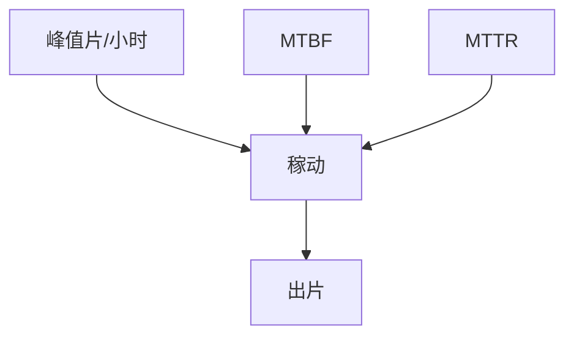
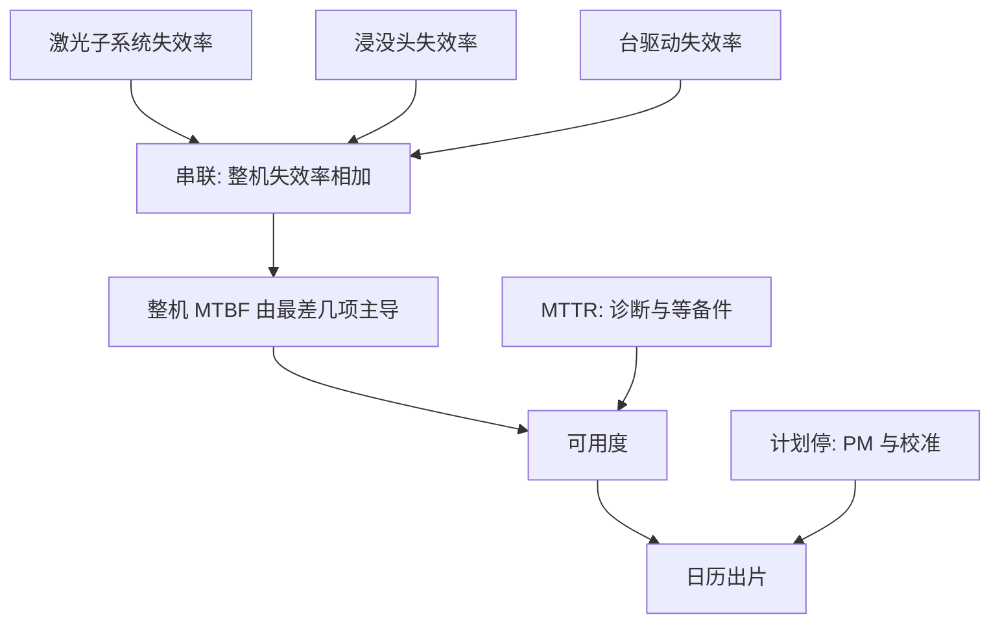

# 稼动率与 MTBF

WPH 是理想节拍。稼动率把故障、校准、换版、等片乘进去。MTBF 决定你敢不敢把关键层绑在一台上。

<footer>—— SEMI E10 对设备可靠性、可用性、可维护性与利用率（RAM/U）的定义与时间分类</footer>

[上一课](/litho/tool-matching)让多机可混。缺口是单机到底在不在产。本课钉稼动与 MTBF，配方软件下一课。峰值片/小时怎么算是[扫描仪产能](/litho/scanner-throughput)的事，本课算第二本：日历时间里真正出片的比例。

## 问题

产能表用峰值 WPH，财务用出片。停机：激光、浸没头、台、源。预防维护和校准吃掉日历时间。把「激光功率不够」写成唯一瓶颈，会漏可用性。

展开：峰值与出片之间隔着整本时间账。硬件失效只是一列——激光气体到寿命、浸没供水异常、台驱动与光源各按自己的节奏停；预防维护（PM）、校准、换版、等片、工程实验都在吃日历。两类停机代价不对称：计划停能排进节假日与非关键层，非计划停砸在量产层上，还赔上腔内半批片和恢复后的重校准。关键层绑死一台省下的匹配成本，要用可用度来还。

## 方法

SEMI 时间分类：生产、待机、工程、计划停、非计划停、非计划时间，六态互斥。MTBF / MTTR 分子系统。双台掩盖装载，掩盖不了激光换管。备件与远程诊断进 MTTR。与训练集群的故障率课无关；本课是曝光机可用性。

工程流程：按 SEMI E10 六态对账，口径不许私改，否则两台机没法并表。MTBF/MTTR 按子系统记账：激光气体、浸没头、台驱动是三套失效率，混报成整机 MTBF 就无法决定备件与冗余。MTTR 的大头是诊断与等备件，不是拧螺丝——远程诊断、预置备件包把小时压成分钟。PM 周期是权衡：太密吃稼动，太疏吃非计划停，后者单价通常高一个量级。

```mermaid
flowchart TD
  WPH["峰值片/小时"] --> AVAIL["稼动"]
  AVAIL --> OUT["出片"]
  MTBF["MTBF"] --> AVAIL
  MTTR["MTTR"] --> AVAIL
```

MTBF 是统计均值不是保票：指数失效率下，单台下次停机在何时不可预测，可预测的只是长期平均——所以答案永远是备件、冗余与快修，不是祈祷。

代个数：某子系统 MTBF 为 500 小时、平均修复 MTTR 为 5 小时，可用度就是 500/505 ≈ 99%；把 MTTR 压到 1 小时，可用度升到约 99.8%——按一年 8000 小时算，多出约 60 小时出片机时。MTTR 是更好下手的那半边。

串联子系统可以类比一根链条：整链强度由最弱一环决定，环越多越容易断。所以别只盯整机 MTBF 的平均数，要找出拖底的子系统（浸没头、光源）单独治理。

## 机制

可用度 $\approx$ MTBF / (MTBF + MTTR) 再扣计划停。浸没与 EUV 源把 MTBF 拉低，所以产线用集群而不是单机神话。

```mermaid
flowchart TD
  L1["激光子系统失效率"] --> SER["串联: 整机失效率相加"]
  L2["浸没头失效率"] --> SER
  L3["台驱动失效率"] --> SER
  SER --> M["整机 MTBF 由最差几项主导"]
  M --> A["可用度"]
  MTTR["MTTR: 诊断与等备件"] --> A
  A --> CAL["日历出片"]
  PM["计划停: PM 与校准"] --> CAL
```

写透一点：子系统串联时整机失效率是各子系统之和，整机 MTBF 由最不可靠的几项主导——浸没与 EUV 源正是那几项，所以产线靠双台掩盖装载、靠快换模组压短 MTTR。可用度 $A=\mathrm{MTBF}/(\mathrm{MTBF}+\mathrm{MTTR})$ 只是机时口径，乘上非计划时间以外的占比才落到日历出片。机差在这里现形：同一机型在不同厂的子系统 MTBF 排名不同——失效率依赖本厂的环境、用法与人员，账本要按本厂重记，不能拿别家规格书充数。

## 边界

本课的可用度公式假设失效独立、修复如新：同批零件一起老化的共因失效、新机早期失效都不在指数模型里。稼动只管时间不管质量：跑废片的机时照算生产，良率另有一本账。PM 期间的校准按口径归计划停，与下一课的校准周期分开记账。

常见误区：把稼动率当质量指标。跑废片的机时照样计成「生产」——稼动只回答「机器在不在转」，良率是另一本账；两本都好看，产能才算真的拿到手。

## 小结

- 出片 = 峰值 WPH × 稼动，两项分开管。
- MTBF 按子系统报，才能决定备件与冗余。
- 下一课配方与机台软件：不少「停机」来自配方与联机状态机，不进硬件 MTBF。
- 出处：SEMI E10；产能课。
