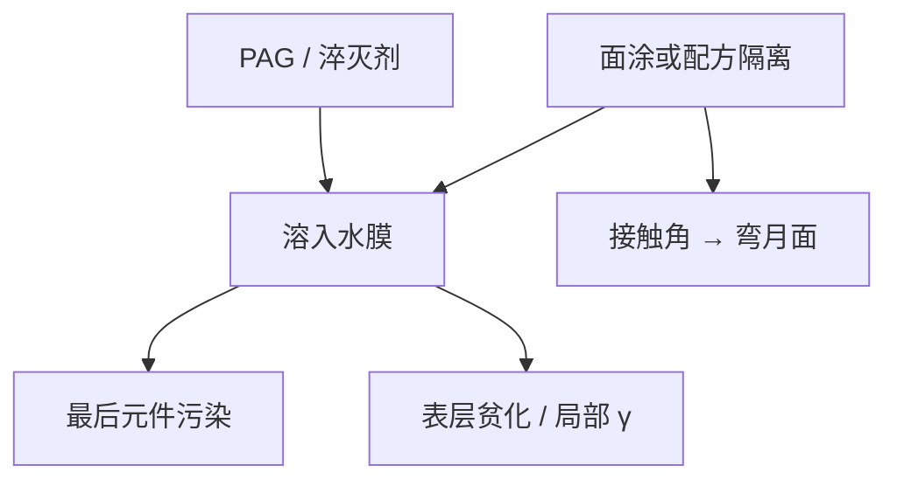

# 面涂与浸出

水膜贴着胶走，PAG 和淬灭剂会溶出去：污染最后一片镜头，也改局部化学。面涂是隔离层；后来的无面涂胶则把隔离写进配方。

<footer>—— 据浸没胶化学的公开讨论：leaching、topcoat、以及后继的 topcoat-less 路线</footer>

[上一课](/litho/immersion-defects)把气泡和水印写成弯月面失稳的形貌。缺口是即使液膜几何合格，胶里的小分子仍会进入水。[CAR](/litho/car-resist) 的 PAG 与淬灭剂在 ArF 上本就有出气与污染账；浸没把接触从「气–胶」换成「水–胶」，浸出（leaching）成为镜头寿命和缺陷的慢变量。本课钉面涂与浸出。离轴照明如何压 $k_1$，从[下一课](/litho/off-axis-illumination)另起，不在这里改光瞳。

## 问题

水是极性介质。离子型 PAG、淬灭剂和小分子添加剂会在秒级扫描接触里溶出。后果有两头：水被污染，回收系统与镜头最后表面吃有机物和酸；胶表层贫 PAG，局部灵敏度与 $\gamma$ 变，窗口边沿先出现桥连或残胶。公开的浸没胶讨论把 leaching 列为必须被面涂或配方挡住的项，而不是可选项。头再稳，也挡不住分配系数。

缺口是化学隔离，不是再设计一个头。头可以除泡，除不掉分子扩散。水印会把已浸出的溶质浓缩，上一课的干燥斑与本课的浸出在缺陷图上可以叠在一起，分析要拆。

### 面涂不是 BARC 的顶配

BARC / EUV 底层在胶下，管反射、黏附、二次电子。面涂（topcoat）在胶上，浸没时代首先为了挡水、控接触角、挡浸出。光学上它是一层额外薄膜，有厚度和折射率，会进驻波与剂量；功能上它不是抗反射的别名。把底层和面涂写成「上下各涂一次 BARC」，栈会乱。

面涂要在显影前去掉或能被显影液兼容。残留面涂当残胶报，会把轨道问题写成曝光不足。

## 方法

早期量产多用疏水面涂：旋涂在 CAR 上，提供接触角窗口给浸没头，并当 PAG 的扩散垒。代价是多一步涂烘、缺陷源多一层、光学模型多一张膜。后续公开路线是 topcoat-less：聚合物疏水基团和低浸出 PAG 把隔离做进胶，减少轨道步骤。两种都要测浸出（水中分析 PAG/阴离子）和镜头污染加速，本课不引用未公开的 ng 级合同值，只保留：有合格线，而且必须和水温、接触时间一起报。

换胶或换面涂，浸没头的接触角窗口要重验证，否则上一课的气泡水印会反弹。OPC 紧凑模型要含顶膜；漏掉面涂厚度，剂量轴会系统性偏。

水质分析要进短环，不能只在换胶资格认证时测一次。

### 与出气课的分工

干式 ArF 的上层涂层更多为了控出气打镜头。浸没面涂身兼出气、浸出、浸润三角。EUV 真空没有液膜，浸出语言不要搬过去；EUV 出气仍在，但是另一课程的氢与多层膜。

## 机制

浸出是近表面扩散加分配：接触时间由扫描速度和头内停留决定，速度越慢往往溶得越多，与产能旋钮打架。表层贫 PAG 使正胶局部欠敏，CD 偏大或清不干净；淬灭剂若先溶，阈值也会动。污染端，溶出物在镜头表面形成吸收膜，193 nm 很疼，透射和焦面慢漂，看起来像设备老化。清洗与换件是维护，不是光学重新设计。

疏水面涂把接触角推到头的设计窗，弯月面更稳，水印下降——流体课与化学课在此交汇。过疏则可能黏附差、面涂缺陷升。工作点是浸润与隔离的折中，不是越疏越好。

浸出测试的接触时间必须接近扫描，而不是把胶在水里泡到平衡。泡到平衡会夸大浸出，引出过厚的面涂，反而伤窗口。

## 边界

本课不把某胶商标的「零浸出」写成物理定律，也不发明 ASML 镜头寿命小时数。高折射率浸没液体会改分配系数，但未成量产，不在此展开。后课默认：浸没栈包含顶界面策略（面涂或无面涂配方）；换策略要同时重做流体缺陷和 E–D 窗。

照明 RET 从下一课开始。面涂不降低 $k_1$，不替代偶极；它只让 1.35 的水膜在化学上可扫描。

无面涂胶仍可能浸出，只是把合格线做进聚合物。监测不能因为名字叫 topcoat-less 就停掉水质分析。

## 小结

- 水–胶接触让 PAG/淬灭剂浸出：污染镜头，并改表层化学。
- 面涂提供隔离与接触角；无面涂路线把隔离写进胶，轨道少一步。
- 面涂不是顶上的 BARC；光学厚度要进模型。
- 浸出与水印可叠加，分析要拆分子扩散与干燥形貌。
- 出处：浸没抗蚀剂化学的公开讨论（leaching / topcoat）；Levinson 对浸没工艺栈的说明；Mack 对 CAR 添加剂的框架。
