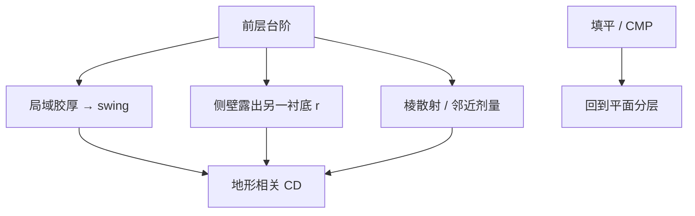

# 基底形貌与反射

台阶让胶厚局域走进摆动横轴，又让界面不再是无限平面；反射有了散射和阴影，CD 跟着底下的地形走。

<footer>—— 薄膜台阶与涂覆见 Mack、Levinson；散射接口对照 Born &amp; Wolf 的非平面界面</footer>

[上一课](/litho/multilayer-barc)假定分层横向无限。缺口是：前层图形留下的**台阶**上，胶厚不是常数，BARC 覆盖不是常数，入射也不再是单一平面界面的 Fresnel。本课钉形貌对反射与 CD 的耦合。EUV 在强吸收、斜入射下的薄膜故事留给[下一课](/litho/euv-thin-film-effects)。

## 问题

旋涂在台阶上厚薄不均：凹槽里胶厚、凸台上胶薄，局部 $d$ 在摆动曲线上走出一大段。即使 BARC 在平坦垫上 $|r|$ 已小，台阶侧壁露出的金属或介质可以是另一张 $r$，局域驻波回到大振幅。散射：台阶棱是衍射物，把能量打进非镜方向，邻近图形的剂量被地形调制——看起来像 OPE，改照明却不如改平坦化。

缺口不是再选一次平坦垫上的胶厚工作点，而是：EPE 预算里与前层图形相关的 CD 项，有一部分是形貌光学，不是本层 TCC 没校准。

### 平坦化与光学谁先

化学机械抛光、多层 BARC 填平、旋涂硬掩模，先把 $d$ 和界面拉回平面分层，本课的散射项才缩小。只加 OPC 偏置去跟每一个台阶，表不可穷尽，且换前层密度就作废。DTCO 放宽台阶高度，是在买光学，不只是买刻蚀。

调平传感器看到的是宏观形貌；台阶是微米以下的局域光学。全局调焦补不了凹槽里的 swing。不要把上一课序的场曲补偿用到这里。

## 方法

诊断：在复现前层台阶的测试结构上量 CD vs 台阶高度 / 密度，对照平坦垫。改 BARC 填平能力，光学项应先动；改本层偶极，若曲线几乎不动，则不是禁戒节距。模拟：至少用局域厚度进薄膜矩阵；侧壁散射需要二维/三维电磁，紧凑 OPC 模型常常没有这一项——热点会表现为「模型外」的桥连。

### 与横向核的边界

光学直径几个 $\lambda/\mathrm{NA}$ 内的台阶都进邻近。稀疏大台阶以局域厚度为主；密栅上的浅台阶以有效介质和散射为主。报告必须声明台阶周期相对光学直径。矢量高 NA 对侧壁 s/p 更敏感，浸没层地形税往往大于干式。

## 机制

局域 $d$ 走摆动横轴，机制已在摆动课。侧壁作为倾斜界面，Fresnel 与阴影随照明方向变，偶极取向会让台阶一侧亮一侧暗，CD 左右不对称——易被误诊为彗差。散射光等效于额外的局部 flare，开阔区旁边的暗图形受害，与透镜晕光同类但源是晶圆地形。

## 边界

本课不写 CMP 工艺配方。三维电磁全芯片不可行，只能热点 clips。禁止把未公开的「台阶每纳米 CD」斜率当常数：它随 BARC 填平和 $|r|$ 变。EUV 斜入射阴影与 DUV 台阶散射会叠在一起，拆到下一课。

## 小结

- 台阶改变局域胶厚、露出的 $r$ 和散射，CD 跟地形走。
- 先平坦化再谈本层 OPC；调焦补不了微台阶。
- 取向相关的不对称不要先归彗差。
- 紧凑模型常缺三维地形项，热点要 clips 验证。
- 下一课：EUV 波长下薄膜与吸收的另一套账。
- 出处：Mack；Levinson；Born &amp; Wolf。
