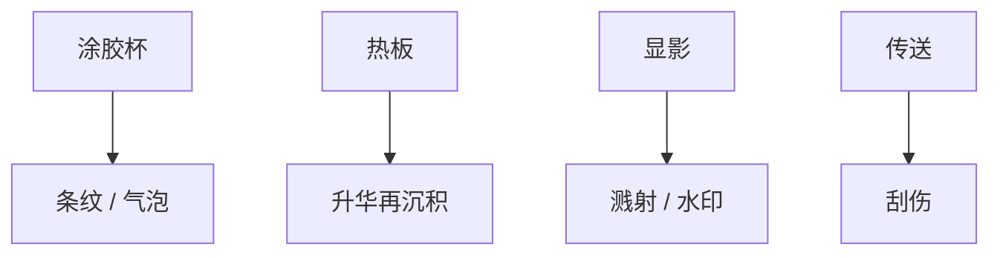

# 轨道缺陷来源

扫描仪写潜像；轨道贡献颗粒、条纹、溅射和升华。缺陷检测要先问在哪一段机台。

<footer>—— 对照 track defect 分类：涂胶条纹、显影溅射、热板升华、传送刮伤</footer>

[上一课](/litho/hotplate-uniformity)是热。缺口是颗粒与图案缺陷的**轨道源**，与 [浸没缺陷](/litho/immersion-defects)、掩模缺陷分开记账。本课分类，不写检测算法。

## 问题

[图形化检测](/litho/patterning-inspection-tools) 看见缺陷，不一定是曝光。涂胶条纹、气泡、 splatter、热板升华再沉积、机械手刮边、显影液干斑，都在 track。分错源会去调剂量或换掩模。

## 方法

按模块分账：涂胶杯（条纹、彗尾、 splatter）、热板（颗粒、升华）、显影碗（溅射、水印）、传送（刮伤、掉片边缘渣）。抽检：涂胶后、曝光前、显影后分步检测，才能定位。换胶与换杯清洗周期是缺陷率的一等参数。

胺污染是化学缺陷：CD 漂、不明欠曝。它走空气，不像颗粒走 SEM。监控要用化学传感器，不只缺陷机。

## 机制

液滴在旋涂中被气流撕碎成卫星点；升华物在较冷盖上凝结再掉。显影溅射把未溶胶块打到邻区。机制不同，清洗配方不同。

## 边界

下一课边缘曝光：有意用光清边，不是缺陷，但过曝会伤边缘器件。

## 小结

- 轨道缺陷按模块分账，分步检测定位。
- 不要默认缺陷来自扫描仪或掩模。
- 出处：track defect 工艺通识；检测课。
