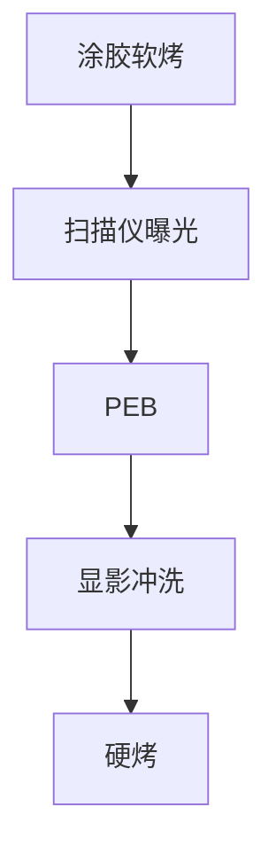

# 轨道与扫描仪联机

涂胶–烘烤–显影在轨道，潜像在扫描仪。联机的是片、配方和时间，不是把两台机器写成一台。

<footer>—— 对照 litho cluster（track + scanner）公开架构</footer>

[上一课](/litho/hard-bake-uv-cure)停在显影后硬化。把整段工艺串起来，缺口是集群：哪一步在 track、哪一步在 scanner、片如何排队。主干 [Twinscan](/litho/twinscan-dual-stage) 写过曝光产能；本课补轨道节拍与接口，不重写双工件台。

## 问题

扫描仪论场和剂量；轨道论模块占用：涂胶杯、热板、显影碗。节拍不匹配就堆片或饿曝光。PEB 延迟（曝光到 PEB 的时间）是化学放大胶的一等参数：酸在室温也会走，延迟散了 CD。把 PEB 延迟写成「剂量不稳」，会找错旋钮。

## 方法

集群调度：曝光后尽快进 PEB 模块，延迟分布要进 SPC。接口：晶圆 ID、配方号、slot 对齐，避免涂了 A 胶去曝 B 程序。环境：轨道与扫描仪的温湿度、氨污染（胺会淬灭酸）要当一个 mill 的化学环境，不是两家设备商各管一段。

离线曝光（track 与 scanner 分开）在研发机台常见，PEB 延迟靠人跑秒表。量产集群把延迟收成受控分布。

## 机制

CAR 的酸在曝光后即存在，扩散与淬灭从这一刻起算。调度方差直接变 CDU。胺类 airborne base 在排队时中和酸，表现为「等得越久越欠曝」。

## 边界

下一课热板均匀性：联机之后，仍可能是热板地图主导 CDU，而不是调度。

## 小结

- 集群把 PEB 延迟和环境化学收成受控量。
- 节拍匹配是产能，延迟匹配是 CD。
- 出处：litho cluster 通识；CAR 酸扩散课。
