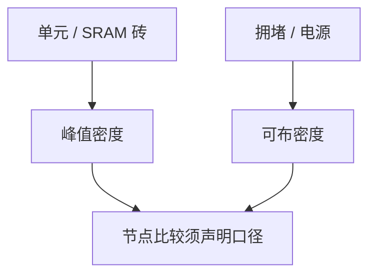

# 晶体管密度度量

MTr/mm²、NAND2 等效、SRAM 位密度是三种口径；只报其中最大的那张图，比较会偏。

<footer>—— 对照逻辑密度度量与 SRAM 密度分报的公开惯例</footer>

[上一课](/litho/cpp-mmp)给出 CPP 与 MMP。缺口是把尺子合成「密度」时口径不一。本课钉晶体管密度度量。IRDS 如何官方化这些趋势，留给[下一课](/litho/irds-roadmap）。

## 方法

三种常见：高压/高性能库的晶体管密度；NAND2 标准单元等效密度；SRAM 位元密度。助推器与轨道对它们影响不同：埋电源可能大幅改逻辑密度、少改 SRAM。光刻层数与 EUV 插入对 BEOL 密度（布线资源）的影响也不落在同一口径。

缺口是**口径**，不是再定义 CPP。把 SRAM 密度当逻辑节点进步，或把宣传峰值密度当全芯片可布密度，都会错估光刻负担。

## 问题

全芯片可实现密度还含布线拥堵、电源网格、IP 空隙，低于砖的峰值。DTCO 必须报「砖」与「阻塞后」两层。3D 堆叠（CFET、键合）把密度改到垂直，平面 MTr/mm² 开始失效——后课会遇，本课先声明平面口径的边界。

ISSCC 对照有用，但各厂口径仍可能不一致。引用时写清是 SRAM 还是逻辑、是否含 dummy。

## 机制

密度 = 计数 / 面积。计数规则（是否含填充管、是否 SRAM）改变分子；面积是否含外围改变分母。光刻只约束面积能否印出，不定义计数规则——但比较光刻进步时必须固定规则。

## 边界

不编造某节点 MTr/mm²。不把密度当功耗或性能。平面口径不描述 3D NAND 的比特密度。

后课默认：比较要写口径；下一课看 IRDS 用哪些表来约束光刻要求。

## 小结

- 逻辑峰值、NAND2 等效、SRAM 是不同密度口径。
- 全芯片可布密度低于砖峰值。
- 引用公开对照时声明口径与年份。
- 出处：密度度量的公开惯例（ISSCC 对照传统）。
