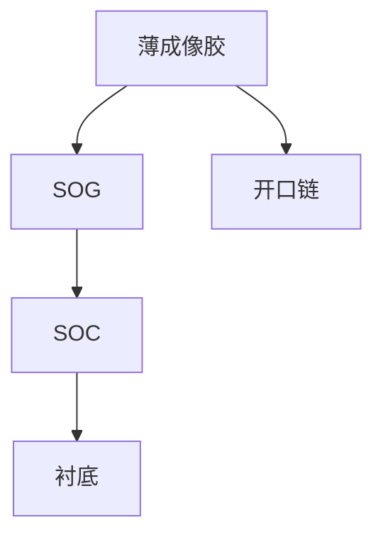

# 三层堆叠 SOC / SOG

薄成像胶要分辨率与随机性；厚底层要抗刻蚀。SOC / SOG 把两件事拆开，转印多一次开口。

<footer>—— 对照先进节点 trilayer 公开流程：成像层 / SOG / SOC</footer>

[上一课](/litho/ebr-edge-bead)切完珠。中心场若只涂一层厚 CAR，[高 NA 薄胶](/litho/high-na-resist-budget) 与深宽比会打架。缺口是三层：薄光刻胶成像，SOG（spin-on glass）当硬掩模，SOC（spin-on carbon）当厚有机底层。后课软烤对每一层都做，本课只钉堆叠角色。

## 问题

单层厚胶：吸收、随机性、倒塌一起坏。单层薄胶：刻蚀预算不够。三层把「谁看见光子」和「谁扛等离子体」分开。缺口不是再写 [BARC](/litho/standing-wave-barc) 的反射公式，而是谁开口、谁停。

## 方法

自下而上：SOC 填形貌、给碳硬掩模厚度；SOG 给含硅层，对碳有选择比；成像胶薄，只把图形落到 SOG。显影后先开口 SOG，再开口 SOC，再进衬底。每一层旋涂+烘烤，均匀性误差会叠——旋涂课的 $d(r)$ 现在有三张。

有的流程用 CVD 硬掩模替换 SOG。名字变了，分工不变：成像层薄、转印层抗刻蚀。

## 机制

含硅层在氧化性等离子体里相对碳更耐或相反，取决于气体——选择比是刻蚀课，本课只要求存在一层「停得住」的中间膜。SOC 的填孔能力决定下层金属沟槽上还要不要再平坦化。

## 边界

本课不写 DSA 或金属氧化物胶替代三层。下一课软烤：溶剂走了，堆叠才变成可曝光固体。

## 小结

- 三层拆开成像厚度与刻蚀厚度。
- 误差按层叠加；开口链是后课 BARC/硬掩模刻蚀的前置。
- 出处：先进节点 trilayer 公开流程通识。
