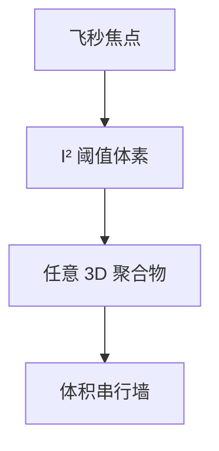

# 双光子 3D 打印

聚合速率跟强度平方走，反应被关在焦点体素里；可以写出真三维聚合物，吞吐却按体素串行。

<footer>—— 对照 two-photon polymerization（Nanoscribe 一类）的公开原理</footer>

[上一课](/litho/grayscale-litho)用二维剂量做高度。缺口是任意三维。本课钉双光子 3D 打印。生物芯片光刻作为另一应用域，留给[下一课](/litho/biochip-litho）。

## 问题

双光子聚合：近红外飞秒激光，只有焦点附近强度够发生双光子吸收，体素外几乎不聚合。可写悬空波导、超材料、微针。分辨率可到亚微米体素，但速度是扫描体素——再遇直写面积/体积墙，只是对象是体积。量产 IC 无关；微光学、生物医学、研究是尼奇。

缺口是**体积串行**，不是投影并行。把双光子当 High-NA 之后的量产接班，wph 算术不成立。

### 与远场衍射

非线性阈值可以让有效体素小于线性衍射斑，这是「超分辨」叙事的来源。仍不是 EUV 替代，材料是聚合物不是硅前道。

多焦点并行与投影式双光子在研究中，要过的仍是体积×剂量墙。

## 方法

工具：飞秒激光、压电/扫描台、负胶体系。设计：3D CAD。后处理：显影未聚合树脂。与灰度：灰度快、形状受限；双光子慢、形状自由。

## 机制

极化率二阶过程 ∝ I²，焦点外 I 下降则反应骤降。体素尺寸由数值孔径、阈值、扫描速度决定。串行时间 ∝ 体积 / 体素 / 扫描占空比。

## 边界

不服务硅前道量产。不把某商家最小特征当物理极限常数。材料收缩与机械强度是产品问题。

后课默认：真三维聚合物直写存在且慢；下一课生物芯片常用更经典的平面光刻做流道与阵列。

## 小结

- 双光子用 I² 阈值写出三维体素，形状自由、吞吐串行。
- 非线性可小于线性斑，仍不是 IC 量产路径。
- 与灰度二维高度映射互补。
- 出处：two-photon polymerization 公开原理。
