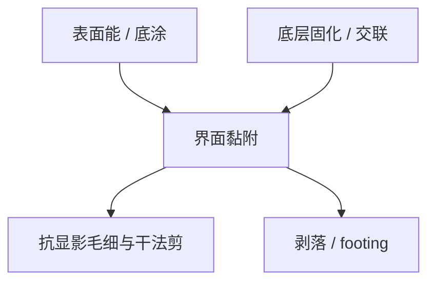

# 底层与粘附

浮雕再直，底部剪应力一过黏附强度就剥。底层首先是界面能与机械锚，其次才是光学减反或二次电子源。

<footer>—— 据 BARC / underlayer 与抗蚀剂黏附的产线叙述；EUV 底层功能栈见主干 underlayer 课</footer>

[上一课](/litho/pab-solvent)把膜内溶剂赶到可重复。缺口是膜下界面：胶（或成像层）与 BARC / SOC / 无机硬掩模之间的黏附。主干 [EUV 底层](/litho/euv-underlayer) 已从二次电子与隔离写过 EUV 栈。本课补的差是一般层的黏附力学与表面处理，不把那一课的电子产额再推导一遍。聚合物分子量如何改膜的内聚与溶解，留给[下一课](/litho/resist-polymer-mw)。

## 问题

显影液毛细力、冲洗、随后干法的剪应力，都作用在界面上。黏附不足：漂胶、剥落、局部「缺图形」，看起来像随机缺孔或扫描失焦。黏附过强且互溶：界面混合，footing、去胶残渣、BARC 开口困难。[图形倒塌](/litho/pattern-collapse) 是高深宽比下的毛细力矩，黏附是它的边界条件——倒是体，剥是界面。

缺口不是再列 BARC 减反，而是：表面能、底涂（HMDS 一类）、底层交联密度，如何把「还贴着」写成可签核项。光学 BARC 选厚在反射极小，并不自动给出黏附极大。

### 不要把 EUV 电子灌入当成黏附

高 Z 底层抬灵敏度，是电子产额，不是黏附变好。黏附失败的片也可以很敏。分析要拆：重复性差的剥落跟涂胶头、底涂、等待湿度走；泊松缺孔跟剂量走。

HMDS 把氧化硅表面从亲水改成更匹配有机胶的润湿。过量或过烘反而生成弱界面层。底涂是资格项，不是「有或没有」开关。

## 方法

实验：划格、磁带、显影后高压冲洗、聚焦离子束看界面、刻蚀后剥落检查。表面：接触角、底涂温度时间、底层 PAB / 固化。光学与黏附联合：换 BARC 材料族时同时看反射与剥落，不要只盯 swing。

EUV 层沿用主干底层课的功能清单（黏附、隔离、电子、硬掩模），本课只强调：黏附规格在 DUV 与 EUV 上都是一等项，不因为「有 BARC」就自动满足。

## 机制

润湿不良则涂布空洞，显影从空洞撕开。润湿好但扩散互溶，形成混合层，$R(m)$ 在底部失定义，出现 footing。底层过固化变玻璃，机械锚变差；欠固化则被显影液攻击。PAB 过狠让胶底部溶剂过低、收缩应力集中在界面，剥落在曝光前就已经埋下。

倒塌时，黏附力矩对抗毛细力矩。同样深宽比，黏附好可以多活一截；黏附课救不了深宽比预算本身——[胶厚](/litho/high-na-resist-budget) 仍要薄。

金属衬底与低 k 介质表面能差很大，同一胶换层必须重做底涂，不能把前层资格复印。

## 边界

不写 HMDS 的分子式考据，不把某 BARC 牌号当标准。不重写驻波光学。下一课分子量改的是膜的内聚强度与溶解行为，从而改「撕在体内还是撕在界面」。

## 小结

- 黏附是界面能与固化窗口，不是减反厚度的副产品。
- 剥落会伪装成缺孔；用重复性与剂量敏感拆开。
- 底涂与底层固化是资格项；过/欠都失败。
- EUV 电子产额与黏附是不同账。
- 出处：BARC/underlayer 黏附通称；主干 [EUV 底层](/litho/euv-underlayer)；Mack / Levinson 工艺叙述。
